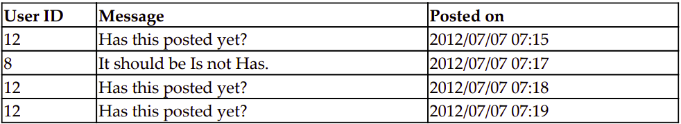

# مدل ها 

در این بخش به بحث های زیر میپردازیم 
* اهمیت مدل ها 
* نمودار کلاس ها 
* الگوی مدل ساختاری
* مدل الگوی رفتاری
* مایگریشن ها(مهاجرت ها)

من یک بار به یک استارت آپ تحلیل داده توی مراحل اولیه اشون مشاوره دادم.با وجود اینکه گرفتن دیتا به یک بازه زمانی اخیر محدود بود اون ها خیلی مشکل های کارایی(performance) داشتن  ختی باز کردن صفحات بعضی اوقات چند ثانیه طول می کشید.بعد از بررسی ساختارتون,مشکل به تظر میومد که از مدل داده شون بود. گرچه مهاجرت کردن(migrating) و تبدیل پتابایت هایی از دیتای ساختار یافته زنده غیر ممکن به نظر میرسید .

    Show me your flowcharts and conceal your tables, and I shall continue to be mystified.
    Show me your tables, and I won't usually need your flowcharts; they'll be obvious.
    (Fred Brooks, The Mythical Man-month)
    

Traditionally, designing code around well thought-out data is always recommended. But in this age of big data, that advice has become more relevant. If your data model is poorly designed, the volume of data will eventually cause scalability and maintenance issues. I recommend using the following adage on how to balance code and data:

    Rule of Representation: Fold knowledge into data so program logic can
    be stupid and robust.

فکر کن چطوری میتونی پیچیدگی رو از کد به دیتا ببری. همیشه سخت تره که منطق کد رو بفهمی تا منطق دیتارو. یونیکس از همین فلسفه خیلی خوب خوب استفاده میکنه با استفاده از دادن یک عالمه وسیله ساده که میتونن با هم ترکیب(پایپ) بشن تا هر گونه تغییر رو روی دیتا های متنی انچام بدی
.
در آخر, دیتا مدت زمان خیلی بیشتری دوام میاره تا کد. شرکت ها ممکنه به خاطر این که پایگاه کد نیازاشون رو دیگه برطرف نمیکنه تصمیم بگیرن که کل پایگاه کد شون رو دوباره بنویسن,ولی دیتابیس ها معمولا حفظ میشن و حتی بین چند اپلیکیشن هم به اشتراک گذاشته می شوند.     
دیتابیس های خوب طراحی کردن بیشتر یک هنره تا یک علم. این بخش به شما چند قانون بنیادی رو مثل عادی سازی(Normalization) یا بهترین روش ها برای منظم کردن داده رو به شما ارایه میده. ولی قبل از اون,بیاید یک نگاهی بندازیم که دیتا مدل ها توی کجای یک اپلیکشن جنگو کاربرد دارن. 
 

# ام بزرگ تر از وی و سی بزرگ تر از وی است 
در جنگو, مدل ها کلاس هایی هستند که روشی شی گرایانه برای دسترسی به دیتابیس میده. معمولا, هر کلاس به یک جدول در دیتابیس و هر صفت ‌(اتربیوت) به یک ستون در دیتابیس اشاره دارد. شما میتونین با استفاده از api که خودکار ساخته شده به جدوال کویری بزنید. 
مدل ها میتونن پایه خیلی از اجزای دیگه باشه. وقتی که مدل دارین., میتونید خیلی سریع ادمین های مدل, فرم های مدل و یک عالمه ویو عمومی(جنریک). 
در هر مورد , شما فقط نیاز دارین چند خط کد بنویسید که حیلی دیگه این پروسه جادویی به نظر نیاد. 

همچنین, مدل ها تو خیلی بیشتر از جاهایی که انتظار دارید استفاده میشه. این به خاطر اینه که جنگو میتونه به روش های متفاوتی اجرا بشه. بعضی از نقاط ورود در جنگو :‌
*  جریان آشتای وب درخواست-پاسخ  
* شل اینترکتیو جنگو 
* دستورات مدیریتی (management commands)
* اسکریپت های تست 
* صف های وظایف ناهمزمان همانند سلری

تقریبا در همه این موارد, ماژول مدل ایمپورت میشود (بخشی از **django.setup()**). از این رو , بهترین کار اینه که مدل هاتون رو از هرگونه وابستگی های غیر ضروری آزاد نگه داریم یا که اجزایی مثل ویو رو امیپورت کنیم. 
خلاصه, طراحی مناسب مدل ها خیلی مهم هستندو حالا بیاین شروع کنیم یک مدل سوپرکتاب رو. 
####لانچ کیف قهوه ای :
    یادداشت نویسنده: پیشروی این پروژه سوپرکتاب در یک جعبه(بخش) مثل این نمایش داده خواهد شد. 

    شاید شما از جعبه عبور کنید, ولی بینش ها و تجربه های زیادی رو از دست میدید,و درامای کار کردن روی یک پروژه وب ابپلیکیشن.
هفته اول استیو با مشتریش٫ هوش ابرقهرمانی و مانیتورینگ (شیم) به صورت کوتاه٫ خیلی قاطی پاتی بود. اداره خیلی آینده نگرانه ٫ ولی چیزی رو انجام دادن به ۱۰۰ تاتاییدیع و امضا نیاز داشت 
    
    با وجود توسعه دهنده ارشد جنگو بودن, استیو یک سرور در حال توسعه متوسط که روش ۴ تا ماشین مجازی بیشتر از دو روز بالا بود رو تموم کرده بود. 
    صبح بعدش, دستگاه ناپدید شده بود. یک ربات به اندازه ماشین لباسشویی که نزدیکیا بود گفت که به دلیل نصب برنامه های تایید نشده بخش پزشک قانونی انتقال داده شده .
    
    مدیر بخش فنی, هارت, گرچه خیلی کمک کرد.اون درخواست کرد که ماشین به همراه تمام موارد نصب شده برگردونده بشه که این پروسه فقط یک ساعت طول کشید. 
    او همچنین پیش تاییدیه هایی رو فرستاد که مشکلی برای پروژه ابرکتاب پیش نیاد. 
    
بعدا در بعد از ظهر اون روز, استیو یک کیف قهوه ای ناهار به همراه خودش داشت    ت 
    لباس پوشیده در یک بلیزر بژ رنگ و یک جین آبی کم رنگ., هارت هم به موقع رسید. 
    با اینکه از اکثر آدم ها قد بلند تر بود و کله اش هم خیلی خوب شیو شده بود, اون خیلی باحال و قابل دسترس بود. 
    اون از استیو پرسید که آیا استیو قبلا نگاهی به پایگاه داده ابرقهرمانی که تو سالای ۶۰ میلادی تلاش به ساخت بود انداخته یا نه 
    
    
    "اوه آره Sentinel Project درسته؟" استیو گفتت
    "آره یک نگاهی انداختم دیتابیس به نظر میومد که به صورت موجودیت-ویژگی-ارزش مدل طراحی شده بود,یک چیزی که که من اون رو ضد-قاعده میدونم. شاید اونا ایده خیلی کمی از ابرقهرمان داشتن اون موقع ها    ا." 

    
    هارت تقریبا پیچ خورد وقتی آخرین جمله رو شنید. توی صدای آروم تری گفت,
    "تو درست میگی,من نکردم,درکنارش,بهم کلا دو روز وفت دادن تا همه چی رو طراحی کنم. من واقعا به معنای کلمه فک کردم یک جای دنیا یک بمب اتمی در حال تیک تیک کردنه"
    
    دهان استیو باز باز موند و ساندویچش قبل از ورود به دهانش خشکش زد. 
    هارت خندید. "قطعا بهترین کارم نبود.وقتی از یک میلیارد انتری میگذشت روزها وقت میگرفت تا هر گونه تحلیلی رو روی اون دیتابیس لعنتی انجام بدیم.
    ابرکتاب اون رو توی چند ثانیه جمع میکنه,درسته؟"

    استیو ضعیف سر تکون داد. اون هیچوقت فکر نمیکرد که یک ملیارد ابرقهرمان یک جا باشند اصلا.


####شکار مدل 
این اولین دید از شناختن مدل ها توی ابرکتابه. معمول برای اولین تلاش,ما فقط مدل اصلی و روابطش رو به صورت نمودار ساده نمایان میکنیم. 


بیاید یک لحظه مدل ها رو فراموش کنیم و درباره اشیایی حرف بزنیم که داریم مدلشون میکنیم. هر کاربر یک پروفایل داره. یک کاربر میتونه چندین کامنت یا پست بزاره. یک لایک میتونه به یک ترکیبی از کاربر/پست مرتبط باشه. 

کشیدن یک نمودار کلاس مثل این رو پیشنهاد میکنم. صفت های کلاس ممکنه توی این بخش گم شده باشند. ولی شما میتونید بعدا جزییاتش رو بیشتر کنید. وقتی که کل پروژه توی نمودار نمایان شد, جدا کردن اپ ها رو ساده تر میکنه. 

اینجا چند نکته وجود داره تا این نمایش رو انجام بدیم:
* 'اسم' ها معمولا وقتی دارید شرح میدید به صورت موجودیت معنا پیدا میکنن 
* جعبه هایی که موجودیت ها رو نشون میدن به مدل تبدیل میشوند. 
* خط های متصل کننده که دو جهتی هستند و سه نوع از روابط رو در جنگو تعریف میکنند:
یک-به-یک , یک-به-خیلی (با کلید خارجی پیاده سازی میشن) و خیلی-به-خیلی
*  بخشی که رابطه یک-به-یک رو تعریف میکنه در **موجودیت-رابطه مدل** وجود دارد. در کلماتی دیگه,طرف ان ام جایی هست که کلید خارجی تعریف میشه.

The class diagram can be mapped into the following Django code (which will be spread
across several apps):

```python

class Profile(models.Model):
    user = models.OneToOneField(User)
    
class Post(models.Model):
    posted_by = models.ForeignKey(User)

class Comment(models.Model):
    commented_by = models.ForeignKey(User)
    for_post = models.ForeignKey(Post)

class Like(models.Model):
    liked_by = models.ForeignKey(User)
    post = models.ForeignKey(Post)
```

Later, we will not reference the **User** directly, but use the more general **settings.AUTH_USER_MODEL** instead. 
We are also not concerned about field attributes such as **on_delete** or **primary_key** at this stage. We will get into those details soon.


#Splitting models.py into multiple files


Like most components of Django, a large models.py file can be split up into multiple files within a package. A package is implemented as a directory, which can contain multiple files, one of which must be a specially named file called __init__.py. This file can be
empty, but should exist.

All definitions that can be exposed at package level must be defined in __init__.py with global scope. For example, if we split models.py into individual classes, in corresponding files inside the models subdirectory such as postable.py, post.py, and comment.py, then the directory structure would look as follows: 

models/
    - comment.py
    - __init__.py
    - postable.py
    - post.py

To ensure that all the models are imported correctly, __init__.py should have the following lines:

```python
from postable import Postable
from post import Post
from comment import Comment
```

Now you can import models.Post as previously
Any other code in the __init__.py file will be run when the package is imported. Hence, it is the ideal place for any package-level initialization code.

#Structural patterns

This section contains several design patterns that can help you design and structure your models. Structural patterns mentioned here would help you realize the relationships between models more effectively.

##Patterns — normalized models

**Problem:** By design, model instances have duplicated data that causes data inconsistencies.
**Solution:** Break down your models into smaller models through normalization. Connect these models with logical relationships between them.

##Problem details

Imagine if someone designed our post table (omitting certain columns) in the following way:


I hope you noticed the inconsistent superhero names in the first column (and captain's consistent lack of patience).

If we were to look at the first column, we are not sure which spelling is correct __ **Captain Temper** or **Capt. Temper**  . This is the kind of data redundancy that we would like to eliminate through normalization.

##Solution details

Before we take a look at the fully normalized solution, let's have a brief primer on database normalization in the context of Django models.

####Three steps of normalization

Normalization helps you efficiently store data. Once your models are fully normalized, they will not have redundant data, and each model should contain data that is only logically related to it.

To give a quick example, if we were to normalize the post table so that we can unambiguously refer to the superhero who posted that message, then we need to isolate the user details in a separate table. Django already creates the user table by default. So, you only need to refer to the ID of the user who posted the message in the first column, as shown in the following table:



Now, it is not only clear that there were three messages posted by the same user (with an arbitrary user ID), but we can also find that user's correct name by looking up the user table.

Generally, you will design your models to be in their fully normalized form and then selectively denormalize them for performance reasons (see the next section on Performance to know why). In databases, **normal forms** are a set of guidelines that can be applied to a table to ensure that it is normalized. Commonly found normal forms are first, second, and third normal forms, although they could go up to the fifth normal form.


In the next example, we will normalize a table and create the corresponding Django models. Imagine a spreadsheet called Sightings that lists the first time someone spots a superhero using a power or superhuman ability. Each entry mentions the known origins, superpowers, and location of the first sighting, including latitude and longitude:


The preceding geographic data has been extracted from
http://www.golombek.com/locations.html

##First normal form (1NF)

- No attribute (cell) with multiple values
- A primary key defined as a single column or a set of columns (composite key)

Let's try to convert our spreadsheet into a database table. Evidently, our Power column breaks the first rule.

The updated table here satisfies the first normal form. The primary key (marked with a *) is a combination of **Name** and **Power**, which should be unique for each row:


##Second normal form (2NF)

The second normal form must satisfy all the conditions of the first normal form. In addition, it must satisfy the condition that all non-primary key columns must be dependent on the entire primary key.

In the previous table, notice that Origin depends only on the superhero, that is, Name. It doesn't matter which Power we are talking about. So, Origin is not entirely dependent on the composite primary key — Name and Power.

Let's extract just the origin information into a separate table called Origin, as shown here:


Now our Sightings table updated to be compliant to the second normal form looks as follows:


##Third normal form (3NF)

In third normal form, the tables must satisfy the second normal form and should additionally satisfy the condition that all non-primary key columns must be directly dependent on the entire primary key and must be independent of each other.

Think about the **Country** column for a moment. Given the **Latitude** and **Longitude** , you can easily derive the **Country** column. Even though the country where a superpower was sighted is dependent on the Name-Power composite primary key, it is only indirectly dependent on them.

So, let's separate the location details into a separate countries table as follows:


Now our Sightings table in its third normal form looks as follows:


As before, we have replaced the superhero's name with the corresponding User ID that can be used to reference the user table.

#Django models

We can now take a look at how these normalized tables can be represented as Django models. Composite keys are not directly supported in Django. The solution used here is to apply the surrogate keys and specify the *unique_together* property in the *Meta* class:

```python

class Origin(models.Model):
    superhero = models.ForeignKey(
    settings.AUTH_USER_MODEL, on_delete=models.CASCADE)
    origin = models.CharField(max_length=100)

    def __str__(self):
        return "{}'s orgin: {}".format(self.superhero, self.origin)


class Location(models.Model):
    latitude = models.FloatField()
    longitude = models.FloatField()
    country = models.CharField(max_length=100)

    def __str__(self):
        return "{}: ({}, {})".format(
            self.country,
            self.latitude, 
            self.longitude
            )

    class Meta:
        unique_together = ("latitude", "longitude")


class Sighting(models.Model):
    superhero = models.ForeignKey(
    settings.AUTH_USER_MODEL, on_delete=models.CASCADE)
    power = models.CharField(max_length=100)
    location = models.ForeignKey(Location, on_delete=models.CASCADE)
    sighted_on = models.DateTimeField()

    def __str__(self):
        return "{}'s power {} sighted at: {} on {}".format(
        self.superhero,
        self.power,
        self.location.country,
        self.sighted_on
        )

    class Meta:
        unique_together = ("superhero", "power")

```

#Performance and denormalization

Normalization can adversely affect performance. As the number of models increase, the number of joins needed to answer a query also increase. For instance, to find the number of superheroes with the Freeze capability in the USA, you will need to join four tables. Prior to normalization, any information can be found by querying a single table.

You should design your models to keep the data normalized. This will maintain data integrity. However, if your site faces scalability issues, then you can selectively derive data from those models to create denormalized data.

#####Best Practice:
*Normalize while designing, but denormalize while optimizing.*


For instance, if counting the sightings in a certain country is very common, then add it as an additional field to the *Location* model. Now, you can include the other queries using Django **object-relational mapping (ORM)** , unlike a cached value.

However, you need to update this count each time you add or remove a sighting. You need to add this computation to the *save* method of Sighting, add a signal handler, or even compute using an asynchronous job.

If you have a complex query spanning several tables, such as a count of superpowers by country, then creating a separate denormalized table might improve performance. 
Typically, this table will be in a faster in-memory database or a cache. As before, we need to update this denormalized table every time the data in your normalized models changes (or you will have the infamous cache-invalidation problem).

Denormalization is surprisingly common in large websites because it is a tradeoff between speed and space. Today, space is cheap, but speed is crucial to user experience. So, if your queries are taking too long to respond, then you might want to consider it.

#Should we always normalize?

Too much normalization is not necessarily a good thing. Sometimes, it can introduce unnecessary tables that can complicate updates and lookups.

For example, your user model might have several fields for their home address. Strictly speaking, you can normalize these fields into an address model. However, in many cases, it would be unnecessary to introduce an additional table to the database.

Rather than aiming for the most normalized design, carefully weigh each opportunity to normalize and consider the trade offs before refactoring.

#Pattern — model mixins

**Problem:** Distinct models have the same fields and/or methods duplicated violating the DRY principle .
**Solution:** Extract common fields and methods into various reusable model mixins.

####Problem details

While designing models, you might find certain common attributes or behaviors shared across model classes. For example, a post and comment model needs to keep track of its created date and modified date. Manually copying and pasting the fields and their associated method is not a very DRY approach.

Since Django models are classes, object-oriented approaches such as composition and inheritance are possible solutions. However, compositions (by having a property that contains an instance of the shared class) will need an additional level of indirection to access fields.

Inheritance can get tricky. We can use a common base class for post and comments. 
However, there are three kinds of inheritance in Django: concrete, abstract, and proxy.

**Concrete inheritance** works by deriving from the base class just like you normally would in Python classes. However, in Django, this base class will be mapped into a separate table. 
Each time you access base fields, an implicit join is needed. This leads to horrible performance.

**Proxy inheritance** can only add new behavior to the parent class. You cannot add new fields. Hence, it is not very useful for this situation.
Finally, we are left with Abstract inheritance.

####Solution details

Abstract inheritance is an elegant solution which uses special Abstract base classes to share data and behavior among models. When you define an abstract base class in Django, which are not the same as abstract base classes (ABCs) in Python, it does not create any corresponding table in the database. Instead, these fields are created in the derived non-abstract classes.

Accessing abstract base class fields doesn't need a *JOIN* statement. The resulting tables are also self-contained with managed fields. Due to these advantages, most Django projects use abstract base classes to implement common fields or methods.

Limitations of abstract models are as follows:
- They cannot have a Foreign key or many-to-many field from another model
- They cannot be instantiated or saved
- They cannot be directly used in a query since it doesn't have a manager

Here is how the post and comment classes can be initially designed with an abstract base class:

```python

class Postable(models.Model):
    created = models.DateTimeField(auto_now_add=True)
    modified = models.DateTimeField(auto_now=True)
    message = models.TextField(max_length=500)

    class Meta:
        abstract = True


class Post(Postable):
    ...


class Comment(Postable):
    ...

```

To turn a model into an abstract base class, you will need to mention *abstract = True* in its inner *Meta* class. Here, *Postable* is an abstract base class. However, it is not very reusable.

In fact, if there was a class that had just the *created* and *modified/ field, then we can reuse that timestamp functionality in nearly any model needing a timestamp. In such cases, we usually define a model mixin.

#####Model mixins
 
Model mixins are abstract classes that can be added as a parent class of a model. Python supports multiple inheritances, unlike other languages such as Java. Hence, you can list any number of parent classes for a model.

Mixins ought to be orthogonal and easily composable. Drop in a mixin to the list of base classes and they should work. In this regard, they are more similar in behavior to composition rather than inheritance.

Smaller mixins are better. Whenever a mixin becomes large and violates the single responsibility principle, consider refactoring it into smaller classes. Let a mixin do one thing and do it well.

In our previous example, the model mixin used to update *created* and *modified* time can be easily factored out, as shown in the following code: 

```python

class TimeStampedModel(models.Model):
    created = models.DateTimeField(auto_now_add=True)
    modified = models.DateTimeField(auto_now =True)

    class Meta:
        abstract = True


class Postable(TimeStampedModel):
    message = models.TextField(max_length=500)
    ...

    class Meta:
        abstract = True


class Post(Postable):
    ...


class Comment(Postable):
    ...

```

We have two base classes now. However, the functionality is clearly separated. The mixin can be separated into its own module and reused in other contexts. 

#Pattern — user profiles

**Problem: ** Every website stores a different set of user profile details. However, Django's built-in user model is meant for authentication details.
**Solution: ** Create a user profile class with a one-to-one relation with the user model.

####Problem details

Out of the box, Django provides a pretty decent user model. You can use it when you create a super user or login to the admin interface. It has a few basic fields, such as full name, username, and email.

However, most real-world projects keep a lot more information about users, such as their address, favorite movies, or their superpower abilities. From Django 1.5 onwards, the default user model can be extended or replaced. However, official docs strongly recommend storing only authentication data even in a custom user model (it belongs to the *auth* app, after all).

Certain projects need multiple types of users. For example, SuperBook can be used by superheroes and non-superheroes. There might be common fields and some distinctive fields based on the type of user.

####Solution details

The officially recommended solution is to create a user profile model. It should have a one-to-one relation with your user model. All the additional user information is stored in this model:

```python

class Profile(models.Model):
    user = models.OneToOneField(
        settings.AUTH_USER_MODEL,
        on_delete=models.CASCADE,
        primary_key=True
        )

```

It is recommended that you set the *primary_key* explicitly to *True* to prevent concurrency issues in some database backends such as PostgreSQL. The rest of the model can contain any other user details, such as birth-date, favorite color, and so on. 

While designing the profile model, it is recommended that all the profile detail fields must be nullable or contain default values. Intuitively, we can understand that a user cannot fill out all their profile details while signing up. Additionally, we will ensure that the signal handler also doesn't pass any initial parameters while creating the profile instance.

######Signals

Ideally, every time a user model instance is created, a corresponding user profile instance must be created as well. This is usually done using signals.

For example, we can listen for the *post_save* signal from the user model using the following signal handler in *profiles/signals.py*:

```python

from django.db.models.signals import post_save
from django.dispatch import receiver
from django.conf import settings
from . import models

@receiver(post_save, sender=settings.AUTH_USER_MODEL)
def create_profile_handler(sender, instance, created, **kwargs):
    if not created:
        return
    # Create the profile object, only if it is newly created
    profile = models.Profile(user=instance)
    profile.save()

```

The *profile* model has passed no additional initial parameters except for the *user=instance* .

Previously, there was no specific place for initializing the signal code. Typically, they were imported or implemented in *models.py* (which was unreliable). However, with app-loading refactor in Django 1.7, the application initialization code location is well defined.

First, subclass the *ProfileConfig* method in *apps.py* within the profiles app and set up the signal in the *ready* method:

```
# apps.py
from django.apps import AppConfig


class ProfilesConfig(AppConfig):
    name = "profiles"
    verbose_name = 'User Profiles'

    def ready(self):
        from . import signals

```

Next, change the line mentioning profiles in your *INSTALLED_APPS* to a dotted path pointing to this *AppConfig*. So your settings should look as follows:

```python

INSTALLED_APPS = [
    'profiles.apps.ProfilesConfig',
    'posts',
    ...

```

With your signals set up, accessing *user.profile* should return a *Profile* object to all users, even the newly created ones.

#####Admin

Now, a user's details will be in two different places within the admin: the authentication details in the usual user admin page, and the same user's additional profile details in a separate profile admin page. This gets very cumbersome. 

For convenience, the profile admin can be made inline to the default user admin by defining a custom *UserAdmin* in *profiles/admin.py* as follows:

```python

from django.contrib import admin
from django.contrib.auth.admin import UserAdmin
from .models import Profile
from django.contrib.auth.models import User

class UserProfileInline(admin.StackedInline):
    model = Profile


class NewUserAdmin(UserAdmin):
    inlines = [UserProfileInline]


admin.site.unregister(User)
admin.site.register(User, NewUserAdmin)

```

#Multiple profile types

Assume that you need several kinds of users and their corresponding profiles in your application — there needs to be a field to track which type of profile the user has. The *Profile* data itself needs to be stored in separate models or a unified model.

An aggregate *Profile* approach is recommended since it gives the flexibility to change the *Profile* types without loss of *Profile* details and minimizes complexity. In this approach, the *Profile* model contains a superset of all profile fields from all *Profile* types.

For example, SuperBook will need a superhero type profile and an ordinary (non superhero) profile. It can be implemented using a single unified profile model as follows: 

```python

class BaseProfile(models.Model):
    USER_TYPES = (
        (0, 'Ordinary'),
        (1, 'SuperHero'),
    )
    user = models.OneToOneField(settings.AUTH_USER_MODEL, primary_key=True)
    user_type = models.IntegerField(max_length=1, null=True, choices=USER_TYPES)
    bio = models.CharField(max_length=200, blank=True, null=True)

    def __str__(self):
        return "{}: {:.20}". format(self.user, self.bio or "")]

    class Meta:
        abstract = True


class SuperHeroProfile(models.Model):
    origin = models.CharField(max_length=100, blank=True, null=True)

    class Meta:
        abstract = True


class OrdinaryProfile(models.Model):
    address = models.CharField(max_length=200, blank=True, null=True)

    class Meta:
        abstract = True


class Profile(SuperHeroProfile, OrdinaryProfile, BaseProfile):
    pass

```

We grouped the profile details into several abstract base classes to separate concerns. The *BaseProfile* class contains all the common profile details irrespective of the user type. It also has a *user_type* field that keeps track of the user's active profile.

The *SuperHeroProfile* class and *OrdinaryProfile* class contain the *Profile* details specific to superhero and non-hero users, respectively. Finally, the *Profile* class derives from all these base classes to create a superset of profile details.

Some details to take care of while using this approach are as follows:
- All *Profile* fields that belong to the class or its abstract bases classes must be nullable or with defaults.
- This approach might consume more database space per user, but gives immense flexibility.
- The active and inactive fields for a *Profile* type need to be managed outside the model. For example, a form to edit the profile must show the appropriate fields based on the currently active user type.

#Pattern – service objects

**Problem**: Models can get large and unmanageable. Testing and maintenance get harder as a model does more than one thing.
**Solution**: Refactor out a set of related methods into a specialized *Service* object.

####Problem details

Fat models, thin views is an adage commonly told to Django beginners. Ideally, your views
should not contain anything other than presentation logic.

However, over time, pieces of code that cannot be placed anywhere else tend to go into
models. Soon, models become a dump yard for the code.

Consider refactoring out a *Service* object if your model contains code for any of the
following:

1. Interactions with external services, for example, checking whether the user is
eligible to get a *SuperHeroProfile* with a web service
2. Helper tasks that do not deal with the database, for example, generating a short
URL or random captcha for a user
3. Making a short-lived object without a database state, for example, creating a
JSON response for an AJAX call
4. Functionality spanning multiple model instances yet do not belong to anyone
5. Long-running tasks such as Celery tasks

Models in Django follow the Active Record pattern, that is, each class instance corresponds
to a row in the database table. Ideally, they encapsulate both database access
and application (or domain) logic. However, keep the application logic minimal.
While testing, if we find ourselves mocking the database even while not using it, then we
need to consider breaking up the model class. A Service object is recommended in such
situations.

####Solution details

Service objects are **plain old Python objects (POPOs)** that encapsulate a service or
interactions with a system. They are usually kept in a separate file named *services.py* or
*utils.py*.

For example, checking a web service is sometimes dumped into a model method as follows:

```python

class Profile(models.Model):
    ...
    def is_superhero(self):
        url = "http://api.herocheck.com/?q={0}".format(
            self.user.usernam
        )
        return webclient.get(url)
```

This method can be refactored to use a service object as follows:

```python
from .services import SuperHeroWebAPI

def is_superhero(self):
    return SuperHeroWebAPI.is_hero(self.user.username)

```

The service object can now be defined in *services.py* as follows:

```python

API_URL = "http://api.herocheck.com/?q={0}"

class SuperHeroWebAPI:
    ...
    @staticmethod
    def is_hero(username):
        url = API_URL.format(username)
        return webclient.get(url)

```

In most cases, methods of a service object are stateless, that is, they perform the action
solely based on the function arguments without using any class properties. Hence, it is
better to explicitly mark them as static methods (as we have done for *is_hero*).

Consider refactoring your business logic or domain logic out of models into service objects.
This way, you can use them outside your Django application as well.

Imagine there is a business reason to blacklist certain users from becoming superhero types
based on their username. Our service object can be easily modified to support this:

```python

class SuperHeroWebAPI:
    ...
    @staticmethod
    def is_hero(username):
        blacklist = set(["syndrome", "kcka$$", "superfake"])
        url = API_URL.format(username)
        return username not in blacklist and webclient.get(url)

```

Ideally, service objects are self-contained. This makes them easy to test without mocking,
say, the database. They can also be easily reused.

In Django, time-consuming services are executed asynchronously using task queues such as
Celery. Typically, the service object actions are run as Celery tasks. Such tasks can be run
periodically or after a delay.

#Retrieval patterns

This section contains design patterns that deal with accessing model properties or
performing queries on them. These Retrieval patterns can help you design better ways to
access frequently needed information.

####Pattern — property field

**Problem:** Models have derived attributes that are implemented as methods. However,
these attributes should not be persisted to the database.
**Solution:** Use the property decorator on such methods.

####Problem details

Model fields store per-instance attributes, such as first name, last name, birthday, and so
on. They are also stored in the database. However, we also need to access some derived
attributes, such as full name or age.

They can be easily calculated from the database fields, hence need not be stored separately.
In some cases, they can just be a conditional check such as eligibility for offers based on age,
membership points, and active status.

A straightforward way to implement this is to define functions, such as get_age similar to
the following:

```python

class BaseProfile(models.Model):
    birthdate = models.DateField()
    #...
    def get_age(self):
        today = datetime.date.today()
        return (today.year - self.birthdate.year) - int(
            (today.month, today.day) <
            (self.birthdate.month, self.birthdate.day))

```

Calling *profile.get_age()* would return the user's age by calculating the difference in
the years adjusted by one based on the month and date (that is, if this year's birthday is yet
to come).

This could be invoked by a function call. However, it is much more readable (and Pythonic)
to call it *profile.age*.

####Solution details

Python classes can treat a function as an attribute using the property decorator. Django
models can use it as well. In the previous example, replace the function definition line with
the following:

```python

 @property
 def age(self):

```

Now, we can access the user's age with *profile.age*. Notice that the function's name is
shortened as well.

An important shortcoming of a property is that it is invisible to the ORM, just like model
methods are. You cannot use it in a *QuerySet* object. For example, this will not work,
*Profile.objects.exclude(age__lt=18)*. However, it is visible to views or templates.

In case you need to use it in a *QuerySet* object, you might want to use a Query expression.
Use the *annotate* function to add a query expression to derive a calculated field from your
existing fields.

A good reason to define a *property* is to hide the details of internal classes. This is
formally known as the **Law of Demeter (LoD)**. Simply put, the law states that you should
only access your own direct members or use only one dot.

For example, rather than accessing *profile.birthdate.year*, it is better to define a
*profile.birthyear* property. It helps you hide the underlying structure of the
*birthdate* field this way.

#####Best Practice

*Follow the LoD, and use only one dot when accessing a property.*

An undesirable side effect of this law is that it leads to the creation of several wrapper
properties in the model. This could bloat up models and make them hard to maintain.Use
the law to improve your model's API and reduce coupling wherever it makes sense.


####Cached properties

Each time we call a *property*, we are recalculating a function. If it is an expensive
calculation, we might want to cache the result. This way, the next time the *property* is
accessed, the *cached* value is returned:

```python

from django.utils.functional import cached_property

    #...
    @cached_property
    def full_name(self):
        # Expensive operation e.g. external service call
        return "{0} {1}".format(self.firstname, self.lastname)

```

The *cached* value will be saved as a part of the Python instance in memory. As long as the
instance exists, the same value will be returned.

As a fail-safe mechanism, you might want to force the execution of the *Expensive*
*operation* to ensure that stale values are not returned. In such cases, set a keyword
argument such as *cached=False* to prevent returning the *cached* value.

#Pattern — custom model managers

**Problem:** Certain queries on models are defined and accessed repeatedly throughout the
code violating the DRY principle.
**Solution:** Define custom managers to give meaningful names to common queries.

####Problem details

Every Django model has a default manager called objects. Invoking objects.all(),
will return all the entries for that model in the database. Usually, we are interested in only a
subset of all entries.

We apply various filters to find out the set of entries we need. The criterion to select them is
often our core business logic. For example, we can find the posts accessible to the public
by the following code:

```python

public = Posts.objects.filter(privacy="public")

```

This criterion might change in the future. For example, we might want to also check
whether the post was marked for editing. This change might look as follows:

```python

    public = Posts.objects.filter(privacy=POST_PRIVACY.Public, draft=False)

```

However, this change needs to be made everywhere a public post is needed. This can get
very frustrating. There needs to be only one place to define such commonly used queries
without *repeating oneself*.


####Solution details

*QuerySet* is an extremely powerful abstraction. They are lazily evaluated only when
needed. Hence, building longer *QuerySet* by method-chaining (a form of fluent interface)
does not affect the performance.

In fact, as more filtering is applied, the result dataset shrinks. This usually reduces the
memory consumption of the result.

A model manager is a convenient interface for a model to get its *QuerySet* object. In other
words, they help you use Django's ORM to access the underlying database. In fact,
managers are implemented as very thin wrappers around a *QuerySet* object. Notice the
identical interface:

```python

    >>> Post.objects.filter(posted_by__username="a")
    [<Post: a: Hello World>, <Post: a: This is Private!>]
    >>> Post.objects.get_queryset().filter(posted_by__username="a")
    [<Post: a: Hello World>, <Post: a: This is Private!>]

```

The default manager created by Django, *objects*, has several methods, such as all,
*filter*, or *exclude* that return a *QuerySet*. However, they only form a low-level API to
your database.

Custom managers are used to create a domain-specific, higher-level API. This is not only
more readable, but less affected by implementation details. Thus, you are able to work at a
higher level of abstraction closely modeled to your domain.

Our previous example for public posts can be easily converted into a custom manager as
follows:

```python

# managers.py
from django.db.models.query import QuerySet


class PostQuerySet(QuerySet):

    def public_posts(self):
        return self.filter(privacy="public")


PostManager = PostQuerySet.as_manager

```

This convenient shortcut for creating a custom manager from a *QuerySet* object appeared
in Django 1.7. Unlike other previous approaches, this *PostManager* object is chainable like
the default *objects* manager.

It sometimes makes sense to replace the default *objects* manager with our custom
manager, as shown in the following code:

```python

from .managers import PostManager


class Post(Postable):
    ...
    objects = PostManager()

```

By doing this, to access *public_posts* our code gets considerably simplified to the
following:

```python

public = Post.objects.public_posts()

```
Since the returned value is a *QuerySet*, they can be further filtered:

```python

public_apology = Post.objects.public_posts().filter(message_startswith="Sorry")

```

QuerySet have several interesting properties. In the next few sections, we can take a look
at some common patterns that involve combining QuerySets.

#####Set operations on QuerySets

True to their name (or rather the latter half of their name), *QuerySets* support a lot of
(mathematical) set operations. For the sake of illustration, consider two *QuerySets* that
contain the user objects:

```python

    >>> q1 = User.objects.filter(username__in=["a", "b", "c"])
    [<User: a>, <User: b>, <User: c>]
    >>> q2 = User.objects.filter(username__in=["c", "d"])
    [<User: c>, <User: d>]

```

Some set operations that you can perform on them are as follows:

**Union:** This combines and removes duplicates. Use *q1 | q2* to get *[<User: a>,
<User: b>, <User: c>, <User: d>].*

**Intersection:** This finds common items. Use *q1* and *q2* to get *[<User: c>]*.
**Difference:** This removes elements in the second set from the first. There is no
logical operator for this. Instead use *q1.exclude(pk__in=q2)* to get *[<User:
a>, <User: b>]*.

The same operations can be done on *QuerySets* using the *Q* objects:

```python

    from django.db.models import Q

    # Union
    >>> User.objects.filter(Q(username__in=["a", "b", "c"]) |
    Q(username__in=["c", "d"]))
    [<User: a>, <User: b>, <User: c>, <User: d>]
    # Intersection
    >>> User.objects.filter(Q(username__in=["a", "b", "c"]) &
    Q(username__in=["c", "d"]))
    [<User: c>]
    # Difference
    >>> User.objects.filter(Q(username__in=["a", "b", "c"]) &
    ~Q(username__in=["c", "d"]))
    [<User: a>, <User: b>]

```

*The difference is implemented using & (and) and ~ (negation). The Q
objects are very powerful and can be used to build very complex queries.*

However, the *Set* analogy is not perfect. *QuerySets*, unlike mathematical sets, are
ordered. So, they are closer to Python's list data structure in that respect.

#Chaining multiple QuerySets

So far, we have been combining *QuerySets* of the same type belonging to the same base
class. However, we might need to combine *QuerySets* from different models and perform
operations on them.

For example, a user's activity timeline contains all their posts and comments in reverse
chronological order. The previous methods of combining *QuerySets* won't work. A naïve
solution would be to convert them to lists, concatenate, and sort them, as follows:

```python

 >>>recent = list(posts)+list(comments)
 >>>sorted(recent, key=lambda e: e.modified, reverse=True)[:3]
 [<Post: user: Post1>, <Comment: user: Comment1>, <Post: user: Post0>]

```

Unfortunately, this operation has evaluated both the lazy *QuerySet* objects. The combined
memory usage of the two lists can be overwhelming. Besides, it can be quite slow to convert
large *QuerySets* into lists.

A much better solution uses iterators to reduce the memory consumption. Use the
*itertools.chain* method to combine multiple *QuerySets* as follows:

```python

 >>> from itertools import chain
 >>> recent = chain(posts, comments)
 >>> sorted(recent, key=lambda e: e.modified, reverse=True)[:3]

```

Once you evaluate a *QuerySet*, the cost of hitting the database can be quite high.
So, it is important to delay it as long as possible by performing only operations that will
return *QuerySets* unevaluated.

*Keep *QuerySets* unevaluated as long as possible.*

#Migrations

Migrations help you to confidently make changes to your models. Introduced in Django 1.7,
migrations are essential to a methodical development workflow.
The new workflow is essentially as follows:

1. The first time you define your model classes, you will need to run the following:
    ```python

        python manage.py makemigrations <app_label>

    ```
2. This will create migration scripts in the *app/migrations* folder
3. Run the following command in the same (development) environment:

    ```python
        python manage.py migrate <app_label>
    ```

4. This will apply the model changes to the database. Sometimes, questions are
asked to handle the default values, renaming, and so on.
5. Propagate the migration scripts to other environments. Typically, your version
control tool, for example Git, will take care of this. As the latest source is checked
out, the new migration scripts will also appear.
6. Run the following command in these environments to apply the model changes:
    ```python

        python manage.py migrate <app_label>

    ```
7. Whenever you make changes to the models classes, repeat step 1 to step 5.

If you omit the *app_label* in the commands, Django will find unapplied changes in every
app and *migrate* them.

#Summary

Model design is hard to get right. Yet, it is fundamental to Django development. In this
chapter, we looked at several common patterns when working with models. In each case,
we looked at the impact of the proposed solution and various trade-offs.

In the next chapter, we will examine the common design patterns we encounter when
working with views and URL configurations.
