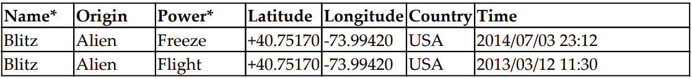
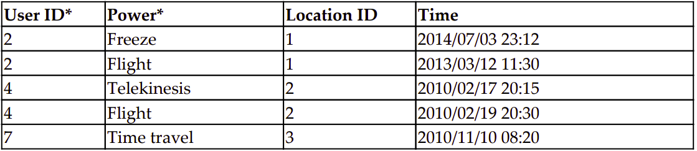

#  Models
  
  
In this chapter, we will discuss the following topics:
* The importance of models
* Class diagrams
* Model structural patterns
* Model behavioral patterns
* Migrations
  
I was once consulted by a data analytics start-up in their early stages. Despite data retrieval being limited to a window of recent data, they had performance issues with page load sometimes taking several seconds. After analyzing their architecture, the problem seemed to be in their data model. However, migrating and transforming petabytes of structured live data seemed impossible.
  
    Show me your flowcharts and conceal your tables, and I shall continue to be mystified.
    Show me your tables, and I won't usually need your flowcharts; they'll be obvious.
    (Fred Brooks, The Mythical Man-month)
  
  
Traditionally, designing code around well thought-out data is always recommended. But in this age of big data, that advice has become more relevant. If your data model is poorly designed, the volume of data will eventually cause scalability and maintenance issues. I recommend using the following adage on how to balance code and data:
  
    Rule of Representation: Fold knowledge into data so program logic can
    be stupid and robust.
  
Think about how you can move the complexity from code to data. It is always harder to understand logic in code compared to data. UNIX has used this philosophy very successfully by giving many simple tools that can be piped to perform any kind of manipulation on textual data.
  
Finally, data has greater longevity than code. Enterprises might decide to rewrite entire codebases because they don't meet their needs anymore, but the databases are usually maintained and even shared across applications.
  
Well-designed databases are more of an art than a science. This chapter will give you some fundamental principles such as Normalization and best practices around organizing your data. But before that, let's look at where data models fit in a Django application.
  
  
# M is bigger than V and C
  
In Django, models are classes that provide an object-oriented way of dealing with databases. Typically, each class refers to a database table and each attribute refers to a database column. You can make queries to these tables using an automatically generated API.
  
Models can be the base for many other components. Once you have a model, you can rapidly derive model admins, model forms, and all kinds of generic views. In each case, you would need to write a line of code or two, just so that it does not seem too magical.
  
Also, models are used in more places than you would expect. This is because Django can be run in several ways. Some of the entry points of Django are as follows:
  
* The familiar web request-response flow
* Django interactive shell
* Management commands
* Test scripts
* Asynchronous task queues such as Celery
  
In almost all of these cases, the model modules would get imported (as a part of **django.setup()**). Hence, it is best to keep your models free from any unnecessary dependencies or to import any other Django components such as views.
  
In short, designing your models properly is quite important. Now let's get started with the SuperBook model design.
  
#### The Brown Bag Lunch:
  
    Author's Note: The progress of the SuperBook project will appear in a box
    like this. You may skip the box, but you will miss the insights,
    experiences, and drama of working in a web application project.
  
    Steve's first week with his client, the SuperHero Intelligence and
    Monitoring (SHIM) for short, was a mixed bag. The office was incredibly
    futuristic, but getting anything done needed a hundred approvals and
    sign-offs.
  
    Being the lead Django developer, Steve had finished setting up a midsized development server hosting four virtual machines over two days.
    The next morning, the machine itself had disappeared. A washing
    machine-sized robot nearby said that it had been taken to the forensic
    department due to unapproved software installations.
  
  
    The CTO, Hart, was, however, of great help. He asked the machine to be
    returned in an hour with all the installations intact. He had also sent preapprovals for the SuperBook project to avoid any such roadblocks in the
    future.
  
  
    Later that afternoon, Steve was having a brown-bag lunch with him.
    Dressed in a beige blazer and light blue jeans, Hart arrived well in time.
    Despite being taller than most people and having a clean-shaven head, he
    seemed cool and approachable. He asked if Steve had checked out the
    previous attempt to build a superhero database in the sixties.
  
    "Oh yes, the Sentinel project, right?" said Steve. "I did. The database
    seemed to be designed as an Entity-Attribute-Value model, something
    that I consider an anti-pattern. Perhaps they had very little idea about the
    attributes of a superhero those days."
  
    Hart almost winced at the last statement. In a slightly lowered voice, he
    said, "you are right, I didn't. Besides, they gave me only two days to
    design the whole thing. I believe there was literally a nuclear bomb ticking
    somewhere."
  
    Steve's mouth was wide open and his sandwich had frozen at its entrance.
    Hart smiled. "Certainly not my best work. Once it crossed about a billion
    entries, it took us days to run any kind of analysis on that damn database.
    SuperBook would zip through that in mere seconds, right?"
  
    Steve nodded weakly. He had never imagined that there would be around
    a billion superheroes in the first place.
  
  
  
#### The model hunt
  
Here is a first cut at identifying the models in SuperBook. As typical for an early attempt,
we have represented only the essential models and their relationships in the form of a
simplistic class diagram:
  

  
Let's forget models for a moment and talk in terms of the objects we are modeling. Each user has a profile. A user can make several comments or several posts. A Like can be related to a single user/post combination.
  
Drawing a class diagram of your models like this is recommended . Class attributes might be missing at this stage, but you can detail them later. Once the entire project is represented in the diagram, it makes separating the apps easier.
  
Here are some tips to create this representation:
* Nouns in your write-up typically end up as entities.
* Boxes represent entities, which become models.
* Connector lines are bi-directional and represent one of the three types of
relationships in Django: one-to-one, one-to-many (implemented with Foreign
Keys), and many-to-many.
* The field denoting the one-to-many relationship is defined in the model on
the **Entity-relationship model (ER-model)**. In other words, the n side is where
the Foreign Key gets declared.
  
The class diagram can be mapped into the following Django code (which will be spread
across several apps):
  
```python
  
class Profile(models.Model):
    user = models.OneToOneField(User)
  
class Post(models.Model):
    posted_by = models.ForeignKey(User)
  
class Comment(models.Model):
    commented_by = models.ForeignKey(User)
    for_post = models.ForeignKey(Post)
  
class Like(models.Model):
    liked_by = models.ForeignKey(User)
    post = models.ForeignKey(Post)
```
  
Later, we will not reference the **User** directly, but use the more general **settings.AUTH_USER_MODEL** instead. 
We are also not concerned about field attributes such as **on_delete** or **primary_key** at this stage. We will get into those details soon.
  
  
# Splitting models.py into multiple files
  
  
  
Like most components of Django, a large models.py file can be split up into multiple files within a package. A package is implemented as a directory, which can contain multiple files, one of which must be a specially named file called __init__.py. This file can be
empty, but should exist.
  
All definitions that can be exposed at package level must be defined in __init__.py with global scope. For example, if we split models.py into individual classes, in corresponding files inside the models subdirectory such as postable.py, post.py, and comment.py, then the directory structure would look as follows: 
  
models/
    - comment.py
    - __init__.py
    - postable.py
    - post.py
  
To ensure that all the models are imported correctly, __init__.py should have the following lines:
  
```python
from postable import Postable
from post import Post
from comment import Comment
```
  
Now you can import models.Post as previously
Any other code in the __init__.py file will be run when the package is imported. Hence, it is the ideal place for any package-level initialization code.
  
# Structural patterns
  
  
This section contains several design patterns that can help you design and structure your models. Structural patterns mentioned here would help you realize the relationships between models more effectively.
  
## Patterns — normalized models
  
  
**Problem:** By design, model instances have duplicated data that causes data inconsistencies.
**Solution:** Break down your models into smaller models through normalization. Connect these models with logical relationships between them.
  
## Problem details
  
  
Imagine if someone designed our post table (omitting certain columns) in the following way:
  

  
I hope you noticed the inconsistent superhero names in the first column (and captain's consistent lack of patience).
  
If we were to look at the first column, we are not sure which spelling is correct __ **Captain Temper** or **Capt. Temper**  . This is the kind of data redundancy that we would like to eliminate through normalization.
  
## Solution details
  
  
Before we take a look at the fully normalized solution, let's have a brief primer on database normalization in the context of Django models.
  
#### Three steps of normalization
  
  
Normalization helps you efficiently store data. Once your models are fully normalized, they will not have redundant data, and each model should contain data that is only logically related to it.
  
To give a quick example, if we were to normalize the post table so that we can unambiguously refer to the superhero who posted that message, then we need to isolate the user details in a separate table. Django already creates the user table by default. So, you only need to refer to the ID of the user who posted the message in the first column, as shown in the following table:
  

  
Now, it is not only clear that there were three messages posted by the same user (with an arbitrary user ID), but we can also find that user's correct name by looking up the user table.
  
Generally, you will design your models to be in their fully normalized form and then selectively denormalize them for performance reasons (see the next section on Performance to know why). In databases, **normal forms** are a set of guidelines that can be applied to a table to ensure that it is normalized. Commonly found normal forms are first, second, and third normal forms, although they could go up to the fifth normal form.
  
  
In the next example, we will normalize a table and create the corresponding Django models. Imagine a spreadsheet called Sightings that lists the first time someone spots a superhero using a power or superhuman ability. Each entry mentions the known origins, superpowers, and location of the first sighting, including latitude and longitude:
  

  
The preceding geographic data has been extracted from
http://www.golombek.com/locations.html
  
## First normal form (1NF)
  
  
- No attribute (cell) with multiple values
- A primary key defined as a single column or a set of columns (composite key)
  
Let's try to convert our spreadsheet into a database table. Evidently, our Power column breaks the first rule.
  
The updated table here satisfies the first normal form. The primary key (marked with a *) is a combination of **Name** and **Power**, which should be unique for each row:
  


  
## Second normal form (2NF)
  
  
The second normal form must satisfy all the conditions of the first normal form. In addition, it must satisfy the condition that all non-primary key columns must be dependent on the entire primary key.
  
In the previous table, notice that Origin depends only on the superhero, that is, Name. It doesn't matter which Power we are talking about. So, Origin is not entirely dependent on the composite primary key — Name and Power.
  
Let's extract just the origin information into a separate table called Origin, as shown here:
  

  
Now our Sightings table updated to be compliant to the second normal form looks as follows:
  

  
## Third normal form (3NF)
  
  
In third normal form, the tables must satisfy the second normal form and should additionally satisfy the condition that all non-primary key columns must be directly dependent on the entire primary key and must be independent of each other.
  
Think about the **Country** column for a moment. Given the **Latitude** and **Longitude** , you can easily derive the **Country** column. Even though the country where a superpower was sighted is dependent on the Name-Power composite primary key, it is only indirectly dependent on them.
  
So, let's separate the location details into a separate countries table as follows:
  

  
Now our Sightings table in its third normal form looks as follows:
  

  
As before, we have replaced the superhero's name with the corresponding User ID that can be used to reference the user table.
  
# Django models
  
  
We can now take a look at how these normalized tables can be represented as Django models. Composite keys are not directly supported in Django. The solution used here is to apply the surrogate keys and specify the *unique_together* property in the *Meta* class:
  
```python
  
class Origin(models.Model):
    superhero = models.ForeignKey(
    settings.AUTH_USER_MODEL, on_delete=models.CASCADE)
    origin = models.CharField(max_length=100)
  
    def __str__(self):
        return "{}'s orgin: {}".format(self.superhero, self.origin)
  
  
class Location(models.Model):
    latitude = models.FloatField()
    longitude = models.FloatField()
    country = models.CharField(max_length=100)
  
    def __str__(self):
        return "{}: ({}, {})".format(
            self.country,
            self.latitude, 
            self.longitude
            )
  
    class Meta:
        unique_together = ("latitude", "longitude")
  
  
class Sighting(models.Model):
    superhero = models.ForeignKey(
    settings.AUTH_USER_MODEL, on_delete=models.CASCADE)
    power = models.CharField(max_length=100)
    location = models.ForeignKey(Location, on_delete=models.CASCADE)
    sighted_on = models.DateTimeField()
  
    def __str__(self):
        return "{}'s power {} sighted at: {} on {}".format(
        self.superhero,
        self.power,
        self.location.country,
        self.sighted_on
        )
  
    class Meta:
        unique_together = ("superhero", "power")
  
```
  
# Performance and denormalization
  
  
Normalization can adversely affect performance. As the number of models increase, the number of joins needed to answer a query also increase. For instance, to find the number of superheroes with the Freeze capability in the USA, you will need to join four tables. Prior to normalization, any information can be found by querying a single table.
  
You should design your models to keep the data normalized. This will maintain data integrity. However, if your site faces scalability issues, then you can selectively derive data from those models to create denormalized data.
  
##### Best Practice:
  
*Normalize while designing, but denormalize while optimizing.*
  
  
For instance, if counting the sightings in a certain country is very common, then add it as an additional field to the *Location* model. Now, you can include the other queries using Django **object-relational mapping (ORM)** , unlike a cached value.
  
However, you need to update this count each time you add or remove a sighting. You need to add this computation to the *save* method of Sighting, add a signal handler, or even compute using an asynchronous job.
  
If you have a complex query spanning several tables, such as a count of superpowers by country, then creating a separate denormalized table might improve performance. 
Typically, this table will be in a faster in-memory database or a cache. As before, we need to update this denormalized table every time the data in your normalized models changes (or you will have the infamous cache-invalidation problem).
  
Denormalization is surprisingly common in large websites because it is a tradeoff between speed and space. Today, space is cheap, but speed is crucial to user experience. So, if your queries are taking too long to respond, then you might want to consider it.
  
# Should we always normalize?
  
  
Too much normalization is not necessarily a good thing. Sometimes, it can introduce unnecessary tables that can complicate updates and lookups.
  
For example, your user model might have several fields for their home address. Strictly speaking, you can normalize these fields into an address model. However, in many cases, it would be unnecessary to introduce an additional table to the database.
  
Rather than aiming for the most normalized design, carefully weigh each opportunity to normalize and consider the trade offs before refactoring.
  