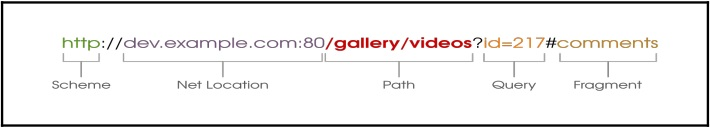

# ویوها و URLها

در این فصل ما در مورد مباحث زیر بحث خواهیم کرد:

- ویوهای مبتنی بر کلاس و مبتنی بر تابع
- میکسین‌ها
- دکوراتورها
- الگوهای مرسوم ویو
- طراحی کردن URLها
- کار کردن با ری‌اکت و دیگر فرانت‌اندهای جاوا اسکریپت

## نگاهی به ویو از بالا 

در جنگو، ویوها به عنوان فراخوانی کننده تعریف می‌شوند که درخواست‌ها را می‌پذیرند و پاسخ‌ها را برمی‌گردانند. ویوها معمولاً یک تابع یا کلاسی به همراه متود کلاسی مخصوص مثل ```()as_view``` هستند.

در هر دو مورد ما یک تابع پایتون معمولی میسازیم که ```HTTPRequest``` را به عنوان آرگومان اول می‌گیرد و ```HTTPResponse``` را به عنوان پاسخ برمی‌گرداند.
یک ```پیکربندی URL یا (URLConf)``` نیز میتواند به عنوان آرگومان اضافه به این تابع فرستاده شود. این آرگومان‌ها می‌توانند از، بخشی از URL گرفته شوند و یا مقدار آن به صورت پیشفرض معین شده باشد.

نمونه یک ویوی ساده به شکل زیر است:

```
    # In views.py
    from django.http import HttpResponse

    def hello_fn(request, name="World"):
        return HttpResponse("Hello {}!".format(name))
```

هر دو خط تابع ویو ما به قدری ساده است که راحت میشود آن را متوجه شد. در حال حاضر ما هیچ کاری با آرگومان‌هایی که با درخواست فرستاده شده‌اند نداریم. برای بهتر فهمیدن کانتکس که در کدام ویو صدا زده شده است، می‌توانیم درخواست را بررسی کنیم به طور مثال با نگاه کردن به پارامترهای ```GET/POST```، مسیر URI یا هدرهای HTTP مانند ```REMOTE_ADDR```.

تنظیم نقشه مسیرها در ```پیکربندی URL``` به صورت سنتی است که از عبارات منظم استفاده می‌شود و نمونه آن به صورت زیر است:

```
    # In urls.py
        url(r'^hello-fn/(?P<name>\w+)/$', views.hello_fn),
        url(r'^hello-fn/$', views.hello_fn),
```
 
برای پشتیبانی کردن از دو الگوی URL میتوانیم از همان ویو مجدداً استفاده کنیم. الگوی اول یک نام را به عنوان آرگومان می‌گیرد. الگوی دوم هیچ آرگومانی را از URL نمی‌گیرد و تابع ویو از مقدار پیشفرض معین شده «World» برای نام را استفاده می‌کند.

وقتی شما از سینتکس مسیریابی ساده شده که در جنگو 2.0 معرفی شد استفاده می‌کنید، ارسال پارامترها به طور یکسان کار میکند.پس شما نگاشت معادل آن را میتوانید در ```viewschapter/urls.py``` پیدا کنید:

```
    # In urls.py
        path('hello-fn/<str:name>/', views.hello_fn),
        path('hello-fn/', views.hello_fn),
```

ما در ادامه کتاب از سینتکس ساده شده استفاده می‌کنیم که خواندن آن راحت‌تر است.

### ویوهایی که کلاسی‌تر هستند

ویوهای مبتنی بر کلاس در جنگو 1.4 معرفی شدند. در اینجا ما معادل تابع ویو قبلی را که دیدیم برای ویو مبتنی بر کلاس بازنویسی کرده‌ایم:

```
from django.views.generic import View


class HelloView(View):
    def get(self, request, name="World"):
        return HttpResponse("Hello {}!".format(name))
```

در اینجا نیز متناظر با قبل در ```پیکربندی URL``` ما دو خط داریم که در زیر آمده است:

```
# In urls.py
    path('hello-cl/<str:name>/', views.HelloView.as_view()),
    path('hello-cl/', views.HelloView.as_view()),
```

چندین تفاوت جالب بین ویوهای کلاسی و ویوهای تابعی وجود دارد. این که ما نیاز داریم اول کلاس را تعریف کنیم خیلی واضح است و بعد از آن باید صراحتاً فقط درخواست‌های ```GET``` را مدیریت کنیم. در ویو  تابعی قبلی برای متود ```POST ،GET``` یا دیگر عملکردهای HTTP همان پاسخ را دریافت می‌کنیم. همانطور که در دستورهای زیر از کلاینت در شل جنگو استفاده می‌کنیم:

```
    >>> from django.test import Client
    >>> c = Client()

    >>> c.get("http://0.0.0.0:8000/hello-fn/").content
    b'Hello World!'

    >>> c.post("http://0.0.0.0:8000/hello-fn/").content
    b'Hello World!'

    >>> c.get("http://0.0.0.0:8000/hello-cl/").content
    b'Hello World!'

    >>> c.post("http://0.0.0.0:8000/hello-cl/").content
    Method Not Allowed (POST): /hello-cl/
    b''
```

توجه کنید که متود ```POST``` به جای اینکه در سکوت نادیده گرفته شود دیگر غیرمجاز است. صریح بودن از نقطه نظر امنیت و نگه‌داری ویو خوب است.

مهمترین مزیت استفاده از کلاس این است که هنگام شخصی سازی ویو می‌توانیم راحت‌تر آن را انجام دهیم. شما می‌توانید یک کلاس عمومی ویو برای خوش آمدگویی بنویسید و خوش آمدگویی‌های اختصصاصی خود را نیز از آن استخراج کنید مثل زیر:

```
    class GreetView(View):
        greeting = "Hello {}!"
        default_name = "World"
        def get(self, request, **kwargs):
            name = kwargs.pop("name", self.default_name)
            return HttpResponse(self.greeting.format(name))

    class SuperVillainView(GreetView):
        greeting = "We are the future, {}. Not them. "
        default_name = "my friend"
```

پس ```پیکربندی URL``` نشأت گرفته از کلاس به صورت زیر است:

```
    # In urls.py
        path('hello-su/<str:name>/', views.SuperVillainView.as_view()),
        path('hello-su/', views.SuperVillainView.as_view()),
```

در صورتی که شما بخواهید چند آرگومان کلمه کلیدی با مقادیر پیشفرضشان را به تابع ویو اضافه و شخصی سازی کنید در شیوه مشابه ممکن نیست و این می‌تواند غیر قابل مدیریت باشد.این دقیقاً همان دلیلی است که ویوهای عمومی، از تابع‌های ویو به ویوهای مبتنی بر کلاس مهاجرت کردند.

**جنگو رها شده(داستان)**

استیو بعد از صرف دو هفته زمان برای شکار کردن یه توسعه دهنده خوب جنگو شروع به فکر کردن خلاقانه و متفاوت کرد. متوجه موفقیت بزرگشان در رویداد هکاتون شد، او و هارت یک مسابقه *جنگوی رها شده* را در S.H.I.M سازماندهی کرده‌اند. قوانین آن‌ها بسیار ساده است: ساختن یک وب اپلیکیشن در یک روز. این ممکنه ساده باشد ولی شما نمی‌توانی یک روز را رد کنی یا زنجیر را بشکنی. هر کسی که طولانی‌ترین زنجیر را بسازد برنده است.

برنده، برد زانی(Brad Zanni) یک سوپرایز واقعی بود. اون یک طراح سنتی بود که هیچ سررشته‌ای از برنامه نویسی نداشت. اون فقط یک بار در کلاس آموزشی یک هفته‌ای جنگو فقط برای ضربه زدن شرکت کرده بود. اون یک زنجیره ناگسستنی از 21 سایت جنگو که همه از صفر ساخته شده بودند را مدیریت کرد.

استیو برای روز بعد از همان روز با او برای ساعت 10 در دفترش قرار ملاقاتی گذاشت. اگر چه برد نمی‌دانست که در فرآیند استخدام قرار گرفته است. در زمان مقرر شده ضربه آرامی شنیده شد و پسری لاغر و ریشو که اواخر بیست سالگی بود وارد شد. همانطور که آن‍ها صحبت می‌کردند، برد هیچ تظاهری به واقعیت نکرد که یک برنامه‌نویس نیست. در واقع برای او هیچ تظاهر کردنی نبود. با چشمان آرام آبیش به عینک ضخیمش نگاهی انداخت و توضیح داد که رازش خیلی ساده بوده است؛ الهام بگیر و تمرکز کن.

او روزش را با یک وایرفریم(طرح اولیه) ساده شروع می‌کرد. بعد می‌خواست یک پروژه خام جنگو را با قالب بوت استرپ توئیتر بسازد. او ویوهای عمومی مبتنی بر کلاس جنگو را پیدا کرد که راهی عالی‌ برای کد نوشتنی بدون سختی، برای ساختن ویوها بود. بعضی اوقات او از یک یا دوتا از میکسین‌های جنگو استفاده میکرد و همچنین عاشق رابط پنل مدیریت جنگو برای اضافه کردن داده در هنگام کار کردن بود.

پروژه مورد علاقه‌اش Labyrinth بود؛ یک هانی پات که به فروم بیس بال مبدل شده بود. او حتی توانست چندین ربات نظارتی که در حال شکار سایت‌های آسیب پذیر بودند را نیز به دام بیاندازد. وقتی که استیو درباره پروژه سوپر کتاب به او توضیح داد، اون خیلی بیشتر خوشحال شد که این پیشنهاد را قبول کند. ایده ساخت شبکه اجتماعی میان ستاره‌ای واقعاً او را مجذوب خود کرد. با کمی گشت و گذار بیشتر، استیو می‌توانست چند ده پروفایل جذاب مثل برد را در S.H.I.M پیدا کند. او یاد گرفت که در وهله اول به جای گشتن در خارج از مجموعه، بهتر است که اول، داخل سازمان را جستجو کند.

## ویوهای عمومی مبتنی بر کلاس

ویوهای عمومی مبتنی بر کلاس، ویوهای مرسومی برای پیاده سازی کردن به شیوه شئ گرا (مخصوصاً متود الگوی قالب) برای استفاده مجدد بهتر هستند. من از اصطلاح ویوهای عمومی متنفرم و ترجیح میدهم آن‌ها را **ویوهای استاک** صدا بزنم، مثل عکس‌های استوک. شما می‌توانید با کمی تغییر و تحول برای اکثر کارهای مرسومی که نیاز دارید از آن‌ها استفاده کنید.

ویوهای عمومی به این دلیل ساخته شدند که توسعه دهنده‌های جنگو احساس میکردند دارند همان نوع ویوها را در هر پروژه‌ای دوباره می‌سازند. تقریباً هر پروژه نیاز به یک صفحه داشت که لیستی از اشیاء(```ListView```)، جزیئات یک شئ(```DetailView```) یا فرمی برای ساختن یک شئ(```CreateView```) را نشان دهند. به دلیل اصل DRY(خودت را تکرار نکن)، این ویوهای با قابلیت استفاده مجدد با جنگو همراه شدند.

جدول مناسبی از ویوهای عمومی در جنگو 2.0 در زیر آمده است:

| توضیحات | نام کلاس | نوع کلاس |
| :---: | :---: | ---: |
|این ویو پدر تمام ویوها است که درستی(سلامت عقل) و ارسال(اعزام) را بررسی می‌کند.|View|پایه(base)|
|این ویو از قالب رندر میگیرد و کلمات کلیدی ```پیکربندی URL``` را در درون کانتکس قرار می‌دهد.|TemplateView|پایه(base)|
|این ویو هر درخواست ```GET``` را ریدایرکت می‌کند.|RedirectView|پایه(base)|
|این ویو از آیتم‌های قابل تکرار مثل ```queryset``` رندر میگیرد.|ListView|لیست(List)|
|این ویو، از آیتم بر اساس ```pk(کلید اصلی)``` یا ```slug(آدرس مخصوص آن آیتم)``` در ```پیکربندی URL``` رندر میگیرد.|DetailView|جزئیات(Detail)|
|این ویو از فرم رندر میگیرد و آن را پردازش می‌کند.|FormView|ویرایش(Edit)|
|این ویو از فرم رندر میگیرد و آن را برای ساخت یک شئ جدید پردازش می‌کند.|CreateView|ویرایش(Edit)|
|این ویو از فرم رندر میگیرد و آن را برای ویرایش کردن یک شئ پردازش می‌کند.|UpdateView|ویرایش(Edit)|
|این ویو از فرم رندر میگیرد و برای حذف کردن یک شئ آن را پردازش می‌کند.|DeleteView|ویرایش(Edit)|
|این ویو لیستی از اشیاء را با فیلد ```تاریخ``` رندر میگیرد که آخرین شئ در اول قرار میگیرد و به همین ترتیب. |ArchiveIndexView|تاریخ(Date)|
|این ویو لیستی از اشیاء را با فیلد ```سال``` که توسط ```پیکربندی URL``` به آن داده می‌شود، رندر میگیرد.|YearArchiveView|تاریخ(Date)|
|این ویو لیستی از اشیاء را با فیلد ```سال``` و ```ماه``` رندر میگیرد.|MonthArchiveView|تاریخ(Date)|
|این ویو لیستی از اشیاء را با فیلد ```سال``` و شماره ```هفته``` رندر میگیرد.|WeekArchiveView|تاریخ(Date)|
|این ویو لیستی از اشیاء را با فیلد ```سال، ماه``` و ```روز``` رندر میگیرد.|DayArchiveView|تاریخ(Date)|
|این ویو لیستی از اشیاء که تاریخ آن‌ها، امروز است را رندر میگیرد.|TodayArchiveView|تاریخ(Date)|
|این ویو شئ‌ای را که با فیلدهای ```سال، ماه``` و ```روز``` که بر اساس ```pk(کلید اصلی)``` یا ```slug(آدرس مخصوص آن آیتم)``` مشخص شده است را رندر می‌گیرد.|DateDetailView|تاریخ(Date)|
|این ویو فرم ورود را رندر میگیرد و فرآیند وارد شدن را مدیریت می‌کند.|LoginView|احراز هویت(Auth)|
|این ویو کاربرانی که قبلاً وارد شده اند و هنوز از حساب خود خارج نشده‌اند را خارج کرده و پیام **شما خارج شدید** را به آن‌ها نشان می‌دهد.|LogoutView|احراز هویت(Auth)|
|این مجموعه‌ای از شش ویو است که جریان کار فراموشی رمز عبور و تغییر آن را مدیریت می‌کند.|Password*View|احراز هویت(Auth)|

ما کلاس‌های پایه مثل ```BaseDetailView``` یا میکسین‌ها مانند ```SingleObjectMixin``` را اینجا ذکر نکردیم. آن‌ها به عنوان کلاس‌های پدر طراحی شده‌اند و در بیشتر موارد، شما از آن‌ها به صورت مستقیم استفاده نمی‌کنید.

من قویاً توصیه میکنم که مناسب‌ترین ویوی عمومی را انتخاب کنید. به طور مثال به جای استفاده از ```ListView``` می‌توانید همان ویو را با استفاده از ```TemplateView``` پیاده سازی کنید یا حتی ```View```. هر چند که اینطور شما اکثر مزیت‌های استفاده کردن از ویوهای عمومی را از دست می‌دهید.

پس خودتان را با این جدول آشنا کنید و ویو عمومی که با توجه به نیازتان، بیشترین تطابق را دارد انتخاب کنید. بهترین منبع برای ویوهای عمومی مبتنی بر کلاس درجه یک به آدرس <http://ccbv.co.uk/> است(اکثر توسعه دهندگان جنگو این آدرس را بخاطر دارند). شما تمام ویژگی‌ها و متودهای هر یک از ویوهایی که در اینجا ذکر شد را پیدا خواهید کرد.

### ویوهای مبتنی بر کلاس همیشه عمومی ویوهای مبتنی بر کلاس نیستند

اکثر افراد بین ویوهای مبتنی بر کلاس با ویوهای عمومی مبتنی بر کلاس گیج می‌شوند. اسم‌های آن‌ها بهم شبیه است ولی یکی نیستند. این منجر به برخی ```تصورات غلط(misconceptions)``` شده که در زیر آمده است:

- **فقط ویوهای عمومی هستند که با جنگو همراه شده‌اند**: خوشبختانه این اشتباه است. هیچ جادوی خاصی در ویوهای عمومی مبتنی بر کلاس نیست که ارائه شده باشد.

شما آزادید که مجموعه ویوهای عمومی مبتنی بر کلاس خود را منتشر کنید همچنین می‌توانید از کتابخانه‌های واسط مثل```django-vanilla-views```(<http://django-vanilla-views.org/>) فلان استفاده کنید که پیاده‌سازی ساده‌تری نسبت به ویوهای عمومی استاندارد دارند. به خاطر داشته باشید که استفاده از ویوهای عمومی شخصی‌سازی شده ممکن است که کد شما را برای بقیه ناآشنا کند.
- **ویوهای مبتنی بر کلاس همیشه باید از ویوهای عمومی استخراج شوند**: دوباره می‌گوییم، هیچ چیز جادویی برای ویوهای عمومی مبتنی بر کلاس وجود ندارد. اگر چه 90 درصد اوقات، شما کلاس عمومی مثل ```View``` را پیدا می‌کنید که برای استفاده به عنوان کلاس پایه ایده‌آل است. شما آزادید که ویژگی‌های مشابه خودتان را پیاده‌سازی کنید.

## میکسین‌های ویو

میکسین‌ها ذات کدهای DRY در ویوهای مبتنی بر کلاس هستند. میکسین‌های ویو نیز مثل میکسین‌های مدل، از مزیت ارث‌بری چندگانه پایتون برای استفاده مجدد تکه‌های عملکرد استفاده می‌کنند. آن‌ها اغلب کلاس‌های بدون پدر در پایتون 3 هستند(یا اگر چه این‌ها کلاس‌های سبک جدید هستند از کلاس ```شئ(object)``` در پایتون 2 استخراج شده‌اند).

میکسین‌ها، پردازش‌های ویو را که در جای خوب تعریف شده باشند پیگیری میکنند. به طور مثال اکثر ویوهای عمومی از ```get_context_data``` استفاده می‌کنند تا دیکشنری کانتکس را با آن تنظیم کنند. کلاس مشتق شده یا میکسین‌ها میتوانند متغیر کانتکس اضافه را به آن اضافه کند. برای مثال ```فید(feed)``` حاوی فیدهای کاربران درباره پست‌ها است. در زیر میکسین آن که ممکن است چگونه باشد آمده است:

```
    class FeedMixin:
        def get_context_data(self, **kwargs):
            context = super().get_context_data(**kwargs)
            context["feed"] = models.Post.objects.viewable_posts(
                self.request.user)
            return context
```

متود ```get_context_data``` در ابتدا کانتکس‌های همنام خود را در تمامی کلاس‌های پایه فراخوانی کرده و تجمیع می‌کند. بعد مقدار دیکشنری کانتکس را با متغیر ```feed``` بروزرسانی می‌کند.

حالا با قرار گرفتن آن در لیست کلاس های پایه می‌توان از این میکسین برای افزودن فید کاربر استفاده کرد. اگر سوپر کتاب به یک صفحه اصلی شبکه اجتماعی معمولی با یک فرم برای ساختن یک پست بر اساس فید شما نیاز دارد، می‌تواند از این میکسین که در زیر آمده است استفاده کند:

```
    class MyFeed(FeedMixin, generic.CreateView):
        model = models.Post
        template_name = "myfeed.html"
        success_url = reverse_lazy("my_feed")
```

یک میکسین که خوب نوشته شده باشد الزامات خیلی کمی دارد. باید انقدر انعطاف پذیر باشد که در اکثر موقعیت‌ها مفید واقع شود. در مثال قبل، ```FeedMixin``` متغیر کانتکس ```feed``` را در کلاس مشتق شده بازنویسی خواهد کرد. اگر یک کلاس پدر از متغیر کانتکس ```feed``` استفاده کند می‌تواند روی میکسین باعث ایجاد نقص شود. از این رو خیلی مفیدتر خواهد بود اگر یک متغیر کانتکس شخصی سازی شده جدید را بسازد مثل زیر:

```
    class FeedMixin(object):
        feed_context_name = "feed"

        def get_context_data(self, **kwargs):
            context = super().get_context_data(**kwargs)
            context[self.feed_context_name] = 
                models.Post.objects.viewable_posts(self.request.user)
            return context
```

توانانی ترکیب کردن میکسین‌ها با بقیه کلاس‌ها نیز برایشان هم بزرگ‌ترین مزیت است و هم بزرگ‌ترین عیب. اشتباه ترکیب کردن آن‌ها می‌تواند به نتایج عجیب و غریب منجر شود. پس قبل از استفاده از میکسین نیاز دارید اطمینان حاصل کنید که سورس کد میکسین و بقیه کلاس‌ها، درگیری‌ای با متودها یا متغیرهای کانتکس نداشته باشند.

### ترتیبی از میکسین‌ها

شما ممکن است با کدهایی مواجه شده باشید که چندین میکسین به صورت زیر داشته‌اند:

```
class ComplexView(MyMixin, YourMixin, AccessMixin, DetailView):
```

پی بردن به ترتیب لیست کلاس‌های پایه می‌تواند بسیار مشکل باشد. مثل اکثر چیزها در پایتون، قوانین عادی پایتون اعمال می‌شود. **Method Resolution Order (MRO)** پایتون معین می‌کند که آن‌ها چطور باید مرتب شوند.

مخلص کلام این است که میکسین‌ها اول بیایند و کلاس‌های پایه، آخر. هر چی کلاس پدر تخصصی‌تر باشه باید چپ تر قرار بگیرد. در عمل این تنها قانونی است که باید یادتان بماند. 

برای اینکه متوجه شوید  چرا اینطوری کار میکند به مثال ساده زیر توجه کنید:

```
    class A:
        def do(self):
            print("A")


    class B:
        def do(self):
            print("B")


    class BA(B, A):
        pass


    class AB(A, B):
        pass


    BA().do() # Prints B
    AB().do() # Prints A
```

همانطور که شما انتظار دارید اگر در لیست کلاس‌های پایه ```B``` قبل از ```A``` ذکر شده بود، متود ```B``` صدا زده میشد و بالعکس.

حالا تصور کنید که ```A``` کلاس پایه‌ای مثل ```CreateView``` باشد و ```B``` میکسینی مثل ```FeedMixin```. یک میکسین عملکرد پایه‌ای یک کلاس پایه را بیش از پیش افزایش می‌دهد. از این رو باید کد میکسین اول عمل کند و به نوبه خود اگر نیاز بود کلاس پایه هم صدا زده شود. پس ترتیب درست، ```BA```(میکسین اول، پایه آخر) است.

ترتیب اینکه مشخص کنیم چطور کلاس‌های پایه را صدا بزنیم می‌تواند با چک کردن ویژگی ```__mro__``` کلاس بررسی شود:

```
    >>> AB.__mro__
    (<class 'AB'>, <class 'A'>, <class 'B'>, <class 'object'>)
```

پس اگر ```AB``` متود ```()super``` را صدا بزند، اول ```A``` فراخوانی می‌شود؛ بعد متود ```()super``` کلاس ```A```، کلاس ```B``` را صدا خواهد زد و به همین ترتیب.


**نکته(TIP)**

معمولاً MRO پایتون به ترتیب در مرحله اول، از عمق شروع میکند و در مرحله دوم از چپ به راست را، برای انتخاب متود در سلسله مراتب کلاس‌ها دنبال می‌کند. جزئیات بیشتر میتواند در <http://www.python.org/download/releases/2.3/mro/> پیدا شود.

## دکوراتورها

قبل از ویوهای مبتنی بر کلاس، دکوراتورها تنها راه برای تغییر رفتار ویوهای مبتنی بر تابع بودند. از آنجایی که اطراف یک تابع قرار دارند، نمی‌توانستند عملکرد ویو را تغییر دهند و بنابراین به طور موثر با آن، مثل جعبه‌ای که از درونش خبر ندارند رفتار میکردند. 

یک ```دکوراتور(Decorator)``` تابعی است که تابعی را می‌گیرد و یک تابع دکوراتور شده را برمیگرداند. گیج شدید؟ یک سری کد وجود دارد که به شما کمک می‌کند این مسئله را بهتر متوجه شوید. استفاده از علامت ```@``` برای نشان دادن دکوراتور است، همانطور که در زیر دکوراتور ```login_required``` نشان داده شده است:

```
    @login_required
    def simple_view(request):
        return HttpResponse()
```

کدی که در ادامه آمده دقیقاً همان کد قبلی است:

```
    def simple_view(request):
        return HttpResponse()

    simple_view = login_required(simple_view)
```

از آنجایی که ```login_required``` اطراف ویو قرار گرفته است، تابع اطراف گیرنده(wrapper)، کنترل تابع را بدست می‌گیرید. اگر کاربری وارد نشده باشد به ```settings.LOGIN_URL``` ریدایرکت می‌شود. در غیر اینصورت تابع ```simple_view``` را اجرا می‌کند انگار که اصلاً وجود نداشته است.

دکوراتورها انعطاف کمتری نسبت به میکسین‌ها دارند هرچند ساده‌ترند. شما می‌توانید از هر دو آنها یعنی دکوراتورها و میکسین‌ها استفاده کنید. در حقیقت، تعداد زیاد از میکسین‌ها با دکوراتورها پیاده‌سازی شده‌اند. 

## الگوهای ویو

بیاید چندتا از الگوهای طراحی دیده شده در طراحی ویو را ببینیم.

### الگو - دسترسی به ویوهای کنترل شده

**مسئله**: صفحات نیاز دارند با شروطی قابل دسترسی باشند چه کاربر وارد شده باشد، چه عضو باشد چه کارمند یا هر شرط دیگری.

**راه حل**: استفاده از میکسین‌ها یا دکوراتورها برای کنترل دسترسی به ویو.

#### جزئیات مسئله

اکثر وب سایت‌ها صفحاتی دارند که فقط اگر شما وارد شده باشید می‌توانید به آن دسترسی پیدا کنید. مسلماً بقیه صفحات در دسترس افراد ناشناس یا بیننده‌های عمومی است. اگر بیننده‌های ناشناس بخواهند تلاش کنند که به صفحاتی که باید کاربر وارد شده باشد دسترسی پیدا کنند، به صفحه ورود منتقل می‌شوند. در حالت ایده‌آل به این صورت است که بعد از وارد شدن دوباره به همان صفحه قبلی که میخواستند آن را ببینند منتقل شوند. 

به طور مشابه صفحاتی هستند که مسلماً فقط نوع خاصی از کاربران می‌توانند آن را ببینند. به طور مثال پنل مدیریت جنگو فقط برای کارمندان قابل دسترس است. اگر افراد غیر کارمند تلاش کنند که به صفحات مدیریت دسترسی پیدا کنند، به صفحه ورود منتقل می‌شوند.

در نهایت، صفحاتی هستند که اگر فقط دسترسی دیدن آن‌ها به ما اعطا شده باشد می‌توانیم آن‌ها را ببینیم. برای مثال توانایی ویرایش کردن یک نوشته باید فقط برای نویسنده آن قابل دسترس باشد. هر کس دیگری که بخواهد به این صفحه دسترسی پیدا کند باید خطای **دسترسی غیرمجاز(Permission Denied)** را ببیند.

#### جزئیات راه حل

دو راه برای کنترل دسترسی ویو وجود دارد:

1. به وسیله استفاده از دکوراتورها روی ویوهای مبتنی بر تابع یا ویوهای مبتنی بر کلاس:

```
    @login_required(MyView.as_view())
```

2. به وسیله بازنویسی کردن متود ```dispatch``` ویوهای مبتنی بر کلاس از طریق میکسین:

```
    from django.utils.decorators import method_decorator

    class LoginRequiredMixin:
        @method_decorator(login_required)
        def dispatch(self, request, *args, **kwargs):
            return super().dispatch(request, *args, **kwargs)
```

3. ما واقعا اینجا نیازی به دکوراتورها نداریم. به شما توصیه میشود که از حالت خیلی صریح‌تر زیر استفاده کنید:

```
    class LoginRequiredMixin:

        def dispatch(self, request, *args, **kwargs):
            if not request.user.is_authenticated():
                raise PermissionDenied
            return super().dispatch(request, *args, **kwargs)
```

وقتی شما خطای ```دسترسی غیر مجاز(Permission Denied)``` را مطرح کنید. جنگو قالب ```403.html``` در دایرکتوری ریشه شما را نمایش می‌دهد یا در صورت نبود آن، صفحه استاندارد **403 ممنوع(403 Forbidden)** را نمایش می‌دهد.

البته شما به مجموعه‌ای از میکسین‌های قدرتمند و شخصی سازی شده برای پروژه‌های واقعی  نیاز دارید. پکیج ```django-braces``` (<https://github.com/brack3t/django-braces>) مجموعه‌ عالی از میکسین‌ها مخصوصاً برای کنترل کردن دسترسی به ویوها دارد.

در اینجا مثالی از استفاده آن برای کنترل دسترسی به ویو برای کاربران وارد شده و ناشناس آورده شده است:

```
    from braces.views import LoginRequiredMixin, AnonymousRequiredMixin

    class UserProfileView(LoginRequiredMixin, DetailView):
        # This view will be seen only if you are logged-in
        pass

    class LoginFormView(AnonymousRequiredMixin, FormView):
        # This view will NOT be seen if you are loggedin
        authenticated_redirect_url = "/feed"
```

جنگو ```LoginRequiredMixin``` از آدرس ```django.contrib.auth.mixins``` را با پیاده سازی خودش آماده کرده است اما میکسینی برای محدود کردن ویو فقط برای کاربران ناشناس آماده نکرده است.

کاربران کارمند در جنگو فقط کاربرانی هستند که پرچم ```is_staff``` آن‌ها در مدل کاربر تنظیم شده است. شما می‌توانید میکسین پیش ساخته ```UserPassesTestMixin``` را صدا بزنید و استفاده کنید که در زیر مثال آن آمده است:

```
    from django.contrib.auth.mixins import UserPassesTestMixin

    class SomeStaffView(UserPassesTestMixin, TemplateView):
        def test_func(self, user):
            return user.is_staff
```

شما همچنین می‌توانید میکسین‌های خودتان را بسازید که بررسی‌های به خصوصی را انجام دهد مانند اینکه شئ‌ای توسط نویسنده‌اش ویرایش می‌شود یا خیر(به وسیله مقایسه‌‌اش با یوزرهای وارد شده):

```
    class CheckOwnerMixin:
        # To be used with classes derived from SingleObjectMixin
        def get_object(self, queryset=None):
            obj = super().get_object(queryset)
            if not obj.owner == self.request.user:
                raise PermissionDenied
            return obj
```

توصیه می‌شود تا حد امکان به کاربران کمترین امتیاز برای اشیاء داده شود. به این اصل، **اصل حداقل امتیاز(Principle of least privilege)** گفته می‌شود. به عنوان بهترین شیوه، حتما مطمئن شوید که کدام کاربران یا گروه‌ها به جای دسترسی پیشفرضی که دارند، مطمئناً می‌توانند چه کارهایی روی اشیاء انجام دهند.

### الگو - بهبود دهنده‌های کانتکس

**مسئله**: چندین ویو بر اساس ویوهای عمومی نیاز به همان متغیر کانتکس دارند.

**راه حل**: ساخت یک میکسین که مجموعه‌هایی از متغیر کانتکس را به اشتراک بگذارد.

#### جزئیات مسئله

قالب‌های جنگو فقط می‌توانند متغیرهایی را نمایش دهند که در دیکشنری کانتکس حاضر باشند. هرچند سایت‌ها نیاز دارند که همان اطلاعات در چندین صفحه باشد. برای نمونه، سایدباری که پست‌های اخیر را در فید شما نمایش می‌دهد ممکن است در چندین ویو نیاز باشد.

هرچند اگر از ویو عمومی مبتنی بر کلاس استفاده کنیم، فقط می‌توانیم مجموعه محدودی از متغیرهای کانتکس مربوط به آن مدل به خصوص استفاده کنیم. تنظیم کردن همان متغیر کانتکس در هر ویو پیروی کردن از اصل DRY نیست.

#### جزئیات راه حل

اکثر ویوهای عمومی مبتنی بر کلاس از ```ContextMixin``` مشتق شده‌اند که متود ```get_context_data``` را آماده کرده است و اکثر کلاس‌ها آن را بازنویسی می‌کنند و متغیرهای کانتکس خودشان را به آن اضافه می‌کنند. درحالی که بهترین شیوه بازنویسی این متود است؛ شما اول نیاز دارید ```get_context_data``` سوپر کلاس را صدا بزنید و بعد متغیرهای کانتکس خودتان را اضافه یا بازنویسی کنید.

ما می‌توانیم این حالت از میکسین‌ها را همانطور که در قبل دیدیم انتزاع کنیم:

```
    class FeedMixin(object):
        def get_context_data(self, **kwargs):
            context = super().get_context_data(**kwargs)
            context["feed"] = models.Post.objects.viewable_posts(
                self.request.user)
            return context
```

ما می‌توانیم این میکسین را به ویوهامان اضافه کرده و از متغیرهای کانتکس اضافه شده نیز در قالبمان استفاده کنیم. به خاطر داشته باشید که ما از مدیر مدل(model manager) تعریف شدۀ [فصل 3]('../../../03-%20Models/README.md) *مدل‌ها*، برای فیلتر کردن پست‌ها استفاده می‌کنیم.

راه حل خیلی عمومی‌تر استفاده از میکسین ```StaticContextMixin``` از پکیج ```django-braces``` برای متغیرهای کانتکس ایستا است. به طور مثال ما می‌توانیم متغیر کانتکس ```latest_profile``` را که آخرین کاربری که به اضافه شده است، را اضافه کنیم:

```
    class CtxView(StaticContextMixin, generic.TemplateView):
        template_name = "ctx.html"
        static_context = {"latest_profile": Profile.objects.latest('pk')}
```

در اینجا ```static_context``` به معنای هرچیزی است که از یک درخواست تا به درخواست دیگر تغییری نمی‌کند. به این معنا که شما می‌توانید مجموعه‌هایی از پرس و جوها(```Querysets```) را به خوبی ذکر کنید. هر چند متغیر کانتکس فید ما به ```self.request.user``` نیاز دارد تا پست‌های قابل دیدن کاربر را بازیابی کند. از این رو نمی‌تواند به عنوان کانتکس ایستا در اینجا استفاده شود.

متقابلاً اگر کانتکس اشتراکی مقداری ایستا باشد و ویوی عمومی از ```ContextMixin``` مشتق شده باشد(که اکثراً همینطور است) پس آن‌ها هنگام صدا زدن ```as_view``` می‌توانند ذکر شوند. برای نمونه:

```
    path('myfeed/', views.MyFeed.as_view(
        extra_context={'title': 'My Feed'})),
```

### الگو - سرویس‌ها

**مسئله**: اپلیکیشن‌ها به یک رابط ماشینی برای یک قابلیت یا اطلاعات خاص وب سایت شما نیاز دارند. دریافت و خراشیدن داده از صفحات HTML رندر شده می‌تواند کاری سخت و پرزحمت باشد. برعکس API تمام عیار(که در [فصل 8]('../../../08-%20Working%20Asynchronously/README.md)، *کار کردن به صورت ناهمزمان* پوشش داده شده است) که نیاز به یک اندپوینت واحد برای یک هدف خاص یا یکبار استفاده اشاره دارد. 

**راه حل**: یک سرویس سبک بسازید که داده را به حالت ماشین پسند مثل JSON یا XML برگرداند.


#### جزئیات مسئله

ما اغلب فراموش می‌کنیم که وب سایت‌ها فقط توسط انسان‌ها استفاده نمی‌شوند. درصد قابل توجهی از ترافیک وب از دیگر برنامه‌ها مثل خزنده‌ها، ربات‌ها، خراش دهنده‌ها می‌آید. گاهی اوقات شما نیاز دارید همچنین برنامه‌هایی را برای خودتان بنویسید که اطلاعاتی از سایت‌های دیگر را استخراج کند.

عموماً صفحات طراحی شده برای مصرف انسان‌ها برای استخراج مکانیکی سنگین و دست و پاگیر هستند. صفحات HTML دارای اطلاعاتی هستند که توسط نشانه گذاری احاطه شده است و نیاز به پاک سازی گسترده دارند. گاهی اوقات اطلاعات پراکنده شده است و نیاز به گردآوری و تبدیل این داده‌های پراکنده است.

یک رابط ماشینی برای این چنین موقعیت‌هایی ایده‌آل است. شما فقط نمی‌توانید دردسر استخراج اطلاعات را کاهش دهید اما می‌توانید مخلوطی از آن بسازید. طول عمر اپلیکیشن اگر عملکرد آن به شیوه‌ای ماشین پسند در معرض دید قرار گیرد به طور فزاینده‌ای افزایش می‌یابد.

#### جزئیات راه حل

در جنگو شما می‌توانید بدون استفاده پکیج‌های واسط یک سرویس پایه‌ بسازید. به جای رندر گرفتن HTML، شما می‌توانید داده سریالایز شده را در حالت JSON برگردانید.

برای مثال، ما می‌توانیم سرویس ساده‌ای بسازیم که پنج پست عمومی اخیر از سوپر کتاب را برمیگرداند:

```
    from django.http import JsonResponse

    class PublicPostJSONView(View):
        def get(self, request, *args, **kwargs):
            msgs = models.Post.objects.public_posts().values(
                "posted_by_id", "message")[:5]
            return JsonResponse(list(msgs), safe=False
```

اگر سعی کنیم که این ویو را بازیابی کنیم به جای پاسخ HTML، رشته JSON دریافت خواهیم کرد:

```
    >>> from django.test import Client
    >>> Client().get("http://0.0.0.0:8000/public/").content
    b'[{"posted_by_id": 23, "message": "Hello!"},
    {"posted_by_id": 13, "message": "Feeling happy"},
    ...
```

توجه کنید که ما نمی‌توانیم متود ```مجموعه پرس و جو(QuerySet)``` را مستقیماً برای رندر گرفتن پاسخ JSON قرار دهیم. آن باید لیست، دیکشنری یا هر نوع داده‌ای پیش ساخته پایتون باشد که بتواند توسط سریالایز JSON شناسایی شود. اگر شما هر نوع داده‌ای غیر از ```دیکشنری(dict)``` را سریالایز کنید، نیاز دارید که پارامتر کلید ```safe``` را برابر ```False``` قرار دهید.

البته اگر بخواهید هر چیز پیچیده‌تری از یک API ساده بسازید نیاز به استفاده از پکیج‌هایی مثل فریمورک رست جنگو(Django REST framework) دارید. فریمورک رست جنگو از سریالایز کردن(و دیسریالایز کردن) ```مجموعه پرس و جو(QuerySet)```، احراز هویت، ایجاد API قابل مرور وب و بقیه ویژگی‌های ضروری برای ساخت API قدرتمند و تمام عیار نیاز دارید مراقبت می‌کند. ما این را در [فصل 9]('../../../09-%20Creating%20APIs/README.md) *ساختن APIها* پوشش داده‌ایم.

## طراحی کردن URLها

جنگو یکی از منعطف‌ترین طرح‌های URL را در فریمورک‌های وب را دارا است. اساساً هیچ طرح ضمنی URL وجود ندارد. شما به صراحت می‌توانید هر طرح URL که برای کاربرانتان معنا پیدا می‌کند استفاده کنید.

هر چند به عنوان ابرقهرمان دوست دارم بگویم؛ *قدرت بزرگ با مسئولیت‌های بزرگ همراه است*. شما دیگر نمیتوانید از طراحی درهم و برهم URL خلاص شوید.

URLها قبلاً زشت بودند چون توسط کاربران نادیده گرفته می‌شدند. برگردیم به دهه 90 میلادی زمانی که استفاده کردن از پورتال‌ها محبوب بود. فرض بر این بود که کاربران شما از درب جلویی می‌آیند که صفحه اصلی است. آن‌ها با کلیک کردن بر روی لینک‌ها به دیگر قسمت‌های سایت‌ها می‌رفتند.

موتورهای جستجو همه این چیزها را تغییر دادند. بنا بر تحقیقی در سال 2013، نزدیک نصف(47 درصد) تمام بازدیدها از موتورهای جستجو نشأت گرفته است. این به معنای این است که هر صفحه در وب سایت شما بستگی به محبوبیت و جستجو ارتباط دارد که می‌تواند اولین صفحه‌ای باشد که کاربران می‌بینند. هر URLای می‌تواند درب ورودی باشد.

مهمتر از همه، مرور کردن 101 باره آموخته‌های امنیتی به ما یاد داده است. ما به مبتدی‌ها می‌گوییم، *روی لینک‌های آبی کلیک نکنید*. میگوییم اول URL را بخوانید. آیا URL بانک شما است یا سایتی است که تلاش می‌کند، جزئیات حساب کاربری شما را بدزدد.

امروزه URLها به بخشی از رابط کاربری تبدیل شده‌اند. آن‌ها دیده می‌شوند، کپی می‌شوند، به اشتراک گذاشته می‌شوند و حتی ویرایش می‌شوند. آن‌ها را طوری بسازید که در یک نگاه قابل فهم و خوب به نظر برسند نه چشم را زخم کنند. به طور مثال:

<http://example.com/gallery/default.asp?sid=9DF4BC0280DF12D3ACB60090271E26A8&command=commntform>

کوتاه و قابل فهم بودن نه تنها توسط کاربران استقبال می‌شود بلکه توسط موتورهای جستجو نیز. URLهای طولانی و کم ارتباط با محتوا، تأثیر منفی روی رتبه سایت شما در موتورهای جستجو می‌گذارد.

در نهایت به طور ضمنی به یاد داشته باشید که *URIهای خوب تغییر نمی‌کنند* و شما باید تلاش کنید که ساختار URLها را در طول زمان حفظ کنید حتی اگر وب سایت شما به صورت کامل باز طراحی شد، لینک‌های قدیمی شما باید همچنان کار کند. جنگو شما را از این موضوع مطمئن می‌کند.

قبل از اینکه به دل جزئیات طراحی URLها برویم، نیاز داریم که ساختار URLها را متوجه شویم.

### ساختمان URL

به طور فنی، URLها متعلق به خانواده‌ای عمومی از شناسه‌ها است که **Uniform Resource
Identifiers (URIs)** صدایشان می‌زنیم. از این رو URL نیز همان ساختار URI را دارا است.

یک URI از چندین بخش تشکیل شده است:

*URI = Scheme + Net Location + Path + Query + Fragment*

به طور مثال ساختار یک URI(<http://dev.example.com/gallery/videos?id=217#comments>) می‌تواند در پایتون به وسیله تابع ```urlparse``` شکسته شود.

```
    >>> from urllib.parse import urlparse
    >>> urlparse("http://dev.example.com:80/gallery/videos?id=217#comments")
    ParseResult(scheme='http', netloc='dev.example.com:80',
    path='/gallery/videos', params='', query='id=217', fragment='comments')
```

قسمت‌های URI می‌تواند به صورت گرافیکی به تصویر کشیده شود که به صورت زیر است:



حتی اگر چه مستندات جنگو ترجیح می‌دهد که از عبارت URL استفاده کند، ممکن است از لحاظ فنی درست باشد که بگوییم در اکثر اوقات دارید با URIها کار می کنید. ما در این کتاب از این عبارات به جای همدیگر استفاده خواهیم کرد.

الگوهای URL جنگو اکثراً در رابطه با قسمت **مسیر(path)**(در تصویر قبل به صورت پررنگ نشان داده شده است) URI است. تمام قسمت‌های دیگر کنار گذاشته شده است.

#### چه اتفاقی در urls.py می‌افتد؟

از بسیاری جهات، ```urls.py``` نقطه ورود برای پروژه شما است. معمولاً این اولین فایلی است که من هنگام مطالعه یک پروژه جنگو آن را باز می‌کنم. این مثل خواندن یک نقشه قبل از اکتشاف آن است. اساساً ```urls.py``` حاوی تنظیمات URL ریشه یا ```پیکربندی URL``` در کل پروژه شما است.

یک لیست پایتونی از ```الگوها(patterns)``` است که به متغیری عمومی به نام ```urlpatterns``` اختصاص داده شده است. هر URL ورودی با این توالی، از بالا تا پایین با هر یک از این الگوها مطابقت داده می‌شود. در اولین مطابقت جستجو متوقف شده و درخواست به ویوی متناظر ارسال می‌شود.

این گزیده‌ی ```urls.py``` از [python.org](https://www.python.org/) است که در جنگو ساخته شده است:

```
    urlpatterns = [


        # Homepage
        url(r'^$', views.IndexView.as_view(), name='home'),

        # About
        url(r'^about/$',
            TemplateView.as_view(template_name="python/about.html",
            name='about'),

        # Blog URLs
        url(r'^blogs/', include('blogs.urls', namespace='blog')),

        # Job archive
        url(r'^jobs/(?P<pk>\d+)/$',
            views.JobArchive.as_view(),
            name='job_archive'),

        # Admin URLs
        url(r'^admin/', include(admin.site.urls)),

        # ...
    ]
```
برخی از نکات جالب توجه در اینجا به شرح زیر است:

- همه الگوها در لیست معمولی پایتون قرار دارند.
- هر الگوی URL با استفاده از تابع URL ساخته شده است که پنج آرگومان میگیرد. اکثر الگوها سه آرگومان دارند: الگوی عبارت منظم، ویو صدا کننده و اسم ویو.
- الگوی URL درباره(About)، مستقیماً ویو را با نمونه سازی از ```TemplateView``` تعریف کرده است. این رویکرد زمانی استفاده می‌شود که شما می‌توانید از ویوهای عمومی با کمی شخصی سازی استفاده کنید.
- URL بلاگ(Blog) در جای دیگری ذکر شده است، به طور مشخص در ```urls.py``` درون اپ blog. عموماً جدا کردن الگوی URL اپ درون فایل خودش، تمرین خوبی است.
- الگوی ```Job``` تنها مثال اینجا است که تحت عنوان عبارت منظم آمده است.

هر الگوی URL از دو تابع استفاده می‌کنند: تطابق دادن URLهایی که به شکل معینی ظاهر می‌شوند؛ و استخراج کردن اطلاعات جالب از URL و فرستادن آن به ویو صدا کننده است.

از جنگو 2.0 به بعد شما می‌توانید از الگوی URL ساده شده بدون عبارت منظم استفاده کنید. از آنجایی که درک آن آسان‌تر است تقریباً تمام مستندات جنگو، حتی آموزشش نیز از این فرمت استفاده می‌کنند. اجازه دهید ما اول امتحان کنیم.

#### سینتکس الگوی URL ساده شده

اکثر مبتدی‌ها در الگوهای URL جنگو عبارات منظم را پیدا می‌کنند که کاراکترهای خاصی مثل ```^``` یا ```$``` در آن استفاده شده است که چالش برانگیز است. عبارات منظم در خودشان، زبان کوچکی هستند. پس یک سینتکس ساده‌تر، تا حد زیادی بر اساس فلسک به عنوان راهی پیشفرض و جدید برای اختصاص الگوهای URL پذیرفته شد.

به جای استفاده از عبارات منظم، می‌توانید ```مسیر(path)``` URL را مستقیماً در الگو درون تابع ```path```(که همان پارامترهای مشخص شده در تابع URL که قبلاً معرفی شد را دارد) مشخص کنید. همچنین شما می‌توانید نام قسمت‌های URL را بگیرید و در علامت‌های کمتری و بیشتری(```<>```) قرار دهید و پیشوند اختیاری نوع داده‌ای را برای آن بگذارید.

چندین مثال که می‌تواند این موضوع را بهتر توضیح دهد. در جدول زیر سینتکس‌های قدیمی و جدید با هم مقایسه شده‌اند:

| قدیمی(الگوی عبارت منظم) | جدید(الگوی ساده شده) |
| :----------: | :----------: |
|# Homepage ```url(r'^$', IndexView.as_view(), name='home'),```| # Homepage ```path('', IndexView.as_view(), name='home'),``` |
|```url(r'^about/$', AboutView.as_view(), name='about'),```| ```path('about/', AboutView.as_view(), name='home'),``` |
|```url(r'^hello/(?P<name>\w+)/$', views.hello_fn),```|  ```path('hello/<str:name>/', views.hello_fn),``` |
| ```url(r'^(?P<year>[0-9]{4})/(?P<month>[-\w]+)/(?P<day>[0-9]+)/(?P<pk>[0-9]+)/$',``` | ```path('<int:year>/<int:month>/<int:day>/<int:pk>/',``` |

**(داستان)**

سینتکس نه تنها قابل خواندن است بلکه برای گرفتن انواع داده‌ای نیز بهتر است مثل داده‌های عددی که نیازی به، به خاطر سپردن معادل متناظر عبارات منظم آن را ندارند. آن‌ها بعد از اینکه به نوع داده‌ای موردنظر تبدیل شدند به ویو صدا کننده آن فرستاده می‌شوند. این را با عبارت منظم مقایسه کنید که به معنای واقعی کلمه فقط رشته برمیگرداند.

نوع و مسیر(path) که به صورت پیشفرض در دسترس و قابل تبدیل هستند در زیر آمده است هر چند شما نیز میتوانید نوع و مسیرهای خودتان را اضافه کنید:

- ```str```: هر رشته‌ای که حاوی جدا کننده مسیر ```/``` نباشد به جز رشته‌های خالی. اگر نوعی مشخص نشود، این نوع پیشفرض است.
- ```int```: هر داده عددی حتی شامل صفر نیز می‌شود. در نهایت به صورت ```int``` به ویو فرستاده می‌شود.
- ```slug```: هر رشته ساخته شده که ترکیبی از حروف ASCII، اعداد، (خط تیره) - یا (خط فاصله) _ باشد.
- ```uuid```: هر نوع ```uuid``` که اساساً به صورت **12345678-1234-5678-1234-567812345678** است. به عنوان نمونه ```uuid``` فرستاده می‌شود.
- ```path```: هر رشته‌ای که *حاوی* جدا کننده مسیر ```/``` باشد به جز رشته‌های خالی.

برای تطابق‌های ملزوم پیچیده می‌توانید از عبارات منظم استفاده کنید یا یک تبدیل کننده مسیر شخصی سازی شده را تعریف کنید(اگر میخواهید دادۀ غیر رشته‌ای استخراج کنید توصیه می‌شود).

**نکته(TIP)**

ما تمام آرگومان‌ها را به عنوان کلید واژه می‌فرستیم. جایگاه آرگومان‌ها در سینتکس ساده شده قابل استفاده نیست.

من توصیه میکنم از سینتکس ساده برای خوانایی بیشتر و بررسی نوع بیشتر استفاده کنید ولی برای درک بهتر کدهای پایه‌ای موجود، شما نیاز خواهید داشت که سینتکس الگوی URL عبارات منظم را نیز به خوبی بدانید.

#### سینتکس الگوی URL با عبارت منظم

استفاده از الگوی عبارت منظم می‌تواند گاهی به عنوان توده‌ای گیج کننده از علائم نگارشی به نظر برسد. هرچند مثل اکثر چیزها در جنگو، این فقط پایتون عادی است.

این میتواند خیلی قابل فهم باشد اگه به عملکرد دو الگوی عبارت منظم نگاه کنیم: مطابقت دادن و استخراج کردن.

قسمت اول آسان است. اگر بخواهید مسیری مثل ```/year/1980/``` را مطابقت دهید فقط از عبارت منظم ```^year/\d+/``` استفاده می‌کنید(که در اینجا ```d\``` برای اعداد تنهای 0 تا 9 ایستاده است). اسلش اول را نادیده بگیرد چون خورده می‌شود.

قسمت دوم کار جالب است چون در مثال ما دو راه برای استخراج کردن سال وجود دارد(که اینجا ```1980``` است) که برای ویو لازم است.

ساده‌ترین کار این است که دور هر گروه از مقادیر پرانتز قرار دهیم که گرفته شود و هر کدام از مقادیر به عنوان آرگومان‌های جایگاهی به ویو ارسال می‌شوند. به عنوان مثال الگوی ```^year/(\d+)/```، مقدار ```1980``` را به عنوان آرگومان دوم(اولین مورد درخواست(request) است) به ویو ارسال می‌کند.

مسئله با آرگومان‌های جایگاهی می‌تواند به راحتی ترتیب‌ها را درهم و برهم کند. از این رو ما آرگومان‌های بر اساس نام را داریم که بر اساس نام آن‌ها مقادیرشان گرفته می‌شود. مثال حالا شبیه ```^year/(?P<year>\d+)/``` خواهد بود. این به این معنی خواهد بود که ویو با آرگومان کلید واژه که ```year``` با مقدار ```1980``` صدا زده می‌شود.

**نکته(TIP)**

از تولیدکننده‌های عبارات منظم آنلاین مثل <http://pythex.org/> یا <https://www.debuggex.com/> برای مهارت و امتحان کردن عبارت‌های منظمتان استفاده کنید.

اگر ویوهای مبتنی بر کلاس دارید می‌توانید با ```self.args``` به آرگومان‌های جایگاهی و با ```self.kwargs``` به آرگومان‌های کلید واژه‌ای دسترسی پیدا کنید. اکثر ویوهای عمومی انتظار دارند که آرگومان‌هایشان صرفاً آرگومان کلید واژه‌ای باشد برای مثال ```self.kwargs["slug"]```.

##### آیا میتوانیم سینکس ساده شده را با عبارات منظم جایگزین کنیم؟

باور دارم که شما کاملاً می‌توانید به سینتکس ساده شده سوئیچ کرده و از عبارت منظم برای مطابقت الگو دوری کنید. عبارات منظم ممکن است که قدرتمندتر به نظر برسند ولی آن‌ها خوانایی را قربانی می‌کنند و همچنین محدودیت‌های خود را دارند.

الگوی سال مثال قبل را در نظر بگیرید. بعضی از مردم باهوش ممکنه عبارت منظم را به صورت ```^year/(\d{4})/``` بنویسند اما در مورد سال 793 میلادی چطور(وقتی وایکینگ‌ها شروع به حمله ایرلند کردند) یا 11234 میلادی(شاید ورود واکینگ‌های فضایی به زمین؟) یا هر سال غیر 4 عددی دیگر؟

الگوی ساده شده ```<year/<int:year/``` می‌تواند تمام این حالات سال و بیشتر را تطابق دهد. شما می‌توانید یک بررسی برای معتبر بودن سال در ویو اضافه کنید. به صورت زیر:

```
    class YearView(View):
        def get(self, request, year):
            try:
                d = datetime(year=year, month=1, day=1)
                reply = "First day of the year {} is {}!".format(
                    year, d.ctime())
            except ValueError:
                reply = "Error: Invalid year!"
            return HttpResponse(reply)
```

دوباره، این نمی‌تواند سال 11234 میلادی را مدیریت کند از آن جا که اشیاء datetime پایتون فقط می‌توانند سال را نهایتاً تا 9999 نمایش دهند. اگر برنامه داشته باشید که از اشیاء datetime استفاده کنید به هر صورت این محدودیت را دارید. اجازه دهید که حتی راجع به مدیریت سال‌های قبل از میلاد بحث نکنیم.

مختصراً، بهتر است که اطلاعات استخراج شده از الگوی URL را درون ویو بررسی کنید. شما می‌توانید از منطق بررسی بهتری یا حتی عبارت منظم بهتری برای اپلیکیشن استفاده کنید که پیام خطای خیلی  بهتری به جای نمایش مرموزانه خطای **404: صفحه پیدا نشد(404: Page not found)** به شما می‌دهد.

در موارد نادر دو ویو ممکن است که مسیر URL شبیه به هم داشته باشند که نیاز به عبارات منظم دارد. حتی بعد شما می‌توانید پیشوند مسیری طراحی کنید که بین آن‌ها تمایز ایجاد کند.

#### نام‌ها و فضاهای نام

همیشه برای الگوهایتان اسم بگذارید چون کمک می‌کند که کدتان را از مسیرهای مطلق URL جدا کند. برای نمونه در ```پیکربندی URL``` قبلی اگر شما می‌خواستید به صفحه ```درباره(About)``` ریدایرکت کنید، ممکن بود که وسوسه شوید و از ```redirect("/about")``` استفاده کنید به جای اینکه از ```redirect("about")``` استفاده کنید که از نام به جای ```مسیر(path)``` استفاده می‌کند.

در اینجا چند مثال بیشتر از واکشی‌های معکوس(reverse lookup) آورده‌ایم:

```
    >>> from django.urls import reverse
    >>> reverse("hello_fn")
    /hello-fn/
    >>> reverse("year_view", kwargs={"year":"793"})
    /year/793/
```

نام‌ها باید منحصر به فرد باشند. اگر دو الگو یک اسم داشته باشند کار نخواهند کرد. قبل‌تر از چندین پکیج جنگو برای اضافه کردن پیشوندهایی به الگوی نام استفاده می‌شد. برای مثال در اپلیکیشنی به نام ```Blog``` ممکن بود ویوی فید را با نام ```blog-feed``` صدا بزنید در صورتی که ```feed``` نامی مرسوم است و ممکن است سبب ناسازگاری با دیگر اپ‌ها گردد.

فضاهای نام ساخته شده‌اند که چنین مشکلاتی را حل کنند. الگوهای نام نیاز دارند در فضاهای نام استفاده شوند و فقط در آنجا منحصر به فرد باشند و نه در کل پروژه. به شما توصیه میشه که به هر اپ فضای نام خودش را اختصاص دهید.

برای مثال ما می‌توانیم فضای نام ```viewschapter``` را که فقط URLهای این فصل است را با اضافه کردن این خط به ```پیکربندی URL``` ریشه بسازیم:

```
path('', include(viewschapter.urls, namespace='viewschapter')),
```

حالا می‌توانیم از الگوهای نام استفاده کنیم مثل ```feed``` یا هر چیز دیگری که در ```فضای نام(namespace)``` اپ منحصر به فرد هستند. با این حال وقتی میخواهید به نامی درون یک ```فضای نام``` ارجاع دهید نیاز دارید که اول ```فضای نام``` را ذکر کنید و بعد از آن علامت : و بعد از آن نام الگو که در مثال ما به صورت ```"viewschapter:hello_fn"``` است. 

```
    >>> from django.urls import reverse
    >>> reverse("viewschapter:hello_fn")
    /hello-fn/
```

همانطور که زِن(Zen) پایتون گفته است: *Namespaces are one honking great idea — let's do more of those(فضاهای نام یک ایده عالی برای سر و صدا کردن هستند - بیاید از آن استفاده بیشتری کنیم)*. شما می‌توانید فضاهای نام تو در تو بسازید که الگوهای نام شما را تمیزتر خواهد کرد مثل ```blog:comment:edit```. خیلی توصیه میکنم که از فضاهای نام در پروژه‌هایتان استفاده کنید.

#### ترتیب الگوها

ترتیب الگوهای شما از این مزیت بهره میبرد که جنگو چطور آن‌ها را پردازش کند که  پردازش آن به صورت بالا به پایین است. یک قانون سرانگشتی خوب این است که موارد خاص را در بالا نگه داریم. الگوهای گسترده‌تر و عمومی‌تر می‌تواند پایین‌تر ذکر شود. گسترده‌ترین الگو که همه درخواست‌ها را میگیرد می‌تواند به پایین‌ترین نقطه برود.

برای مثال مسیر اپ پست‌های ```بلاگ``` ممکن است مجموعه‌ای از کاراکترهای معتبر باشد اما شما می‌خواهید صفحه ```درباره(About)``` را به صورت جدا مدیریت کنید. توالی درست این الگوها باید به صورت باشد:

```
    blog_patterns = [
        path('about/', views.AboutView.as_view(), name='about'),
        path('<slug:slug>/', views.ArticleView.as_view(), name='article'),
    ]
```

اگر ما ترتیب را برعکس کنیم بعد آن مورد خاص یعنی ```AboutView``` هیچوقت صدا زده نخواهد شد.

#### سبک‌های الگو URL

طراحی URLهای سایت به راحتی ممکنه است نادیده گرفته شود. طراحی خوب URLها نه تنها می‌تواند به صورت منطقی سایت شما را سازمانی دهی کند بلکه می‌تواند حدس زدن مسیرها برای کاربران را نیز راحت‌تر کند. طراحی ضعیف حتی ممکنه که ریسک‌های امنیتی به وجود بیاورد: برای مثال استفاده از ID دیتابیس(که در یک دنباله افزایشی یکنواخت از اعداد صحیح رخ می‌دهد) در الگوی URL می‌تواند ریسک دزدیده شدن اطلاعات خراب کردن سایت را افزایش دهد.

بیاید چندین سبک مرسوم طراحی کردن URL را امتحان کنیم.

##### URLهای به سبک دپارتمان‌های فروش

بعضی از سایت‌ها شبیه دپارتمان‌های فروش گذاشته شده‌اند. قسمتی برای غذا وجود دارد که در درونش راهرویی برای میوه وجود خواهد داشت که در درون این قسمت انواع مختلفی از سیب‌ها کنار هم قرار گرفته‌اند.

در مورد URLها، به این معناست که صفحات مرتب شده را می‌توانید به صورت سلسله مراتبی پیدا کنید که به صورت زیر است:

```
    http://site.com/ <section> / <sub-section> / <item>
```

زیبایی این لایه این است که می‌توان به آسانی از آن بالا رفت و به قسمت پدر رسید. هر موقع که آخر URL بعد از هر اسلش را پاک کنید یک سطح بالاتر خواهید رفت.

به طور مثال شما می‌توانید ساختار مشابهی را برای ```article``` بسازید که در زیر نشان داده شده است:

```
    blog_patterns = [
        path('', views.BlogHomeView.as_view(), name='blog_home'),
        path('<slug:slug>/', views.ArticleView.as_view(), name='article'),
    ]
```

به الگوی ```blog_home``` توجه کنید که  اگر کاربری از یک مقاله خاص بالا برود یک فهرست مقاله را نشان خواهد داد.

##### URLهای RESTful

در سال 2000، روی فیلدینگ(Roy Fielding) در پایان نامه دکترای خود عبارت **Representational state transfer (REST)** را معرفی کرد. خواندن تز او (<http://www.ics.uci.edu/~fielding/pubs/dissertation/top.htm>) به شدت توصیه می‌شود تا معماری وب را بهتر متوجه شوید. به شما کمک خواهد کرد که وب اپلیکیشن‌های بهتری بنویسید که محدودیت‌های هستۀ معماری را نقض نخواهد کرد.

یکی از بینش‌های کلیدی این است که URI شناسه یک منبع است. یک منبع می‌تواند هر چیزی باشد مانند یک مقاله، یک کاربر یا مجموعه‌ای منابع مثل رخداد‌ها. به طور کلی، منابع اسم هستند.

وب برخی از عملکردهای اساسی HTTP برای دستکاری منابع را در اختیار شما قرار می‌دهد: ```GET، POST، PUT، PATCH و DELETE```.

**نکته(TIP)**

این‌ها قسمتی از یک URL نیستند و از این رو تمرین بدی است اگر از این عملکردها در URL، برای دستکاری منابع استفاده کنیم.

به طور مثال، مثالی که در ادامه آمده است URL بدی در نظر گرفته می‌شود: <http://site.com/articles/submit/>

به جای آن شما باید عملکرد را از URL حذف کرده و از عمل ```POST``` استفاده کنید: <http://site.com/articles/>

توجه کنید که همیشه استفاده کردن از این عملکردها در URL اشتباه نیست. URL جستجوی سایت شما می‌تواند فعل search را داشته باشد تا زمانی که با یکی از منابع به عنوان REST مرتبط نیست: <http://site.com/search/?q=needle>

URLهای RESTful برای طراحی کردن رابط‌ها خیلی مفید هستند. آن‌ها تقریباً بین عملیات‌های پایگاه داده **Create(ساختن)، Read(خواندن)، Update(بروزرسانی کردن) و Delete(حذف کردن) (CRUD)** و عملکردهای HTTP نگاشت یک به یک انجام می‌دهند. ما APIهای RESTful را در [فصل 9]('../../../09-%20Creating%20APIs/README.md)، *ساختن APIها* با جزئیات بیشتر پوشش داده‌ایم.

توجه کنید که سبک URLهای RESTful مکمل سبک URLهای دپارتمان فروش است. اکثر سایت‌ها هر دو سبک را با هم ترکیب می‌کنند. آن‌ها برای وضوح و فهم بیشتر از هم جدا شده‌اند.

## React.js، Vue.js و دیگر ویوهای جایگزین

در سال 2018 اکثر وب اپلیکیشن‌های بزرگ از فریمورک‌های فرانت اند ‌جاوا اسکریپت از جمله انگولار یا ری‌اکت جی اس استفاده می‌کردند. بعضی از این‌ها مثل انگولار فریمورک‌های تماماً MVC هستند ولی بعضی دیگر مثل ری‌اکت جایگزین‌های ویو هستند.

از آنجا که ری‌اکت در حال حاضر محبوب‌ترین انتخاب برای توسعه فرات اند است، ما به طور خلاصه نگاهی می‌کنیم به ری‌اکت و جنگو که چگونه با هم کار می‌کنند. از نظر معماری ری‌اکت لایه‌های **قالب(Template)** را به جای ویوهای اپلیکیشن جنگوی شما جایگذاری می‌کند. همانطور که در نمودار زیر نمایش داده شده است:

||
|:--:|
|چگونه اضافه کردن ری‌اکت معماری سنتی سایت جنگویی را تغییر می‌دهد. این یکی از چند راه موجود است که می‌توان ری‌اکت و جنگو را با هم ادغام کرد.|

شما می‌توانید از فریمورک رست جنگو یا سرویس ساده ویو برای ارسال داده JSON به ری‌اکت استفاده کنید. رندر گرفتن از قالب در مرورگر، سمت کلاینت انجام خواهد شد.

رابط‌های ری‌اکت می‌توانند بدون بارگذاری مجدد خیلی بیشتر ریسپانسیو و پویا باشند.

وب اپلیکیشن‌های کاملی وجود دارند که می‌توانند بدون بارگذاری مجدد صفحه ساخته شوند که به آن **Single Page
Application (SPA)** می‌گویند.

هرچند خزنده‌های موتورهای جستجو توانایی اجرای جاوا اسکریپت را ندارند که منجر به رتبه سئوی ضعیف چنین سایت‌هایی می‌شود. برای غلبه به این مشکل گاهی اوقات از سمت سرور جاوا اسکریپت برای رندر گرفتن HTML استفاده می‌شود.

با جاوا اسکریپت به عنوان گزینه قابل دوام در بک اند، جنگو و ری‌اکت به چندین شیوه مختلف می‌توانند ترکیب شوند. بعضی از الگوهای مرسوم آن این‌ها است:

- **ری‌اکت بر اساس SPA و بک اند API رست جنگو(React based SPA and Django REST API backend)**: این تفکیک ایده‌آل از نگرانی‌ها است. شما API عمومی بک اند را برای کلاینت‌های مختلفی از جمله اپ‌های موبایل می‌گیرید اما ممکن است مجبور شوید که چگونگی پشتیبانی فهرست بندی جستجو را کشف کنید.
- **ری‌اکت بر اساس SPA و اندپوینت‌های API جنگو(React based SPA and Django API endpoints)**: به جای ساخت بک اند API به صورت کامل، این رویکرد هر صفحه را به عنوان یک اندپوینت API در دسترس قرار می‌دهد. این روش برای مهاجرت کردن سایت‌ها به صورت تکه تکه راحت‌تر است اما فرانت اند و بک اند شما را محکم بهم نگه می‌دارد.
- **قالب‌های جنگو به همراه کامپوننت‌های ری‌اکت(Django templates and bundled React components)**: قالب‌های جنگو می‌توانند به وسیله تگ ```<script>``` به باندل ری‌اکت مراجعه کرده و داده را به پروپرتی‌های ری‌اکت ارسال کنند. اینجا می‌توانید مزیت‌های ابزارهای ساخته شده با جاوا اسکریپت را ببینید مثل Webpack به transpile و minify. این روش به خوبی کار می‌کند اگر سایت شما هم به صفحات ایستا و هم به صفحات پویا نیاز داشته باشد.

همانطور که می‌بینید قالب‌های سمت سرور همچنان برای سئو مهم هستند. یک صفحه جاوا اسکریپتی سنگین ممکن است روی کلاینت‌های کم قدرت مثل دستگاه‌های اینترنت اشیاء امکان پذیر نباشند. در موارد مشابه نیز شما ممکن است بخواهید صفحاتتان توسط سیستم قوی  قالب سمت سرور جنگو رندر گرفته شود.

## خلاصه

ویوها قسمتی فوق العاده قوی در معماری MVC جنگو هستند. در طول زمان ویوهای مبتنی بر کلاس انعطاف پذیرتر و بیشتر قابل استفاده مجدد شده‌اند تا در مقایسه با ویوهای مبتنی بر تابع سنتی. میکسین‌ها بهترین مثال برای ویژگی قابل استفاده مجدد بودن هستند.

جنگو دارای یک سیستم ارسال URL فوق العاده انعطاف پذیر است. ساخت یک URL خوب چندین وجه را در نظر می‌گیرد. کاربران نیز از URLهای خوب طراحی شده استقبال می‌نمایند.

در فصل بعدی ما به زبان قالب جنگو و بهترین روش استفاده از آن نگاه می‌کنیم.