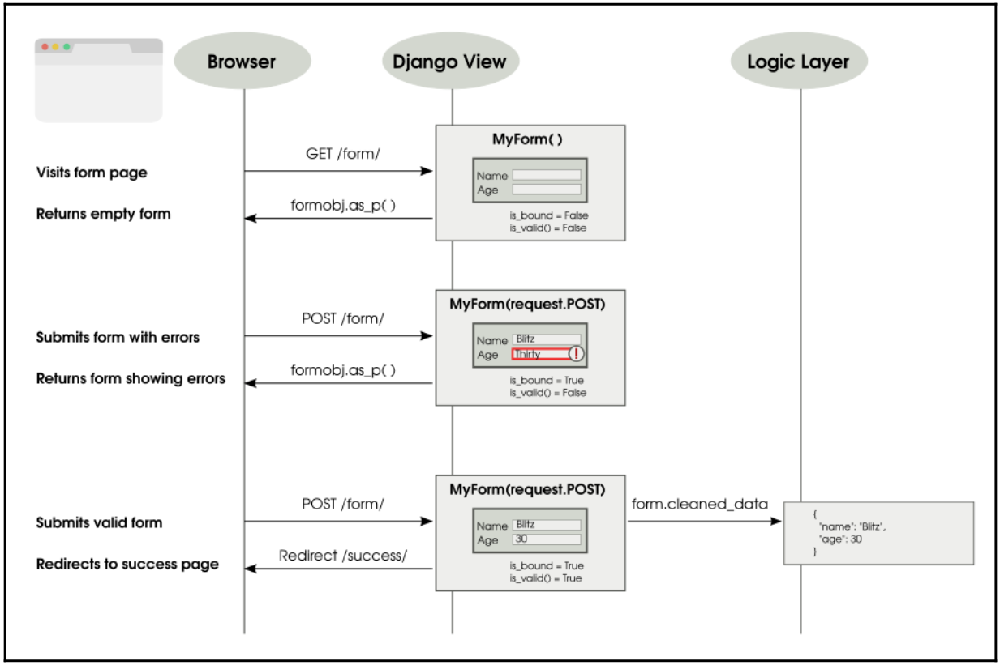
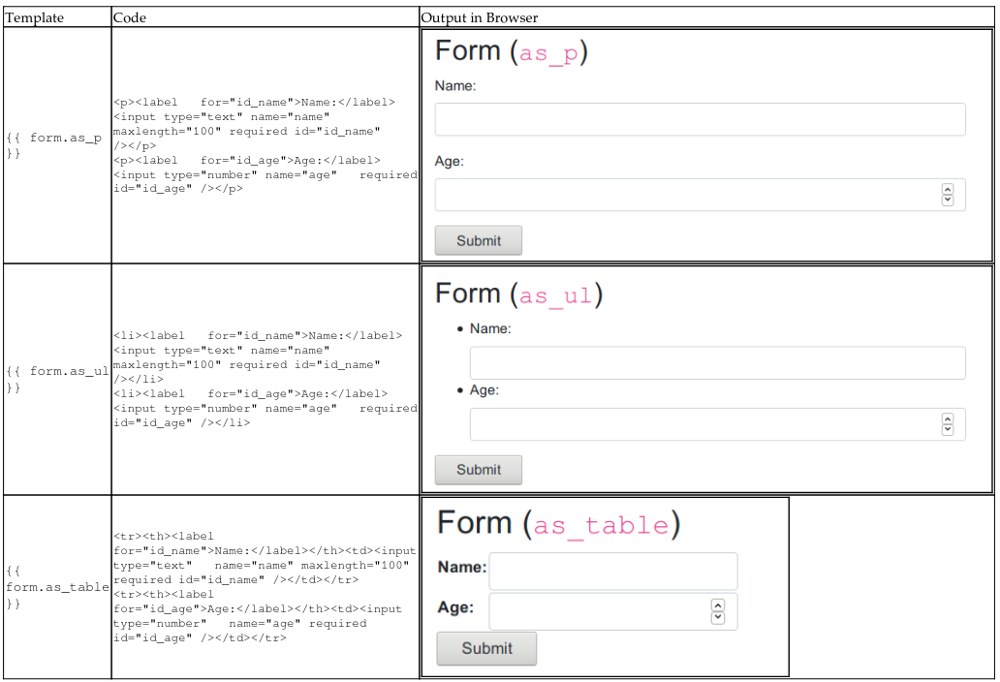

# Forms

In this chapter, we will discuss the following topics:
- Form workflow
- Untrusted input
- Form processing with class-based views
- Working with CRUD views

Let's set aside Django forms and talk about web forms in general. Forms are not just long,
boring pages with several fields that you have to fill in. Forms are everywhere. We use
them every day. Forms power everything from Google's search box to Facebook's Like
button.

Django abstracts most of the grunt work while working with forms such as validation or presentation. It also implements various security best practices. However, forms are also common sources of confusion because they could be in one of several states. Let's examine them more closely.


### How forms work
Forms can be tricky to understand because interacting with them takes more than one
request-response cycle. In the simplest scenario, you need to present an empty form, which
the user then fills in correctly and submits. Conversely, they might enter some invalid data,
in which case the form needs to be resubmitted until the entire form is valid.

From this scenario, we can see that a form can be one of several states, changing between
them:

- **Empty form (unfilled form)**: This form is called an unbound form in Django
- **Submitted form with errors**: This form is called a bound form but not a valid form
- **Submitted form without errors**: This form is called a bound and valid form


*Tip: The users will never see the form in the submitted form without errors state. They don't have to. Typically, submitting a valid form should take the users to a success page.*

### Forms in Django

Django's form class instances contain the state of each field and, by summarizing them up a level, of the form itself. The form has two important state attributes, which are as follows:

- `is_bound`: If this returns false, then it is an unbound form, that is, a fresh form
with empty or default field values. If it returns true, then the form is bound, that
is, at least one field has been set with a user input.
- `is_valid()`: If this returns true, then every field in the bound form has valid
data. If false, then there is some invalid data in at least one field or the form is not
bound.

For example, imagine that you need a simple form that accepts a user's name and age. The `forms` class can be defined as follows (refer to the code in `formschapter/forms.py`):

```python
from django import forms
class PersonDetailsForm(forms.Form):
    name = forms.CharField(max_length=100)
    age = forms.IntegerField()
```

This class can be initiated in a bound or unbound manner, as shown in the following code:

```bash
>>> f = PersonDetailsForm()
>>> print(f.as_p())
<p><label for="id_name">Name:</label> <input type="text" name="name"
maxlength="100" required id="id_name" /></p>
<p><label for="id_age">Age:</label> <input type="number" name="age"
required id="id_age" /></p>
>>> f.is_bound
False
>>> g = PersonDetailsForm({"name": "Blitz", "age": "30"})
>>> print(g.as_p())
<p><label for="id_name">Name:</label> <input type="text" name="name"
value="Blitz" maxlength="100" required id="id_name" /></p>
<p><label for="id_age">Age:</label> <input type="number" name="age"
value="30" required id="id_age" /></p>
>>> g.is_bound
True
```

Note how the HTML representation changes to include the value attributes with the bound data in them.

The form can be bound only when you create the form object in the constructor. How does the user input end up in a dictionary-like object that contains values for each form field?

To find this out, you need to understand how a user interacts with a form. In the following
diagram, a user opens a person's details form, fills it incorrectly at first, submits it, and then
resubmits it with the valid information:



As shown in the preceding diagram, when the user submits the form, the view callable gets all the form data inside `request.POST` (an instance of `QueryDict`). The form gets initialized with this dictionary-like object, referred to in this way as it behaves like a dictionary and has a bit of extra functionality.

Forms can be defined so that they can send the form data in two different ways: `GET` or `POST`. Forms defined with `METHOD="GET"` send the form data encoded in the URL itself. For example, when you submit a Google search, your URL will have your form input, that is, the search string visibly embedded in the URL, such as `?q=Cat+Pictures`. The `GET` method is used for idempotent forms, which do not make any lasting changes to the state of the world (or to be more pedantic, processing the form multiple times has the same effect as processing it once). For most cases, this means that it is used only to retrieve data.

However, the vast majority of forms are defined with `METHOD="POST"`. In this case, the form data is sent along with the body of the HTTP request, and it is not seen by the user. They are used for anything that involves a side effect, such as creating or updating data.

Depending on the type of form you have defined, the view will receive the form data in `request.GET` or `request.POST`, when the user submits the form. As mentioned earlier, either of them will be like a dictionary, so you can pass it to your `form` class constructor to get a bound form object.

<br>

**The Breach**

Steve was curled up and snoring heavily in his large three-seater couch.
For the last few weeks, he had been spending more than 12 hours at the office, and tonight was no exception. His phone lying on the carpet beeped. At first, he said something incoherent, still deep in sleep. Then, it beeped again and again, with increasing urgency.

By the fifth beep, Steve awoke with a start. He frantically searched all over his couch, and finally located his phone on the floor. The screen showed a brightly colored bar chart. Every bar seemed to touch the top line except one. He pulled out his laptop and logged into the SuperBook server. The site was up and none of the logs indicated any unusual activity. However, the external services didn't look that good.

The phone at the other end seemed to ring for eternity until a croaky voice answered, *"Hello, Steve?"*. Half an hour later, Jacob was able to zero down the problem to an unresponsive superhero verification service. *"Isn't that running on Sauron?"* asked Steve. There was a brief hesitation. *"I am afraid so,"* replied Jacob.

Steve had a sinking feeling at the pit of his stomach. Sauron, a mainframe application, was their first line of defense against cyber attacks and other kinds of possible attack. It was three in the morning when he alerted the mission control team. Jacob kept chatting with him the whole time. He was running every available diagnostic tool. There was no sign of any security breach.

Steve tried to calm him down. He reassured him that perhaps it was a temporary overload, and that he should get some rest. However, he knew that Jacob wouldn't stop until he found what was wrong. He also knew that it was not typical of Sauron to have a temporary overload. Feeling extremely exhausted, he slipped back to sleep.

Next morning, as Steve hurried to his office building holding a bagel, he heard a deafening roar. He turned and looked up to see a massive spaceship looming over him. Instinctively, he ducked behind a hedge. On the other side of the hedge, he could hear several heavy metallic objects clanging onto the ground. Just then, his cell phone rang. It was Jacob. Something had moved closer to him. As Steve looked up, he saw a nearly 10-foot-tall robot, colored orange and black, pointing what looked like a weapon directly down at him.

His phone was still ringing. He darted out into the open, barely missing the sputtering shower of bullets around him. He took the call.

"Hey Steve, guess what, I found out what actually happened." "I am dying to know," Steve quipped.

"Remember that we had used UserHoller's form widget to collect customer feedback? Apparently, their data was not that clean. I mean several serious exploits. Hey, there is a lot of background noise. Is that the TV?"
Steve dived towards a large sign that said "Safe Assembly Point".

"Just ignore it. Tell me what happened," he screamed.

"Okay. So, when our admin opened the feedback page, his laptop must have gotten infected. The worm could reach the other systems he has access to, specifically, Sauron. I must say Steve, this is a very targeted attack. Someone who knows our security system quite well has designed this. I have a feeling something scary is coming our way."

Across the lawn, a robot picked up an SUV and hurled it toward Steve. He raised his hands and shut his eyes. The spinning mass of metal froze a few feet above him.

"Important call?" asked Hexa as she dropped the car

"Yeah, please get me out of here," Steve begged.

### Why does data need cleaning?

Eventually, you need to get the cleaned data from the form. Does this mean that the values that the user entered were not clean? Yes, for two reasons.

First, anything that comes from the outside world should not be trusted initially. Malicious users can enter all sorts of exploits through a form that can undermine the security of your site. So, any form data must be sanitized before you use it.

**Best Practice**: Never trust the user input.

Secondly, the field values in `request.POST` and `request.GET` are just strings. Even if your form field can be defined as an integer (say, age) or date (say, birthday), the browser would send them as strings to your view. Invariably, you would like to convert them to the appropriate Python types before use. The `form` class does this conversion automatically for you while cleaning.

Let's see this in action:
```bash
>>> fill = {"name": "Blitz", "age": "30"}
>>> g = PersonDetailsForm(fill)
>>> g.is_valid()
True
>>> g.cleaned_data
{'age': 30, 'name': 'Blitz'}
>>> type(g.cleaned_data["age"])
int
```

The `age` value was passed as a string (possibly from request.POST) to the form class. After validation, the cleaned data contains the age in the integer form. This is exactly what you would expect. Forms try to abstract away the fact that strings are passed around and give you clean Python objects that you can use.

*Tip: Always use the `cleaned_data` from your form rather than raw data from the user.*

### Displaying forms

Django forms also help you create an HTML representation of your form. They support three different representations: as_p (as paragraph tags), as_ul (as unordered list items), and as_table (as, unsurprisingly, a table).

The template code, generated HTML code, and browser rendering for each of these representations have been summarized in the following table:



Note that the HTML representation gives only the `form` fields. This makes it easier to include multiple Django forms in a single HTML form. However, this also means that the template designer has a fair bit of boilerplate to write for each form, as shown in the following code:
```html
<form method="post">
    
    <table>{{ form.as_table }}</table>
    <input type="submit" value="Submit" />
</form>
```

*Tip: To make the HTML representation complete, you need to add the surrounding `form` tags, a `csrf_token`, the `table` or `ul` tags, and the Submit **button**.*