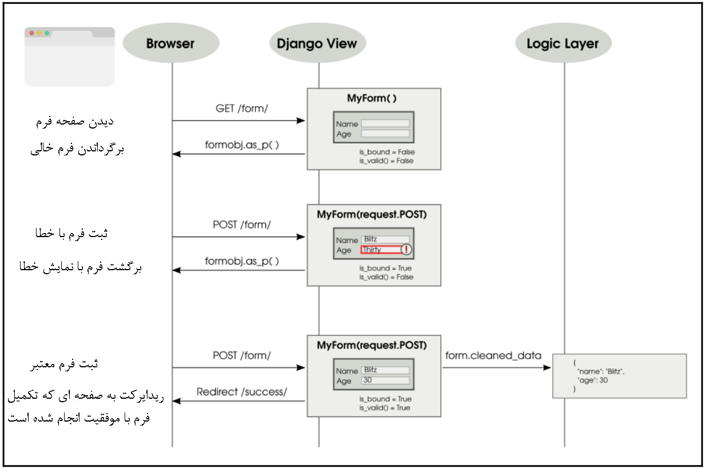
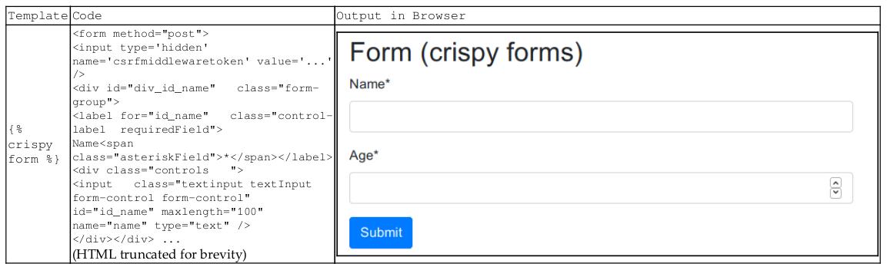

# فرم ها :
در این فصل به مباحث زیر می پردازیم:<br>

•	نحوه کارکرد فرم ها<br> 
•	ورودی غیر قابل اعتماد<br>
•	پردازش فرم با (CBV)Class Based View<br> 
•	کار با ویوهای CRUD<br>

بیایید فرم های جنگو را کنار بگذاریم و به طور کلی در مورد فرم های وب صحبت کنیم. فرم ها فقط صفحات طولانی و خسته کننده با چندین فیلد نیستند که باید آنها را پر کنید. فرم ها همه جا هستند. ما هر روز از آنها استفاده می کنیم. فرم‌ها همه چیز را از کادر جستجوی Google گرفته تا دکمه لایک فیس‌بوک را شامل می شوند . 

جنگو  کارهای  پچیده  رادر هنگام کار با  فرم هایی مانند اعتبار سنجی یا نمایشی به صورت خلاصه انجام می دهد . همچنین بهترین شیوه های امنیتی مختلف را پیاده سازی می کند. با این حال، فرم ها می توانند یاعث سردرگمی شوند  زیرا ممکن است چندین حالت مختلف باشند. بیایید آنها را دقیق تر بررسی کنیم.


## فرم ها چگونه کار می کنند
درک فرم ها ممکن است مشکل باشد زیرا تعامل با آنها بیش از یک چرخه درخواست-پاسخ طول می کشد. در ساده ترین حالت، شما باید یک فرم خالی ارائه دهید که کاربر آن را به درستی پر کرده و ارسال  کند. برعکس، آنها ممکن است برخی از داده‌های نامعتبر را وارد کنند، در این صورت، فرم باید دوباره ارسال شود تا کل فرم معتبر باشد.

در این سناریو می بینیم که یک فرم می تواند یکی از چندین حالت زیر  باشد و بین آنها تغییر می کند:


•	فرم خالی (فرم پر نشده): به این فرم در جنگو فرم بدون چهارچوب (unbound form) گفته می شود.<br>
•	فرم ارسال شده با خطا: به این فرم فرم محدود(bound form) می گویند اما فرم معتبر نیست .<br>
•	فرم ارسال شده بدون خطا: به این فرم فرم محدود(bound form) و معتبر(valid form) می گویند .<br>

نکته: کاربران هرگز فرمی که در وضعیت خطا نباشد را مجدد نخواهند دید . به طور معمول، ارسال یک فرم معتبر باید کاربران را به یک صفحه موفقیت آمیز هدایت کند.


<b>فرم ها در جنگو</b><br>

نمونه های کلاس فرم جنگو شامل وضعیت هر فیلد و با خلاصه کردن آنها در یک سطح، خود فرم است. فرم دارای دو ویژگی مهم  است که به شرح زیر است:

محدود شده (is_bound): اگر این مقدار false را برگرداند، یک فرم بدون قید است، یعنی یک فرم تازه با مقادیر فیلد خالی یا پیش فرض. اگر مقدار true را برگرداند، فرم محدود است، یعنی حداقل یک فیلد با ورودی کاربر تنظیم شده است.<br>

 معتبر (is_valid): اگر این مقدار true را برگرداند، هر فیلد در فرم محدود دارای داده معتبر است. اگر نادرست باشد، حداقل در یک فیلد تعدادی داده نامعتبر وجود دارد یا فرم محدود نشده است.


```python
from django import forms
class PersonDetailsForm(forms.Form):
    name = forms.CharField(max_length=100)
    age = forms.IntegerField()
```

این کلاس را می توان به صورت محدود یا بدون کران آغاز کرد، همانطور که در کد زیر نشان داده شده است:

```bash
>>> f = PersonDetailsForm()
>>> print(f.as_p())
<p><label for="id_name">Name:</label> <input type="text" name="name"
maxlength="100" required id="id_name" /></p>
<p><label for="id_age">Age:</label> <input type="number" name="age"
required id="id_age" /></p>
>>> f.is_bound
False
>>> g = PersonDetailsForm({"name": "Blitz", "age": "30"})
>>> print(g.as_p())
<p><label for="id_name">Name:</label> <input type="text" name="name"
value="Blitz" maxlength="100" required id="id_name" /></p>
<p><label for="id_age">Age:</label> <input type="number" name="age"
value="30" required id="id_age" /></p>
>>> g.is_bound
True
```

توجه داشته باشید که چگونه نمایش HTML تغییر می کند تا ویژگی های مقادیر را با داده های محدود شده در آنها شامل شود. فقط زمانی می توان فرم را محدود کرد که آبجکت <br>فرم را در سازنده آن ایجاد کنید. چگونه ورودی کاربر به یک شی دیکشنری مانند که حاوی مقادیر برای هر فیلد فرم است ختم می شود؟
برای فهمیدن این موضوع، باید نحوه تعامل کاربر با یک فرم را بدانید. در نمودار زیر، کاربر فرم مشخصات یک شخص را باز می کند، ابتدا آن را به اشتباه پر می کند، ارسال می کند و سپس با اطلاعات معتبر دوباره ارسال می کند:



همانطور که در نمودار قبل نشان داده شده است، زمانی که کاربر فرم را ارسال می کند، view که قابل فراخوانی است تمام داده های فرم را در داخل request.POST (نمونه ای از QueryDict) دریافت می کند. فرم با این شی که حالت دیکشنری دارد مقداردهی اولیه می شود، به این صورت که مانند یک فرهنگ لغت رفتار می کند و کمی هم عملکرد اضافی دارد.
فرم ها را می توان به گونه ای تعریف کرد که بتوانند داده های فرم را به دو روش مختلف ارسال کنند: GET یا POST. فرم های تعریف شده با METHOD="GET" داده های فرم کدگذاری شده را  در خود URL را ارسال می کنند. به عنوان مثال، هنگامی که یک جستجوی Google ارسال می کنید، URL شما ورودی فرم شما را خواهد داشت، یعنی رشته جستجو به طور قابل مشاهده در URL جاسازی شده است، مانند ?q=Cat+Pictures. روش GET برای فرم‌های خیلی ساده و ضعیف استفاده می‌شود که هیچ کار مفیدی در جهان  نمی‌کنند (یا به عبارت ساده‌تر، پردازش چند بار فرم اثری مشابه یک بار پردازش ان را دارد). در بیشتر موارد  این بدان معنی است که فقط برای بازیابی داده ها استفاده می شود.

با این حال، اکثریت قریب به اتفاق فرم ها با METHOD="POST" تعریف می شوند. در این حالت داده های فرم به همراه بدنه درخواست HTTP ارسال می شود و توسط کاربر دیده نمی شود. آنها برای هر چیزی که شامل یک اثر جانبی است، مانند ایجاد یا به روز رسانی داده ها استفاده می شود.

بسته به نوع فرمی که تعریف کرده اید، وقتی کاربر فرم را ارسال می کند، view داده های فرم را در request.GET یا request.POST دریافت می کند. همانطور که قبلا ذکر شد، هر یک از آنها مانند یک دیکشنری خواهد بود، بنابراین می توانید آن را به سازنده کلاس فرم خود ارسال کنید تا یک آبجکت فرم محدود شده را دریافت کنید.


<br>

<b>نقض امنیتی :</b><br>

استیو روی کاناپه بزرگ سه نفره خود خمیده بود و به شدت خروپف می کرد. در چند هفته گذشته، او بیش از 12 ساعت را در دفتر سپری کرده بود و امشب نیز از این قاعده مستثنی نبود. تلفنش که روی فرش افتاده بود بوق زد. ابتدا چیزی نامنسجم گفت که هنوز در خواب بود. سپس، بارها و بارها، با اضطرار فزاینده، بوق زد.

با صدای پنجم، استیو از خواب بیدار شد. او دیوانه وار تمام مبل خود را جستجو کرد و سرانجام گوشی خود را روی زمین پیدا کرد. صفحه نمایش نمودار میله ای با رنگ روشن را نشان می داد. به نظر می‌رسید که هر نوار به جز یکی، خط بالایی را لمس می‌کند. لپ تاپ خود را بیرون آورد و وارد سرور SuperBook شد. سایت فعال بود و هیچ یک از گزارش‌ها فعالیت غیرعادی را نشان نمی‌داد. با این حال، خدمات خارجی چندان خوب به نظر نمی رسید.

به نظر می رسید که تلفن آن طرف تا ابد زنگ می زند تا اینکه صدای عصبی پاسخ داد: "سلام استیو؟". نیم ساعت بعد، جاکوب توانست مشکل یک سرویس تأیید صحت که پاسخگو نبود را برطرف کند. "آیا این دویدن روی سائورون (Sauron) نیست؟" از استیو پرسید. یک تردید کوتاه وجود داشت. جاکوب پاسخ داد: من می ترسم.

شکم استیو در حال غرغر کردن بود . Sauron، یک اپلیکیشن mainframe است که اولین خط دفاعی آنها در برابر حملات سایبری و انواع دیگر حملات احتمالی بود. ساعت سه بامداد بود که به تیم کنترل ماموریت هشدار داد. جاکوب در تمام مدت با او چت می کرد. او همه ابزارهای تشخیصی موجود را اجرا می کرد. هیچ نشانه ای از نقض امنیتی وجود نداشت.

استیو سعی کرد او را آرام کند. او به جاکوب اطمینان داد که شاید این یک بار اضافی موقتی است و نیاز بخ کاهش باردارد . با این حال، او می دانست که جاکوب تا زمانی که اشتباه را پیدا نکند، متوقف نخواهد شد. او همچنین می دانست که برای سائورون معمولی نیست که اضافه بار موقت داشته باشد. با احساس خستگی شدید، دوباره به خواب رفت.

صبح روز بعد، هنگامی که استیو در حالی که یک نان شیرینی در دست داشت با عجله به سمت ساختمان اداری خود می رفت، صدای غرش کر کننده ای را شنید. او برگشت و به بالا نگاه کرد تا یک سفینه فضایی عظیم را دید که بر فراز او قرار داشت. به طور غریزی پشت پرچینی خم شد. در طرف دیگر پرچین، او می توانست چندین شی فلزی سنگین را بشنود که به زمین می چسبیدند. همون موقع تلفن همراهش زنگ خورد. جاکوب بود. چیزی به او نزدیکتر شده بود. همانطور که استیو به بالا نگاه کرد، یک ربات قد تقریباً 10 فوتی، نارنجی و مشکی رنگی را دید که چیزی شبیه یک سلاح را مستقیماً به سمت او نشانه رفته بود.
تلفنش همچنان زنگ می خورد. گلگوله ها به اطراف او می خوردند . او تماس را پذیرفت.

"هی استیو، حدس بزن چی، فهمیدم واقعا چه اتفاقی افتاده است." استیو با کنایه گفت: «من عاشق اینم که بدونم . 

"یادتان می آید که ما از ویجت فرم UserHoller برای جمع آوری بازخورد مشتریان استفاده کرده بودیم؟ ظاهراً داده های آنها چندان تمیز نبود. منظورم چندین سوء استفاده جدی است. سلام، صدای پس زمینه زیادی وجود دارد. آیا آن تلویزیون است؟" استیو به سمت تابلوی بزرگی شیرجه زد که روی آن نوشته شده بود "نقطه مونتاژ ایمن".

او فریاد زد: "فقط نادیده بگیر. به من بگو چه اتفاقی افتاده است."

"خوب. بنابراین، وقتی ادمین ما صفحه بازخورد را باز کرد، لپ تاپ او باید آلوده شده باشد. این کرم می تواند به سیستم های دیگری که به آنها دسترسی دارد، به ویژه سائورون، برسد. باید بگویم استیو، این یک حمله بسیار هدفمند است. کسی که می داند که سیستم امنیتی ما به خوبی این را طراحی کرده است. من احساس می کنم چیزی ترسناک در راه است."

در آن سوی چمن، روباتی یک SUV را برداشت و به سمت استیو پرتاب کرد. دستانش را بالا آورد و چشمانش را بست. توده فلزی در حال چرخش چند فوت بالاتر از او یخ زد.

"تماس مهم؟" هگزا در حالی که ماشین را رها کرد پرسید

استیو التماس کرد: "آره، لطفا مرا از اینجا بیرون کن."


<b>چرا داده ها نیاز به تمیز کردن دارند؟</b><br>در نهایت ما ، باید داده های پاک شده را از فرم دریافت کنید. آیا این به این معنی است که مقادیری که کاربر وارد کرده تمیز نبوده است؟ بله به دو دلیل

اولاً، به هر چیزی که از دنیای بیرون می آید، در ابتدا نباید اعتماد کرد. کاربران مخرب می توانند از طریق فرمی  انواع سوء استفاده ها را بکنند  که می تواند امنیت سایت شما را تضعیف کند. بنابراین، قبل از استفاده از هر داده فرم، باید پاک سازی شود.

بهترین روش: هرگز به ورودی کاربر اعتماد نکنید.

ثانیاً، مقادیر فیلد در request.POST و request.GET فقط رشته هستند. حتی اگر فیلد فرم شما را بتوان به عنوان یک عدد صحیح (مثلاً سن) یا تاریخ (مثلاً تولد) تعریف کرد، مرورگر آنها را به عنوان رشته به ویوی شما ارسال می کند. همیشه، شما می خواهید قبل از استفاده آنها را به انواع پایتون مناسب تبدیل کنید. کلاس form این تبدیل را به طور خودکار برای شما در حین تمیز کردن انجام می دهد.
بیایید این را در عمل ببینیم:

```bash
>>> fill = {"name": "Blitz", "age": "30"}
>>> g = PersonDetailsForm(fill)
>>> g.is_valid()
True
>>> g.cleaned_data
{'age': 30, 'name': 'Blitz'}
>>> type(g.cleaned_data["age"])
int
```
مقدار age به عنوان یک رشته (احتمالاً از request.POST) به کلاس فرم منتقل شد. پس از اعتبارسنجی، داده های پاک شده حاوی سن به شکل عدد صحیح است. این دقیقا همان چیزی است که شما انتظار دارید. فرم‌ها سعی می‌کنند این واقعیت را که رشته‌ها حاوی مقادیر مختلف باشند را انتزاع کنند و اشیاء پایتون تمیزی را در اختیار شما قرار دهند که بتوانید از آنها استفاده کنید.
نکته: همیشه از cleaned_data فرم خود به جای داده های خام کاربر استفاده کنید.


## نمایش فرم ها :

فرم های جنگو همچنین به شما کمک می کنند تا یک نمایش HTML از فرم خود ایجاد کنید. آنها از سه نمایش مختلف پشتیبانی می کنند: as_p (به عنوان برچسب پاراگراف)، as_ul (به عنوان آیتم های لیست نامرتب)، و as_table (به عنوان یک جدول).

کد قالب، کد HTML تولید شده و رندر مرورگر برای هر یک از این نمایش ها در جدول زیر خلاصه شده است:


توجه داشته باشید که ویوی HTML فقط فیلدهای فرم را می دهد. این کار گنجاندن چندین فرم جنگو را در یک فرم HTML ساده تر می کند. با این حال، این بدان معناست که طراح قالب، همانطور که در کد زیر نشان داده شده است، برای هر فرم مقدار مناسبی می تواند اختیار کند :

```html
<form method="post">
    
    <table>{{ form.as_table }}</table>
    <input type="submit" value="Submit" />
</form>
```

نکته: برای کامل کردن نمایش HTML، باید تگ های فرم ، یک csrf_token، تگ جدول یا ul و دکمه ارسال را اضافه کنید.

<b>زمان استفاده از crispy است : </b><br>

زمانی که برای هر فرم در قالب‌هایتان تعداد زیادی کد html بنویسید، ممکن است خسته‌کننده شود. بسته django-crispy-forms کد قالب فرم را واضح تر می کند (یعنی مختصر). تمام ارائه و طرح‌بندی را به خود فرم جنگو منتقل می‌کند. به این ترتیب می توانید کدهای پایتون بیشتری بنویسید و HTML کمتری بنویسید.
جدول زیر نشان می دهد که تگ قالب crispy فرم کامل تری ایجاد می کند و ظاهر بسیار بومی تر به سبک بوت استرپ است:




بنابراین، چگونه می توانید فرم های Crispy را دریافت کنید؟ شما باید بسته django-crispy-forms را نصب کرده و به INSTALLED_APPS خود اضافه کنید. اگر از Bootstrap 4 استفاده می کنید، باید این را در تنظیمات خود ذکر کنید:

```python
CRISPY_TEMPLATE_PACK = "bootstrap4"
```

مقداردهی اولیه فرم نیاز به ذکر یک ویژگی کمکی از نوع FormHelper دارد. کد زیر در formschapter/forms.py در نظر گرفته شده است که حداقل باشد و از طرح بندی پیش فرض استفاده می کند:

```python
from crispy_forms.helper import FormHelper
from crispy_forms.layout import Submit
class PersonDetailsForm(forms.Form):
    name = forms.CharField(max_length=100)
    age = forms.IntegerField()
    def __init__(self, *args, **kwargs):
        super().__init__(*args, **kwargs)
        self.helper = FormHelper(self)
        self.helper.layout.append(Submit('submit', 'Submit'))
```
برای جزئیات بیشتر، مستندات بسته django-crispy-forms را بخوانید.

## <b>آشنایی با CSRF</b><br>
حتما متوجه چیزی به نام توکن جعل درخواست متقابل (CSRF) در قالب‌های فرم شده‌اید. چه کار میکند؟ این یک مکانیسم امنیتی در برابر حملات CSRF برای فرم های شما است.

این با تزریق یک رشته تصادفی تولید شده توسط سرور به نام توکن CSRF، منحصر به فرد برای session کاربر کار می کند. هر بار که یک فرم ارسال می شود، باید یک فیلد مخفی داشته باشد که حاوی این نشانه باشد. این توکن تضمین می کند که فرم توسط سایت اصلی برای کاربر ایجاد شده است و ثابت می کند که یک فرم جعلی ایجاد شده توسط مهاجم با فیلدهای مشابه نیست.
توکن‌های CSRF برای فرم‌هایی که از روش GET استفاده می‌کنند توصیه نمی‌شوند، زیرا اقدامات GET نباید وضعیت سرور را تغییر دهد. علاوه بر این، فرم‌هایی که از طریق GET ارسال می‌شوند، نشانه CSRF را در URLها نشان می‌دهند. از آنجایی که آدرس‌های اینترنتی دارای ریسک بالاتری برای لاگ شدن یا  shoulder-sniffed هستند، بهتر است از CSRF در فرم‌هایی با استفاده از روش POST استفاده کنید.


## <b>پردازش فرم ها با Class Based View  (CBV) :</b><br>

اساساً می‌توانیم یک فرم را با زیر کلاس‌بندی خود کلاس View پردازش کنیم:

```python
class ClassBasedFormView(generic.View):
    template_name = 'form.html'

    def get(self, request):
        form = PersonDetailsForm()
        return render(request, self.template_name, {'form': form})

    def post(self, request):
        form = PersonDetailsForm(request.POST)
        if form.is_valid():
            # Success! We can use form.cleaned_data now
            return redirect('success')
        else:
            # Invalid form! Reshow the form with error highlighted
            return render(request, self.template_name, {'form': form})
```

این کد را با نمودار توالی که قبلاً دیدیم مقایسه کنید. سه سناریو به طور جداگانه بررسی شده است.

انتظار می رود هر فرم از الگوی ارسال/تغییر مسیر/دریافت (PRG) پیروی کند. اگر فرم ارسالی معتبر تشخیص داده شود، باید یک تغییر مسیر صادر کند. این از ارسال فرم های تکراری جلوگیری می کند.

با این حال، این یک کد بسیار DRY نیست. ویژگی های کلاس فرم و template_name تکرار شده اند. استفاده از یک نمای کلی مبتنی بر کلاس مانند FormView می تواند افزونگی پردازش فرم را کاهش دهد. کد زیر عملکردی مشابه کد قبلی و در خطوط کد کمتری به شما می دهد:

```python
from django.urls import reverse_lazy

class GenericFormView(generic.FormView):
    template_name = 'form.html'
    form_class = PersonDetailsForm
    success_url = reverse_lazy("success")
```
در این مورد باید از reverse_lazy استفاده کنیم زیرا الگوهای URL هنگام وارد کردن فایل View بارگذاری نمی شوند.

## <b>الگوهای فرم : </b><br>
بیایید نگاهی به برخی از الگوهای رایجی که هنگام کار با فرم ها استفاده می شود بیندازیم.

<b>الگو – ساخت فرم های داینامیک </b><br>
<b>مشکل</b>: افزودن فیلدهای فرم به صورت پویا یا تغییر فیلدهای فرم از آنچه اعلام شده است.<br>
<b>راه حل</b>: در طول مقداردهی اولیه فرم، فیلدها را اضافه یا تغییر دهید.


<b>جزییات مشکل: </b><br>
فرم ها معمولاً به سبک declarative تعریف می شوند و فیلدهای فرم به عنوان فیلدهای کلاس فهرست می شوند. اما گاهی اوقات تعداد یا نوع این فیلدها را از قبل نمی دانیم. این امر مستلزم آن است که فرم به صورت پویا تولید شود. این الگو را گاهی فرم پویا یا تولید فرم زمان اجرا می نامند.
تصور کنید یک سیستم چک کردن مسافر برای پرواز از یک فرودگاه. این سیستم امکان ارتقاء بلیط های کلاس اقتصادی را به درجه یک فراهم می کند. اگر صندلی های درجه یک باقی مانده است، باید گزینه دیگری را به کاربر نشان دهد و از او بپرسد که آیا مایل به ارتقا به درجه یک هستند یا خیر. با این حال، این فیلد اختیاری را نمی توان اعلام کرد زیرا به همه کاربران نشان داده نمی شود. چنین فرم های پویا را می توان با این الگو اداره کرد.

<b>راه حل مشکل: </b><br>
هر نمونه فرم دارای یک ویژگی به نام فیلدها است که دیکشنری است که تمام فیلدهای فرم را در خود جای می دهد. این را می توان در زمان اجرا تغییر داد. افزودن یا تغییر فیلدها را می توان در طول مقداردهی اولیه فرم انجام داد.

به عنوان مثال، اگر فقط در صورتی نیاز به افزودن یک چک باکس به فرم جزئیات کاربر داشته باشیم که آرگومان کلمه کلیدی به نام "ارتقا" در زمان اولیه سازی فرم درست باشد، آن را به صورت زیر پیاده سازی می کنیم:


```python
class PersonDetailsForm(forms.Form):

    name = forms.CharField(max_length=100)
    age = forms.IntegerField()

    def __init__(self, *args, **kwargs):
        upgrade = kwargs.pop("upgrade", False)
        super().__init__(*args, **kwargs)

        # Show first class option?
        if upgrade:
            self.fields["first_class"] = forms.BooleanField(
            label="Fly First Class?")
```
اکنون، فقط باید آرگومان کلمه کلیدی PersonDetailsForm(upgrade=True) را پاس کنیم تا یک فیلد ورودی بولی اضافی (چک باکس) ظاهر شود.
برای جلوگیری از خطای غیرمنتظره کلمه کلیدی، یک آرگومان کلمه کلیدی تازه معرفی شده باید قبل از فراخوانی super حذف شود یا ظاهر شود.
اگر برای این مثال از یک کلاس FormView استفاده کنیم، باید آرگومان کلمه کلیدی را با نادیده گرفتن متد get_form_kwargs از کلاس View، همانطور که در کد زیر نشان داده شده است، پاس کنیم:

```python
class PersonDetailsEdit(generic.FormView):
    ...

    def get_form_kwargs(self):
        kwargs = super().get_form_kwargs()
        kwargs["upgrade"] = True
        return kwargs
```

از این الگو می توان برای تغییر هر ویژگی یک فیلد در زمان اجرا استفاده کرد، مانند ویجت یا متن راهنما. برای فرم های مدل نیز کار می کند. در بسیاری از موارد، نیاز ظاهری به فرم های پویا را می توان با استفاده از مجموعه فرم های جنگو حل کرد. آنها زمانی استفاده می شوند که یک فرم نیاز به تکرار در یک صفحه داشته باشد. یک مورد معمول استفاده از فرم‌ست‌ها هنگام طراحی نمای شبکه‌ای داده (data-grid)برای افزودن عناصر سطر به ردیف است. به این ترتیب، شما نیازی به ایجاد یک فرم پویا با تعداد دلخواه ردیف ندارید. شما فقط باید یک فرم برای ردیف ایجاد کنید و با استفاده از تابع formset_factory چندین ردیف ایجاد کنید.

<b>الگو : فرم های User-Based</b><br>
<b>مشکل</b>: فرم ها باید بر اساس کاربر وارد شده سفارشی شوند.<br>

<b>راه حل</b>: ویژگی های کاربر وارد شده را به عنوان آرگومان کلمه کلیدی به مقداردهی اولیه فرم منتقل کنید.<br>

<b>جزییات مشکل: </b><br>
یک فرم می تواند به روش های مختلف بر اساس کاربر ارائه شود. برخی از کاربران ممکن است نیازی به پر کردن تمام فیلدها نداشته باشند، در حالی که برخی دیگر ممکن است نیاز به اضافه کردن اطلاعات اضافی داشته باشند. در برخی موارد، ممکن است لازم باشد برخی بررسی‌ها را در مورد واجد شرایط بودن کاربر انجام دهید، مانند تأیید اینکه آیا آنها اعضای یک گروه هستند یا خیر، تا تعیین کنید فرم چگونه باید ساخته شود.

<b>راه حل مشکل: </b><br>
همانطور که حتما متوجه شده اید، می توانید با استفاده از راه حل ارائه شده در الگوی تولید فرم پویا این مشکل را حل کنید. شما فقط باید request.user یا هر یک از ویژگی های آنها را به عنوان آرگومان کلمه کلیدی به فرم ارسال کنید. من دومی را برای به حداقل رساندن جفت بین نما و فرم توصیه می کنم.
مانند مثال قبلی، باید یک چک باکس اضافی را به کاربر نشان دهیم. با این حال، این تنها در صورتی نشان داده می شود که کاربر عضو گروه "VIP" باشد.
بیایید نگاهی بیندازیم که چگونه نمای مشتق شده GenericFormView این اطلاعات را به فرم ارسال می کند:

```python
class GenericFormView(generic.FormView):

    template_name = 'cbv-form.html'
    form_class = PersonDetailsForm
    success_url = reverse_lazy("home")

    def get_form_kwargs(self):
        kwargs = super().get_form_kwargs()
        # Check if the logged-in user is a member of "VIP" group
        kwargs["vip"] = self.request.user.groups.filter(name="VIP").exists()
        return kwargs
```

در اینجا، ما در حال تعریف مجدد متد get_form_kwargs هستیم که FormView قبل از نمونه سازی ، یک فرم را برای برگرداندن آرگومان های کلمه کلیدی فراخوانی می کند. این نقطه ایده آل برای بررسی اینکه آیا کاربر به گروه VIP تعلق دارد و آرگومان کلمه کلیدی مناسب را ارسال می کند.
مانند قبل، فرم می تواند وجود آرگومان کلمه کلیدی vip را بررسی کند (مانند آنچه برای ارتقا انجام دادیم) و یک چک باکس برای ارتقا به کلاس اول ارائه دهد.


<b>الگو : اقدامات چندگانه به ازای هر View</b><br>
<b>مشکل</b>: مدیریت چندین عملکرد فرم در یک نما یا صفحه واحد.<br>

<b>راه‌حل</b>: فرم‌ها می‌توانند از نماهای جداگانه برای رسیدگی به ارسال‌های فرم استفاده کنند، یا یک نمای واحد می‌تواند فرم را بر اساس نام دکمه ارسال شناسایی کند.<br>

<b>جزییات مشکل: </b><br>
جنگو ترکیب چند فرم را با یک عمل مشابه، مانند یک دکمه ارسال، نسبتاً ساده می کند. با این حال، بیشتر صفحات وب نیاز به نمایش چندین عملکرد در یک صفحه دارند. برای مثال، ممکن است بخواهید کاربر با استفاده از دو فرم مجزا که در همان صفحه نشان داده شده اند، مشترک یا لغو اشتراک در یک خبرنامه شود.
با این حال، FormView جنگو برای مدیریت تنها یک فرم در هر سناریو طراحی شده است. بسیاری دیگر از دیدگاه‌های مبتنی بر کلاس عمومی نیز این فرض را دارند.


<b>راه حل مشکل: </b><br>
دو راه برای مدیریت چند فرم وجود دارد: استفاده از نماهای جداگانه و استفاده از یک نمای واحد. بیایید نگاهی به رویکرد اول بیندازیم.

<b>چندین View برای چندین اقدام (Action) :</b><br>
این یک رویکرد نسبتاً ساده است و هر فرم دیدگاه متفاوتی را به عنوان عمل خود مشخص می کند. به عنوان مثال، فرم های اشتراک و لغو اشتراک را درنظر بگیرید. می‌توان دو کلاس view مجزا برای مدیریت متد POST از فرم‌های مربوطه وجود خواهد داشت.

<b>یک View برای چندین اقدام :</b><br>
شاید تقسیم نماها برای رسیدگی به فرم‌ها را غیرضروری بدانید، یا مدیریت فرم‌های مرتبط منطقی در یک نمای رایج را زیباتر بدانید. در هر صورت، می‌توانیم محدودیت‌های نماهای مبتنی بر کلاس عمومی را برای مدیریت بیش از یک فرم دور بزنیم.
در حالی که از یک کلاس view برای چندین فرم استفاده می شود، چالش این است که مشخص کنیم کدام فرم اقدام POST را صادر کرده است. در اینجا از این که نام و مقدار دکمه Submit نیز ارسال می شود، بهره می بریم. اگر دکمه ارسال به صورت منحصر به فرد در فرم ها نامگذاری شده باشد، می توان فرم را در حین پردازش شناسایی کرد.
در اینجا ما یک SubscribeForm را با استفاده از فرم های ترد تعریف می کنیم تا بتوانیم دکمه Submit را نیز نامگذاری کنیم:

```python
class SubscribeForm(forms.Form):
    email = forms.EmailField()

    def __init__(self, *args, **kwargs):
        super().__init__(*args, **kwargs)
        self.helper = FormHelper(self)
        self.helper.layout.append(Submit('subscribe_butn', 'Subscribe'))
```
کلاس UnSubscribeForm دقیقاً به همین صورت تعریف شده است (و از این رو حذف می شود)، با این تفاوت که نام دکمه Submit آن unsubscribe_butn است.
از آنجایی که FormView برای یک فرم طراحی شده است، ما از یک نمای ساده تری مبتنی بر کلاس، مثلا TemplateView، به عنوان پایه نمای خود استفاده خواهیم کرد. بیایید نگاهی به تعریف view و روش دریافت بیندازیم:

```python
from .forms import SubscribeForm, UnSubscribeForm

class NewsletterView(generic.TemplateView):
    subcribe_form_class = SubscribeForm
    unsubcribe_form_class = UnSubscribeForm
    template_name = "newsletter.html"

    def get(self, request, *args, **kwargs):
        kwargs.setdefault("subscribe_form", self.subcribe_form_class())
        kwargs.setdefault("unsubscribe_form", self.unsubcribe_form_class())
        return super().get(request, *args, **kwargs)
```

این دو فرم به‌عنوان آرگومان‌های کلیدواژه درج می‌شوند و در نتیجه وارد بافت قالب می‌شوند. ما نمونه‌های نامحدودی از هر یک از فرم‌ها را تنها در صورتی ایجاد می‌کنیم که قبلاً وجود نداشته باشند، با کمک روش دیکشنری setdefault. به زودی خواهیم دید که چرا. در مرحله بعد، ما نگاهی به روش POST خواهیم داشت، که ارسال ها را از هر دو فرم مدیریت می کند:

```python
def post(self, request, *args, **kwargs):
    form_args = {
    'data': self.request.POST,
    'files': self.request.FILES,
    }
        if "subscribe_butn" in request.POST:
        form = self.subcribe_form_class(**form_args)
        if not form.is_valid():
            return self.get(request, subscribe_form=form)
        return redirect("success_form1")
    elif "unsubscribe_butn" in request.POST:
        form = self.unsubcribe_form_class(**form_args)
        if not form.is_valid():
            return self.get(request, unsubscribe_form=form)
        return redirect("success_form2")
    return super().get(request)
```

ابتدا، آرگومان های کلمه کلیدی فرم، مانند داده ها و فایل ها، در دیکشنری form_args پر می شوند. سپس وجود دکمه اشتراک فرم اول در request.POST بررسی می شود. اگر نام دکمه پیدا شد، اولین فرم نمونه سازی می شود.

اگر فرم اعتبار سنجی ناموفق باشد، پاسخ ایجاد شده توسط متد GET با نمونه فرم اول برگردانده می شود. به همین ترتیب، ما به دنبال دکمه Unsubscribe فرم دوم می گردیم تا بررسی کنیم که آیا فرم دوم ارسال شده است یا خیر.

نمونه هایی از یک فرم در نمای مشابه را می توان به همان روش با پیشوندهای فرم پیاده سازی کرد. شما می توانید یک فرم را با آرگومان پیشوندی مانند SubscribeForm (prefix="offers") نمونه سازی کنید. چنین نمونه ای تمام فیلدهای فرم خود را با آرگومان داده شده پیشوند می کند و به طور موثر مانند فضای نام فرم کار می کند. به طور کلی، می توانید از پیشوندها برای جاسازی چند فرم در یک صفحه استفاده کنید.


<b>الگو : نماهای CRUD </b><br>
<br>مشکل</b>: نوشتن ساختار برای رابط های CRUD ، برای یک مدل تکراری می شود.
<b>راه حل</b>: استفاده از ویوهای عمومی ادیت برمبنای کلاس (generic class-based editing views)
<b>جزییات مشکل: </b><br>
در برنامه های کاربردی وب معمولی، بیشتر زمان صرف نوشتن رابط های CRUD در پایگاه داده می شود. به عنوان مثال، توییتر اساسا شامل ایجاد و خواندن توییت های یکدیگر است. در اینجا، یک توییت، شی پایگاه داده ای است که دستکاری و ذخیره می شود.
نوشتن چنین رابط هایی از ابتدا می تواند خسته کننده باشد. اگر بتوان رابط های CRUD را به طور خودکار از خود کلاس مدل ایجاد کرد، این الگو به راحتی قابل مدیریت است.


<b>راه حل مشکل: </b><br>
جنگو فرآیند ایجاد نماهای CRUD را با مجموعه ای از چهار نمای کلی مبتنی بر کلاس ساده می کند. آنها را می توان به عملیات مربوطه خود به صورت زیر نگاشت کرد:
- `CreateView:` نمای  یک فرم خالی برای ایجاد یک نمونه مدل جدید را نمایش می دهد .
- `DetailView:` این نما جزئیات یک شی را با خواندن از پایگاه داده نشان می دهد .
- `UpdateView:` این نما به شما امکان می دهد تا جزئیات یک شی را از طریق یک فرم از پیش پر شده به روز کنید 
- `DeleteView:` این نما یک صفحه تایید را نمایش می دهد و در صورت تایید، شی را از پایگاه داده حذف می کند.

بیایید به یک مثال ساده نگاهی بیندازیم. ما مدلی داریم که حاوی تاریخ‌های مهم در مورد رویدادهای مورد علاقه همه افرادی است که از سایت ما استفاده می‌کنند. ما باید رابط های ساده CRUD بسازیم تا هر کسی بتواند این تاریخ ها را مشاهده و تغییر دهد. بیایید نگاهی به مدل ImportantDate تعریف شده در formschapter/models.py به شرح زیر بیندازیم:

```python
class ImportantDate(models.Model):
    date = models.DateField()
    desc = models.CharField(max_length=100)

    def get_absolute_url(self):
    return reverse('impdate_detail', args=[str(self.pk)])
```

متد get_absolute_url() توسط کلاس های CreateView و UpdateView برای تغییر مسیر پس از ایجاد یا به روز رسانی موفق شی استفاده می شود. به DetailView شی هدایت شده است.
همانطور که در کد زیر در formschapter/views.py نشان داده شده است، خود نماهای CRUD به اندازه کافی ساده هستند که قابل توضیح باشند:

```python
class ImpDateDetail(generic.DetailView):
    model = models.ImportantDate

class ImpDateCreate(generic.CreateView):
    model = models.ImportantDate
    form_class = ImportantDateForm

class ImpDateUpdate(generic.UpdateView):
    model = models.ImportantDate
    form_class = ImportantDateForm

class ImpDateDelete(generic.DeleteView):
    model = models.ImportantDate
    success_url = reverse_lazy("formschapter:impdate_list")
```

در این نماهای عمومی، کلاس مدل تنها عضو اجباری است که باید ذکر شود. با این حال، در مورد DeleteView، تابع success_url نیز باید ذکر شود. این به این دلیل است که پس از حذف، get_absolute_url دیگر نمی تواند برای یافتن اینکه کاربران را به کجا هدایت کنید استفاده شود.

تعریف ویژگی form_class اجباری نیست. اگر حذف شود، یک متد ModelForm مطابق با مدل مشخص شده ایجاد می شود. با این حال، همانطور که در کد زیر در formschapter/forms.py نشان داده شده است، می‌خواهیم فرم مدل خود را برای استفاده از فرم‌های ترد ایجاد کنیم:


```python
from django import forms
from . import models
from crispy_forms.helper import FormHelper
from crispy_forms.layout import Submit

class ImportantDateForm(forms.ModelForm):
    class Meta:
        model = models.ImportantDate
        fields = ["date", "desc"]

    def __init__(self, *args, **kwargs):
        super().__init__(*args, **kwargs)
        self.helper = FormHelper(self)
        self.helper.layout.append(Submit('save', 'Save'))
```
به لطف فرم‌های Crispy، برای ساختن این فرم‌های CRUD به کدنویسی HTML بسیار کمی در قالب‌های خود نیاز داریم.

ذکر صریح فیلدهای  ModelForm بهترین کار است. تنظیم فیلدها روی «__all__» ممکن است راحت باشد، اما می‌تواند به‌طور ناخواسته داده‌های حساس را به‌ویژه پس از افزودن فیلدهای جدید به مدل نشان دهد.

مسیرهای قالب، به طور پیش فرض، بر اساس کلاس view و نام مدل هستند. برای اختصار، منبع الگو را در اینجا حذف کردیم. لطفاً به فهرست الگوها در برنامه formschapter در پروژه SuperBook مراجعه کنید. ما از همین فرم برای CreateView و UpdateView استفاده می کنیم.
در نهایت، نگاهی به formschapter/urls.py می اندازیم، جایی که همه چیز به هم متصل شده است:

```python
path('impdates/<int:pk>/',
    views.ImpDateDetail.as_view(),
    name="impdate_detail"),

path('impdates/create/',
    views.ImpDateCreate.as_view(),
    name="impdate_create"),

path('impdates/<int:pk>/edit/',
    views.ImpDateUpdate.as_view(),
    name="impdate_update"),

path('impdates/<int:pk>/delete/',
    views.ImpDateDelete.as_view(),
    name="impdate_delete"),

path('impdates/',
    views.ImpDateList.as_view(),
    name="impdate_list"),
```

نماهای عمومی جنگو یک راه عالی برای شروع با ایجاد نماهای CRUD برای مدل های شما است. با چند خط کد، به جای اینکه خودتان این کار خسته کننده را انجام دهید، فرم های مدل و نماهایی که به خوبی آزمایش شده برای شما ایجاد می شوند، دریافت می کنید.

## <b>خلاصه</b><br>
در این فصل، نحوه کار فرم‌های وب و نحوه انتزاع آن‌ها با استفاده از کلاس‌های فرم در جنگو را بررسی کردیم. ما همچنین به تکنیک ها و الگوهای مختلفی که برای صرفه جویی در زمان در حین کار با فرم ها استفاده می شود، نگاه کردیم.

در فصل بعدی، نگاهی به یک رویکرد سیستماتیک برای کار با پایگاه کد جنگو قدیمی خواهیم داشت، و اینکه چگونه می‌توانیم آن را برای برآورده کردن نیازهای مشتری در حال تکامل افزایش دهیم.
