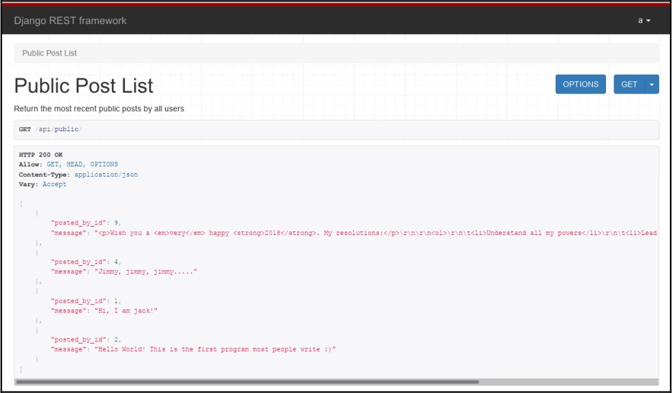
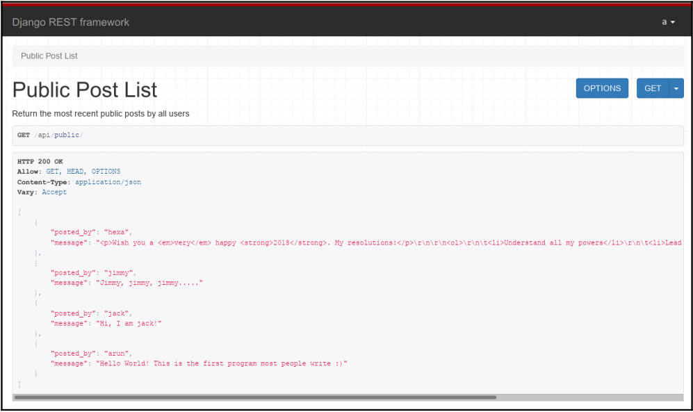

# ساختن APIها

در این فصل ما در مورد مباحث زیر بحث خواهیم کرد:

- RESTful API
- طراحی API
- فریمورک رست جنگو
- الگوهای API

تا کنون اپلیکیشن‌های جنگویی که ما طراحی میکردیم مورد استفاده انسان‌ها قرار میگرفت اما، حالا خیلی از آن‌ها به وسیله اپلیکیشن‌های دیگر دیگر مورد استفاده قرار میگیرند که استفاده ماشین با ماشین (machine to machine) است. طراحی خوب API باعث میشه که برنامه‌نویس‌ها برای نوشتن کد استفاده از آن راحت‌تر باشند.


در این فصل، هر موقع از لفظ API استفاده کردیم منظورمان **Representational state transfer (REST)** web APIها است، همانطوری که عموماً هم اشاره می‌شود. APIها معنای محبوبی دارند نه فقط بخاطر دسترسی عملکرد وب اپلیکشن‌ها است اما همچنین بخاطر ترکیب کردن و ساختن اپلیکیشن به طور کامل نیز است.

## RESTful API

اکثر اپلیکشن‌ها و وب سایت‌های محبوب این روزها یک رابط برنامه‌نویسی کاربردی(API) REST یا REST API ارائه میدهند. آمازون، نتفلیکس، تویلیو و هزاران کمپانی دیگه دارای رابط کاربری عمومی هستند که بخش  قابل توجهی از رشد تجارت آن‌ها شده است.

یک RESTful API یک وب سرویس API است که به ویژگی‌های معماری REST پایبند است. ما به طور خلاصه در [فصل 4]('../../../04-%20Views%20and%20URLs/README.md)، ویو‌ها و  urlها اشاره  کردیم که تز روی فیلدینگ(Roy Fielding) بود که سبک معماری Rest را معرفی کرد. با توجه به سادگی و انعطاف پذیری آن در موارد استفاده مختلف از جمله اپلیکیشن‌های موبایل به یک استاندارد واقعی در صنعت برای رابط‌های برنامه‌نویسی تبدیل شده است.

شش محدودیت معماری برای سیستم خالص RESTful است که آن‌ها در زیر آمده‌اند:

- **کلاینت - سرور**: الزام اینکه کلاینت و سرور باید را به صورت جدا باشند و بتوانند به صورت مستقل تکامل یابند.
- **بی تابعیت(Stateless)**: لازمه REST که بهش بی تابعیت هم میگن اینه که context کلاینت فقط در کلاینت ذخیره بشه ولی در سرور خیر.
- **قابل کش شدن(Cacheable)**: مخصوصا باید پاسخ‌ها(Response) مشخص باشند که قابل کش شدن هستند یا خیر که میتونه مقیاس پذیری و بازدهی را بهبود بده.
- **سیستم لایه‌ای**: به صورت فرم سلسله مراتبی به مدیریت پیچیدگی کمک میکنه و مقیاس پذیری رو بهبود میده.
- **کد بر اساس تقاضا**: به کدها یا اپلت‌ها(applet) اجازه میده که توسط سرور به کلاینت فرستاده بشن.
- **رابط یک شکل(Uniform Interface)**: مجموعه‌ای از محدودیت‌های اساسی است که معماری را جدا می‌کند از جمله منابع و پیام‌های خود توصیف کننده.

هرچند اکثر APIها به صورت خالصانه RESTful نیستند چون آن‌ها ممکنه یک یا چندتا از این محدودیت‌ها را بشکنند(معمولاً هم رابط یک شکل). هرچند هنوز هم ممکنه آن‌ها رو REST API بنامند.

در عمل اکثر آن‌ها به چند مفهوم معماری پایبندند، مانند زیر:

- منابع: هر شئ، داده به وسیله **Uniform Resource Identifiers(URI)** قابل دسترس هستند. این میتونه یک شئ تنها(میتونیم بگیم کاربر) یا یک مجموعه(میتونیم بگیم کاربران) باشه. معمولاً اونا به یک اسم اشاره میکنن تا یک فعل.
- عملیات درخواست: عملیات روی منابع عموماً از عملیات‌های استاندارد HTTP مانند GET, PUT, POST, OPTION و DELETE استفاده می‌شود. آن‌ها از همان قوانین به خوبی پیروی می‌کنند مثلا GET پوچه(بدون عوارض جانبی است) و PUT/DELETE ناتوان‌اند(همیشه همان نتیجه رو میگیرید مهم نیست چندبار آن‌ها را اجرا بشن).
- کدهای خطا: REST API از کدهای خطای HTTP استاندارد مانند 200(موفق)، 300(ریدایرکت) و 400(خطای کاربر) استفاده می‌کند.
- هایپرمدیا: جواب‌ها معمولاً حاوی هایپرلینک یا URIها به دیگر اقدامات(Action) و منابع برای انعطاف پذیری و قابل کشف شدن است. به طور مثال از هایپرلینک‌ها برای صفحه‌بندی(Pagination) یا دیتاهای با ساختار تو در تو استفاده می‌شود.

پیشنهاد من به شما این خواهد بود که استفاده از APIتان را هر چه می‌توانید آسان کنید تا به صورت سختگیرانه از محدودیت‌های REST خالص پیروی کنید. خیلی از APIهای محبوب و شناخته شده آن‌ها را نقص می‌کنند. اگر REST طراحی کردن API از آن روش راحت‌تره، از این روش استفاده کنید.

### طراحی API

ما یک استاندارد تنها برای REST API نداریم. هرچند در طول زمان تعداد زیادی APIهای خوب طراحی شده توسط کمپانی‌هایی مثل استرایپ، گیت‌هاب و ترلو به استاندارد‌هایی تبدیل شده‌اند که اکنون APIهای وب بر اساس آن طراحی می‌شوند. در اینجا ما چندین بهترین شیوه‌(best practice) را علاوه بر اصول طراحی که در بالا ذکر کردیم پوشش می‌دهیم. 


#### ورژن بندی کردن

یک API مثل قراردادی بین سرور و کلاینت است. اگر تغییراتی در رابط(Interface) یا معمولا در سرور صورت بگیرد قرارداد فسخ شده است. هرچند API نیاز دارد که تکامل یابد و ویژگی‌های جدیدی به آن اضافه شود و ویژگی‌های قدیمی آن منسوخ شوند.

از این رو ورژن بندی کردن API تصمیم کلیدی طراحی، در چرخه زندگی آن است که باید زود گرفته شود. چندین پیاده‌سازی محبوب ورژن بندی API وجود دارد:

- ورژن بندی کردن URI: پیشوندی کردن URI با شماره ورژن مانند <http://example.com/v3/superheroes/3>. این روش محبوبی است اما اصول را نقض می‌کند که هر منبع دارای یک URI منحصر به فرد در سراسر ورژن‌ها است.
- ورژن بندی پرس و جوی رشته‌ای(Query String versioning): اضافه کردن یک پرس و جوی رشته‌ای مخصوص هر ورژن به URI مانند <http://example.com/superheroes/3?version=3> . به طور فنی، URI در سراسر ورژن‌ها یکی است اما چنین پاسخ‌هایی در پروکسی‌های وب قدیمی‌تر کش نخواهند شد در نتیجه عملکردی تحقیرآمیز دارد.
- ورژن بندی هدر سفارشی(Custom Header versioning): شامل یک هدر سفارشی در درخواست شما. به عنوان مثال نمونه زیر را در نظر بگیرید
```
    GET /superheroes/3 HTTP/1.1
    Host: example.com
    Accept: application/json
    api-version: 3
```
در حالی که این مورد ممکنه به اصول REST نزدیکتر باشه و تمیزتر ولی این میتونه توی تست بعضی کلاینت‌های وب مثل مرورگر سخت‌تر باشه. هدرهای سفارشی دارای مشخصات بیرونی(outside spec) هستند و ممکنه مشکلات پنهانی را ایجاد کنند و این سبب میشه که دیباگ کردن آن‌ها سخت‌تر باشد.
- ورژن بندی نوع رسانه‌ای(Media Type versioning): استفاده از هدر Accept برای مشخص کردن نوع مدیا سفارشی شده که صریحاً در این ورژن ذکر شده. مثال زیر را در نظر بگیرید
```
    GET /superheroes/3 HTTP/1.1
    Host: example.com
    Accept: application/vnd.superhero-api.v3+json
```
این در حالی است که ممکن است مشکلات تست را نیز داشته باشد مانند هدر سفارشی. این افتخاری است که این روش استاندارد است. ممکنه این خالص‌ترین مدل ورژن بندی REST باشه.

تصمیمات طراحی دیگه‌ای نیز وجود دارد، مثل اینکه کدام طرح‌های ورژن بندی که باید دنبال کنید؟ باید یک افزایش عددی ساده باشد(مانند مثال‌های قبلی)، ورژن بندی مفهومی(مثل فیسبوک)، یا تاریخ انتشار آن(تویلیو)؟ این کاملا شبیه تمرین ورژن بندی محصول است.

سازگاری رو به عقب نیز تصمیم مهمی در چرخه زندگی API است. اینکه چند ورژن قدیمی را نگه دارید؟ اینکه چه چیزی تغییر جزئی یا کلی ورژن را تعیین می‌کند؟ اینکه چگونه ورژن‌های قدیمی‌تر را منسوخ کنیم؟

بهترین کار این که یک سیاست ارتباطی شفاف داشته باشید و همواره ازش پیروی کنید.

## فریمورک رست جنگو
ساختن API وب سایتتون ممکنه با استفاده از الگوی سرویس‌ها که در [فصل 3]('../../../03-%20Models/README.md)، مدل‌ها یاد گرفتیم بی‌اهمیت به نظر برسه. هرچند APIهای دنیای واقعی نیازمند عملکردهای خیلی خیلی بیشتره، از جمله اسناد مروری وب(web browsable document)، احراز هویت(authentications)، سریالایز کردن(serialization) و throttling؛ بهتره که از ابزاری مثل **Django Rest framework(DRF)** استفاده کنید.

جنگو رست فریمورک(DRF) محبوب‌ترین ابزار API برای جنگو است. اون خیلی با معماری جنگو مناسبه و از چندین مفهوم(concept) آشنا استفاده مجدد میکنه از جمله جنریک ویوها و مدل فرم‌ها. خارج از جعبه، API قابل استفاده و در دسترس با یک مرورگر وب معمولی است که تست کردن و پیدا کردن مستندات را برای توسعه دهنده‌ها آسان‌تر می‌کند. 

### بهتر کردن API پست‌های عمومی
مثال الگوی سرویس‌ها را بخاطر دارید، جایی که یک سرویس ساختیم که کل آخرین پست‌های عمومی بازیابی میکرد؟ حالا ما میخواهیم با ویژگی‌هایی که ارائه شده بود، به وسیله DRF آن را مجدداً بسازیم.

در وهله اول، DRF را نصب می‌کنیم و آن را به ```INSTALLED_APPS``` اضافه می‌کنیم. بعد مدل مجوزها و سطح دسترسی‌ها را در ```setting.py``` ذکر می‌کنیم.
```
# Django Rest Framework settings
REST_FRAMEWORK = {
# Allow unauthenticated access to public content
    'DEFAULT_PERMISSION_CLASSES': [
        'rest_framework.permissions.AllowAny'
    ]
}
```
حتی اگر چه ما اجازه دسترسی نامحدود(```AllowAny```) را داده‌ایم. قویاً توصیه میشه که محدودترین سیاست دسترسی را برای امنیت APIتان انتخاب کنید.

جنگو رست فریمورک(DRF) به ما اجازه انتخاب تنوع وسیعی از سیاست‌های دسترسی API را میدهد از جمله اجازه فقط برای کاربران احراز هویت شده(```IsAuthenticated```) یا اجازه دسترسی فقط خواندن کاربران احراز هویت نشده را می‌دهد(```DjangoModelPermissionsOrAnonReadOnly```) و بیشتر. سطح دسترسی‌های خیلی جرئی‌تری نیز میتوانند تعریف شوند.

از آنجایی که ما قبلاً مدل ```Post``` و مدیر مدل(model manager) را برای پست‌های عمومی تعریف کرده‌ایم، می‌توانیم سریالایزر پست(Post Serializer) را بسازیم. سریالایزرها برای تبدیل اشیاء ساختار یافته استفاده می‌کنند از جمله نمونه‌های مدل یا مجموعه‌های پرس و جو(Queryset) به فرمت‌های مثل JSON یا XML که بتوانند بر روی سیم اینترنت ارسال شوند. آن‌ها همچنین فرآیند معکوس این تبدیل شدن یعنی دیسریالایرز کردن هم انجام می‌دهند، اینکه فرمت JSON یا XML را به اشیاء ساختار یافته برگردانند.

فایل جدیدی به نام ```viewschapter/serializers.py``` با محتوای زیر بسازید:

```
from rest_framework import serializers
from posts import models

class PostSerializer(serializers.ModelSerializer):
    class Meta:
        model = models.Post
        fields = ("posted_by_id", "message")
```
ما به صورت اعلامی کلاس ```serializers``` را با آدرس دادن به کلاس ```model``` و فیلدهای آن تعریف کرده‌ایم که نیاز به سریالایز و دیسریالایز شدن دارد. توجه کنید که چگونه به تعریف کردن ```ModelForm``` شباهت دارد.

این از قصد است مانند وب سایت‌هایی که بر پایه HTML هستند و نیاز دارند داده ورودی کاربر به فرم‌ها را اعتبارسنجی کنند. APIهای وب نیز به یک دیسریالایزر نیاز دارد تا داده‌هایی که به API ارسال می‌شود را اعتبارسنجی کند. دقیقاً همانطور که فرم‌ها به مدل‌ها نگاشته می‌شوند، ```ModelForms``` نامیده می‌شوند، سریالایزرها(```Serializers```) نیز که به مدل‌ها نگاشته می‌شوند مدل سریالایزر(```ModelSerializers```) نامیده می‌شوند.

بعداً ما ویو APIمان را در فایل جدایی به نام ```viewschapter/apiviews.py``` تعریف میکنیم:

```
from rest_framework.views import APIView
from rest_framework.response import Response

from posts import models
from .serializers import PostSerializer


class PublicPostList(APIView):
    """
    Return the most recent public posts by all users
    """
    def get(self, request):
        msgs = models.Post.objects.public_posts()[:5]
        data = PostSerializer(msgs, many=True).data
        return Response(data)
```

متودهای کلاس ```APIView``` پارامترهای متفاوتی استفاده می‌کنند و نوع داده‌ای متفاوتی در مقایسه با ```View``` جنگو برمی‌گردانند. رست فریمورک نمونه‌های ```Request``` را میگیرد و جنگو به جای اون نمونه‌های ```HttpRequest```. همچنین رست فریمورک نمونه‌های ```Response``` را برمی‌گرداند در مقابل جنگو نمونه‌های ```HttpResponse```.

در نهایت، ما این رو در اپمون سیم‌کشی میکنیم ```viewschapter/urls.py```:

```
path('api/public/',
     apiviews.PublicPostList.as_view(), name="api_public"),
```
حالا اگر آدرس <http://127.0.0.1:8000/api/public/> یعنی آخرین نقطه API را در مرورگر وبتان ببینید، این صفحه معرکه را می‌بینید:



این را مقایسه کنید با فصل ویو که یک رشته JSON خالی بهتون نشون میداد. ما میتونیم اسم این اندپوینت API و توضیحات آن را ببینیم(از رشته مستندات(docstring) کلاس ```APIView```)، همچنین هدر درخواست و همچنین محموله JSON(با سینتکس مشخص شده).

#### پنهان کردن IDها
همه چیز API عالی به نظر می‌رسد به جز ریسک امنیتی افشا شدن کلید اصلی مدل کاربر به صورت عمومی. خوشبختانه سریالایزرها(```serializers```) میتوانند فیلدهای موجود را با اضافه کردن فیلدهایی که در مدل موجود نیستند، تغییر دهند مانند کد زیر:

```
class PostSerializer(serializers.ModelSerializer):
    posted_by = serializers.SerializerMethodField()

    def get_posted_by(self, obj):
        return obj.posted_by.username

    class Meta:
        model = models.Post
        fields = ("posted_by", "message",)
```

فیلد ```SerializerMethodField```، فیلدی فقط خواندنی است که مقدار(value) را از متود کلاس(class method) میگیرد. به صورت پیش فرض این متود به صورت <get_<field_name نامگذاری می‌شود.

حالا API به جای نمایش دادن کلید اصلی کاربران، پست‌ها را با نام کاربری برمی‌گرداند. همانطور که در تصویر زیر نیز مشخص است:



اگر شما یک خالص نویس REST هستید ممکن است اشاره کنید که به جای نام کاربری می‌توانیم منابع ```User``` را هایپرلینک کنیم. شما ممکن است بخواهید این را پیاده‌سازی کنید اگر کاربرهایتان با اینکه جزئیات حسابشان با API عمومی به اشتراک گذاشته شود راحت باشند.


