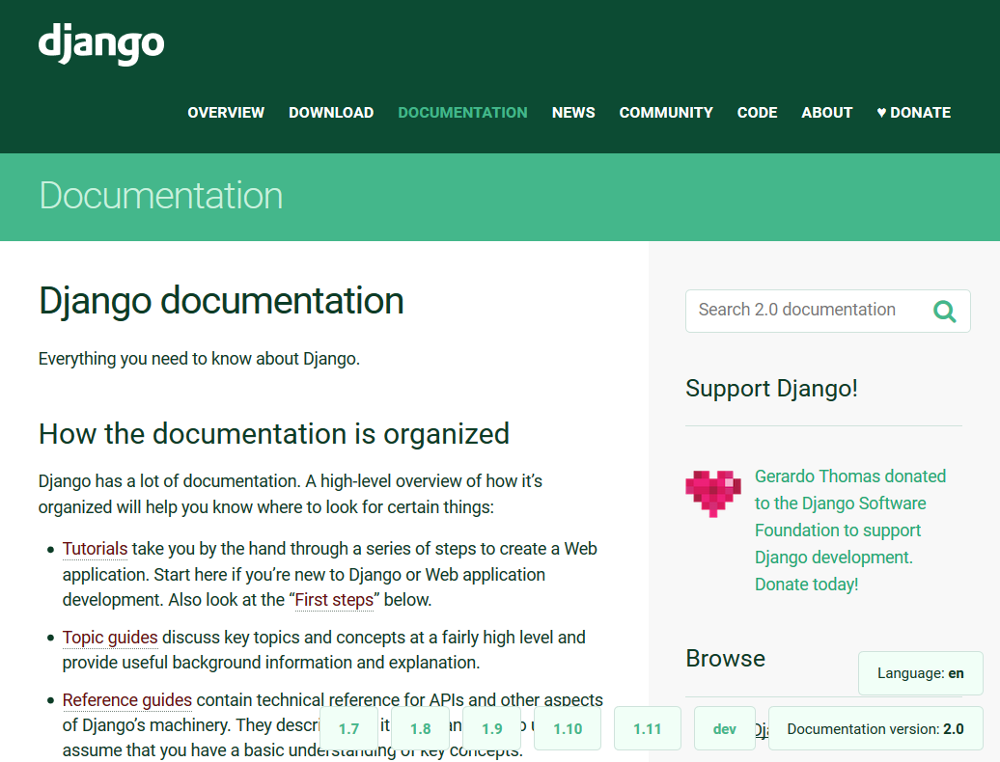
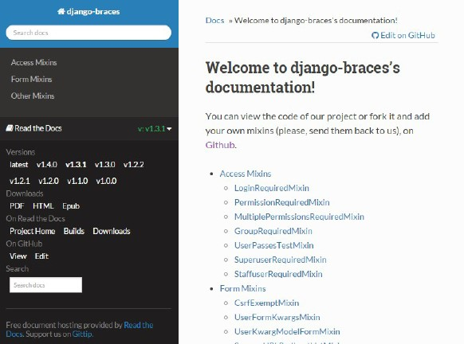
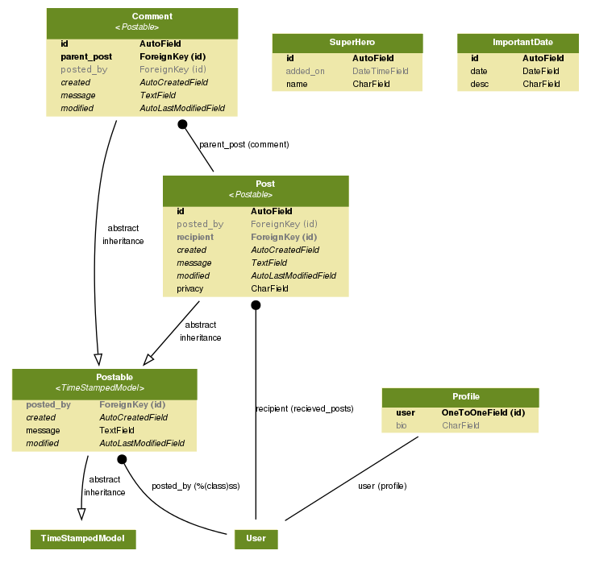

# سرو کار داشتن با کد مورثی

در این فصل، ما در مورد موضوعات زیر صحبت خواهیم کرد:

- یک کد اولیه جنگو را می خوانیم
-	بررسی اسناد مرتبط
- تغییرات افزایشی در مقابل بازنویسی کامل
- تست نوشتن قبل از ایجاد هر گونه تغییر
- اتصال دیتابیس  موروثی

وقتی از شما در خواست می شود تا به یک پروژه ملحق بشوید، هیجان انگیز به نظر میرسد. چرا که ابزارهای قدرتمند جدید و فناوری‌های پیشرفته احتمالا در انتظار شما است. اما با این حال، اغلب از شما درخواست می شود که با یک مجموعه ای از کدهای موجود که احتمالا قدیمی است کار کنید.

در تعبیری  منصفانه ، از پیدایش جنگو مدت زمان زیادی نمی گذرد. به هر حال، پروژه‌های نوشته شده برای نسخه‌های قدیمی جنگو به اندازه کافی متفاوت هستند که باعث نگرانی می‌شود. گاهی اوقات، داشتن همه کدهای منبع و اسناد مرتبط با آن شاید کافی نباشد.

اگر از شما خواسته شد که محیط را دوباره ایجاد کنید ممکن است که لازم باشد تا شما با پیکربندی سیستم عامل، تنظیمات پایگاه داده و اجرای سرویس‌ها به صورت محلی و یا در بستر شبکه کار کنید. بخش های مختلفی برای انجام این پازل وجود دارد که ممکن است تعجب کنید که چطور و از کجا باید شروع کنید.

پی بردن به اینکه در پروژه از چه نسخه ای از جنگو استفاده شده است یک نکته کلیدی است. با تکامل جنگو، همه چیز از ساختار پروژه پیش‌فرض گرفته تا بهترین روش‌های توصیه شده تغییر کرده است. بنابراین تشخیص اینکه از کدام نسخه جنگو استفاده شده است، یک بخش حیاتی در درک آن است.

***تغییر نگهبانان***

تیم superBook صبورانه روی کیسه‌های لوبیای کوتاه مسخره در اتاق تمرین نشسته و منتظر هارت بودند. او یک جلسه اضطراری حضوری تشکیل داده بود. هیچ کس بخش اضطراری را درک نکرد، زیرا حداقل سه ماه از شروع به کار آنها گذشته بود.

خانم O با عجله در حالی که یک لیوان قهوه با طراحی بزرگ در یک دست داشت و در دست دیگر مشتی پرینت از چیزی که شبیه جدول زمانی پروژه بود وارد شد. او بدون اینکه به بالا نگاه کند، گفت: "خیلی زمان نداریم، بنابراین مستقیماً به سر اصل مطلب می‌روم. با توجه به حملات هفته گذشته، هیئت مدیره تصمیم گرفته است که پروژه SuperBook سریعا به جمع بندی برسد و مهلت را تا پایان ماه آینده تعیین کرده است. سوالی هست؟"

برد گفت: بسیار خب، هارت کجاست؟ خانم O مکث کرد، و پاسخ داد: "خوب استعفا داد. او به عنوان رئیس امنیت فناوری اطلاعات مسئولیت اخلاقی رخنه محیطی <sup>[1](#footnote-1)</sup> را بر عهده گرفت." استیو که ظاهراً شوکه شده بود، سرش را تکان می داد. او ادامه داد: متاسفم، اما من به عنوان سرپرست SuperBook گمارده شده‌ام و باید اطمینان حاصل کنم که هیچ مانعی برای انجام پروژه تا موعد مقرر نداریم.

یک ناله جمعی شنیده شد. خانم O که دلسرد نشد، یکی از برگه ها را گرفت و گفت، "اینجا می گوید که ماژول بایگانی از راه دور در وضعیت ناقص بالاترین اولویت را دارد. من معتقدم که ایوان روی این موضوع کار می کند."
ایوان از انتهای اتاق گفت: "درست است." او به دیگران لبخند زد: "تقریباً آنجاست." خانم O از بالای لبه عینکش نگاه کرد و خیلی مؤدبانه لبخند زد.

ایوان از انتهای اتاق گفت: "درست است." او به دیگران لبخند زد: "تقریباً آنجاست." خانم O از بالای لبه عینکش نگاه کرد و خیلی مؤدبانه لبخند زد.

"با توجه به اینکه ما در حال حاضر یک بایگانی بسیار آزمایش شده و کارآمد در پایگاه کد سنتینل خود داریم، توصیه می کنم به جای ایجاد یک سیستم اضافی دیگر، از آن استفاده کنید."

استیو حرفش را قطع کرد، "این کار خیلی اضافه‌ای است. ما می توانیم نسبت به بایگانی کننده قدیمی پیشرفت کنیم، نه؟ اگر خراب نیست، پس نیازی به اصلاح ندارد". خانم O خیلی خلاصه پاسخ داد. برد با صدای بلندگفت  "او دارد روی آن کار می کند" "در مورد همه کارهایی که قبلاً به پایان رسانده است؟"

خانم O با بی حوصلگی پرسید. "ایوان، چه مقدار از کار را تا کنون تکمیل کرده ای؟" او با حالت دفاعی پاسخ داد: «حدود 12 درصد». همه با ناباوری به او نگاه کردند.  او گفت : "چی؟ این 12 درصد سخت‌ترین بخش کار بود."

خانم O ادامه جلسه را با همین حالت ادامه داد. کار همه دوباره اولویت‌بندی شد و متناسب با مهلت زمانی جدید، فشرده شد. همانطور که کاغذهایش را برداشت، آماده رفتن بود، مکثی کرد و عینکش را برداشت و گفت:


"من به معنای واقعی کلمه می دانم که همه شما به چه چیزی فکر می کنید ، اما باید بدانید که ما هیچ انتخابی در مورد  تعیین ضرب الاجل نداشتیم. تنها چیزی که اکنون می توانم به شما بگویم این است که جهان برای رسیدن به آن تاریخ، به هر نحوی، روی شما حساب می کند" عینکش را دوباره گذاشت و از اتاق خارج شد.

ایوان با صدای بلند با خود گفت: "حتما کلاه فویل خود را خواهم آورد<sup>[2](#footnote-2)</sup>
. "


## یافتن نسخه جنگو

در حالت ایده آل، هر پروژه ای یک فایل requirements.txt یا setup.py در دایرکتوری اصلی خود دارد، و داخل آن نسخه دقیق جنگو استفاده شده وجود دارد. 
 
 `Django==1.5.9`

شماره نسخه دقیقا ذکر شده است (به جای Django>=1.5.9) که به آن پینینگ می گویند. پینینگ هر بسته یک عمل خوب در نظر گرفته می‌شود، زیرا مشکلات پیش‌بینی نشده را کاهش می‌دهد و ساخت پروژه  شما را قطعی‌تر می‌کند.


به عنوان بهترین روش، ایجاد یک محیط کاملاً تکرارپذیر برای یک پروژه توصیه می شود. این محیط شامل داشتن یک فایل نیازمندی‌ها با تمام وابستگی‌های مختلف لیست شده(پینینگ) به همراه خروجی یک تابع هش است. –خروجی تابع هش بسته‌ها به این صورت است:

`Django==1.5.9 --hash=sha256:2cf24dba5fb0a30e26e83b2ac5...`

هش ها در برابر دستکاری از راه دور محافظت می کنند و نیاز به ایجاد سرورهای فهرست بسته خصوصی حاوی بسته های تایید شده را کاهش می دهند. متأسفانه، پایگاه‌های کد در دنیا واقعی هستند که در آن‌ها فایل requires.txt به‌روزرسانی نشده یا حتی اصلاً وجود ندارد. در چنین مواردی، برای یافتن نسخه دقیق باید علائم مختلف را بررسی کنید.

## فعال سازی محیط مجازی

در بیشتر موارد، یک پروژه جنگو در یک محیط مجازی دیپلوی  می شود. هنگامی که محیط مجازی پروژه را پیدا کردید، می توانید آن را با رفتن به آن دایرکتوری و اجرای اسکریپت فعال شده برای سیستم عامل خود فعال کنید.

برای لینوکس، دستور به صورت زیر است:

```bash
$ source venv_path/bin/activate
```

هنگامی که محیط مجازی فعال شد، یک شل پایتون را راه اندازی کنید و نسخه جنگو را با دستورات زیر، همانطور که در زیر نشان داده شده است مشاهده خواهید کرد:

```bash
$ python
>>> import django
>>> print(django.get_version())
1.5.9
```
نسخه جنگو استفاده شده در این مورد نسخه `1.5.9` است. همچنین، می‌توانید اسکریپت `manage.py` را در پروژه اجرا کنید تا خروجی مشابهی دریافت کنید:

```bash
$ python manage.py --version
1.5.9
```
با این حال، اگر سورس کد پروژه قدیمی به صورت دیپلوی نشده برای شما ارسال شده باشد، این گزینه در دسترس نخواهد بود. اگر محیط مجازی (و بسته ها) نیز گنجانده شده بود، می توانید به راحتی شماره نسخه (به شکل یک تاپل) را در فایل `__init__.py` دایرکتوری جنگو پیدا کنید. مثال داده شده را در نظر بگیرید:

```bash
$ cd envs/foo_env/lib/python2.7/site-packages/django
$ cat __init__.py
VERSION = (1, 5, 9, 'final', 0)
...
```

اگر به کمک روش‌های ذکر شده موفق به یافتن نسخه جنگو نشدید، باید یادداشت‌های نسخه‌های منتشر شده قدیمی جنگو را مرور کنید تا تغییرات قابل شناسایی را تعیین کنید (به عنوان مثال، تنظیم `AUTH_PROFILE_MODULE` از نسخه 1.5 منسوخ شده است) و آنها را با کد خود مطابقت دهید. هنگامی که نسخه صحیح جنگو را مشخص کردید، می توانید به سراغ تجزیه و تحلیل کد بروید.


[Pipenv](https://docs.pipenv.org/), یک ابزار جدید بسته بندی پایتون است اما ،[ به طور رسمی توصیه شده است](https://packaging.python.org/tutorials/managing-dependencies/#installing-pipenv) چرا که بسیاری از این مشکلات را حل می‌کند. این ابزار عملکرد `pip` و `virtualenv` را با هم ترکیب می کند به طوری که وقتی یک بسته را نصب می کنید، فایل مورد نیاز آن (به نام pipenv) را به طور خودکار به روز می کند نکته مهم آخر اینکه، بیلدهای تکرار پذیر با استفاده از یک فایل `Pipenv.lock`، که کاملاً پین شده و شامل هش است، فعال می‌کند.

## فایل ها کجا هستند؟ این PHP نیست

یکی از سخت‌ترین تصورها برای عادت کردن (مخصوصاً اگر اهل دنیای PHP یا ASP.NET هستید) این است که فایل‌های منبع در دایرکتوری ریشه پوشه وب سرور شما( که معمولاً `wwwroot` یا `public_html` نامیده می‌شود) قرار نگیرند. علاوه بر این، هیچ رابطه مستقیمی بین ساختار دایرکتوری کد و ساختار URL وب سایت وجود ندارد.

در واقع، متوجه خواهید شد که کد منبع وب سایت جنگو شما در یک مسیر مبهم مانند `/opt/webapps/my-django-app` ذخیره شده است. چرا اینطور هست؟ در میان بسیاری از دلایل خوب، انتقال داده های محرمانه خود به خارج از ریشه وب عمومی شما اغلب ایمن تر است. به این ترتیب، یک خزنده وب نمی تواند به طور تصادفی به لیست کد منبع شما برخورد کند.

همانطور که در `فصل 13`(آمادگی برای محیط پروداکشن) خواهید خواند، محل کد منبع را می توان با بررسی فایل پیکربندی وب سرور خود پیدا نمایید. در اینجا، متغیر محیطی `DJANGO_SETTINGS_MODULE` را می‌بینید که روی مسیر ماژول تنظیم شده است، یا درخواست را به سرور WSGI ارسال می‌کند که برای اشاره به فایل `project.wsgi` شما پیکربندی خواهد شد.

## شروع با urls.py

حتی اگر به کل کد منبع یک سایت جنگو دسترسی داشته باشید، فهمیدن نحوه عملکرد آن در برنامه های مختلف می تواند دشوار باشد. اغلب، بهتر است از `URLconf` واقع در فایل `urls.py` شروع کنید، زیرا به معنای واقعی کلمه یک نقشه است که هر درخواست را به نماهای مربوطه مرتبط می کند.


با برنامه‌های معمولی پایتون، من اغلب از ابتدای اجرای آن شروع به خواندن می‌کنم – مثلاً از ماژول اصلی سطح بالا یا هرجا که اصطلاح چک `__main__` شروع می‌شود. در مورد برنامه‌های جنگو، من معمولاً با `urls.py` شروع می‌کنم زیرا دنبال کردن جریان اجرای کد بر اساس الگوهای URL مختلف یک سایت آسان‌تر است.

در لینوکس، می توانید از دستور `find` به صورت زیر برای یافتن محل فایل `settings.py` و خط مربوطه که ریشه `urls.py` را مشخص می کند استفاده کنید:


```bash
$ find . -iname settings.py -exec grep -H 'ROOT_URLCONF' {} \;
./projectname/settings.py:ROOT_URLCONF = 'projectname.urls'
$ ls projectname/urls.py
projectname/urls.py
```

## پرش در اطراف کد

گاهی اوقات خواندن کد مانند مرور صفحات وب بدون لینک است. هنگامی که با یک تابع یا متغیری روبرو می شوید که در جای دیگری تعریف شده است، باید به فایلی که حاوی آن تعریف است بروید. برخی از IDE ها می توانند این کار را به صورت خودکار برای شما انجام دهند به شرطی که به آن ها بگویید که کدام فایل ها را به عنوان بخشی از پروژه ردیابی کند.

اگر به جای آن از Emacs یا Vim استفاده می کنید، می توانید یک فایل TAGS برای پیمایش سریع بین فایل ها ایجاد کنید. به پوشه اصلی پروژه بروید و ابزاری به نام  **Exuberant Ctags** را به صورت زیر اجرا کنید:

```bash
find . -iname "*.py" -print | etags -
```
این یک فایل به نام TAGS ایجاد می کند که حاوی اطلاعات موقعیت است، جایی که هر واحد نحوی، مانند کلاس ها و توابع، تعریف شده است. در Emacs، می توانید تعریف تگ را پیدا کنید، جایی که مکان نما (یا نقطه همانطور که در Emacs نامیده می شود) با استفاده از فرمان `M-` است. 

در حالی که استفاده از یک فایل تگ برای کد بزرگ بسیار سریع است، اما کاملاً ابتدایی است و از یک محیط مجازی (جایی که بیشتر تعاریف ممکن است قرار داشته باشند) آگاه نیست. یک جایگزین عالی استفاده از بسته `elpy` در Emacs است. می توان آن را برای شناسایی یک محیط مجازی پیکربندی کرد. پرش به تعریف یک عنصر نحوی با استفاده از همان فرمان `M-` است. با این حال، جستجو به فایل برچسب محدود نمی‌شود، بنابراین می‌توانید به طور یکپارچه به تعریف کلاس در کد منبع جنگو بروید. اکثر IDE ها این ویژگی را تحت نام `Navigate/Go
to definition` ارائه می کنند. 

## درک کردن پایه‌ی کد

یافتن کد قدیمی با مستندات خوب بسیار نادر است. حتی اگر این کار را انجام دهید، ممکن است اسناد تا حدی با کد هماهنگ نباشد که می‌تواند منجر به مشکلات بیشتر شود. اغلب، بهترین راهنما برای درک عملکرد برنامه، اجرای کدهای تست و یا اجرای خود کد است. اسناد رسمی جنگو بر اساس نسخه هایی در [https://docs.djangoproject.com](https://docs.djangoproject.com) سازماندهی شده است. در هر صفحه‌ای، می‌توانید به سرعت به صفحه مربوطه در نسخه‌های قبلی جنگو (با یک انتخابگر در قسمت پایین سمت راست صفحه) بروید: 



به همین ترتیب، اسناد مربوط به هر بسته جنگو که در  [readthedocs.org](http://readthedocs.org)  میزبانی شده است را نیز می توان به نسخه های قبلی آن ریشه‌یابی کرد.

به عنوان مثال، می توانید با کلیک بر روی انتخابگر در قسمت پایین سمت چپ صفحه، مستندات `django-braces` را تا نسخه 1.0.0 انتخاب کنید:




## ایجاد تصویر کلی

بیشتر مردم با مشاهده نمودار سطح بالا از یک برنامه کاربردی راحت تر آن را درک می کنند. در حالی که این به طور ایده‌آل توسط شخصی ایجاد می‌شود که عملکرد برنامه را می‌فهمد، ابزارهایی وجود دارند که می‌توانند تصاویر بسیار مفیدی در سطح بالا از یک برنامه جنگو ایجاد کنند.

با دستور مدیریت `graph_models` که توسط بسته `django-command-extensions` ارائه می شود، می توان یک نمای کلی گرافیکی از همه مدل ها در برنامه های شما ایجاد کرد. همانطور که در نمودار زیر نشان داده شده است، کلاس های مدل و روابط آنها را می توان در یک نگاه درک کرد:



این تجسم در واقع با استفاده از PyGraphviz ایجاد می شود. این می تواند برای پروژه های حتی با پیچیدگی متوسط واقعاً بزرگ باشد. از این رو، اگر برنامه ها به طور منطقی گروه بندی شده و جداگانه تجسم شوند، ممکن است آسان تر باشد.


## نصب و استفاده از PyGraphviz

اگر فکر مکنید که نصب PyGraphviz چالش برانگیز است، نگران نباشید، شما تنها نیستید. اخیراً هنگام نصب در اوبونتو با مشکلات متعددی مواجه شدم، از ناسازگاری پایتون 3 تا اسناد ناقص. برای صرفه جویی در وقت شما، مراحلی را که برای رسیدن به یک راه‌اندازی صحیح نیاز است، لیست کرده‌ام:

1.	در اوبونتو، برای نصب PyGraphviz به بسته های زیر نیاز دارید:
PyGraphviz:

```bash
$ sudo apt-get install python-dev graphviz libgraphviz-dev pkg-config
```

2.	اکنون محیط مجازی خود را فعال کنید و pip را اجرا کنید تا نسخه توسعه PyGraphviz را مستقیماً از GitHub که از Python 3 پشتیبانی می کند نصب کنید:

```bash
$ pip install
git+http://github.com/pygraphviz/pygraphviz.git#egg=pygraphviz
```

3.	سپس،`django-extensions` را نصب کنید و آن را به `INSTALLED_APPS` خود اضافه کنید. اکنون، شما آماده اید.

4.	در اینجا نمونه ای وجود دارد که برای ایجاد یک فایل GraphViz با پسوند dot فقط برای دو برنامه و تبدیل آن به یک تصویر با پسوند PNG برای مشاهده استفاده می شود:

```bash
$ python manage.py graph_models app1 app2 > models.dot
$ dot -Tpng models.dot -o models.png
```

## تغییرات افزایشی یا نوشتن مجدد به صورت کامل؟

اغلب، کدهای قدیمی توسط صاحبان برنامه به شما تحویل داده می شود به این امید که بیشتر آن می تواند فوراً یا پس از چند تغییر جزئی استفاده شود. با این حال، خواندن و درک یک پایگاه کد عظیم و اغلب قدیمی کار آسانی نیست. جای تعجب نیست که بیشتر برنامه نویسان کار روی greenfield  را ترجیح می دهند.

در بهترین حالت، کد قدیمی باید به راحتی قابل آزمایش، به خوبی مستند و انعطاف پذیر باشد تا در محیط های مدرن کار کند تا بتوانید در کمترین زمان تغییرات تدریجی را شروع کنید. در بدترین حالت، ممکن است توصیه کنید کد موجود را دور بیندازید و به بازنویسی کامل بروید. روش دیگر، همانطور که در بیشتر موارد وجود دارد، رویکرد کوتاه‌مدت ادامه ایجاد تغییرات تدریجی است و ممکن است یک تلاش بلندمدت موازی برای اجرای مجدد کامل انجام شود.

یک قانون کلی که هنگام اتخاذ چنین تصمیماتی باید رعایت شود این است که اگر هزینه بازنویسی برنامه و نگهداری برنامه کمتر از هزینه نگهداری برنامه قدیمی در طول زمان است، توصیه می شود به سراغ بازنویسی بروید. باید مراقب تمام عوامل، مانند زمان صرف شده برای به روز رسانی برنامه نویسان جدید، و هزینه نگهداری سخت افزار قدیمی باشید.

گاهی اوقات، پیچیدگی حوزه برنامه به مانع بزرگی در برابر بازنویسی تبدیل می شود، زیرا بسیاری از دانش‌های آموخته شده در فرآیند ساخت کدهای قدیمی از بین می رود. اغلب، این وابستگی به کد قدیمی خود نشانه ای از طراحی ضعیف در برنامه است، مانند شکست در برون‌سپاری قوانین تجاری از منطق برنامه.

بدترین شکل بازنویسی که احتمالاً می توانید انجام دهید تبدیل یا ترجمه مکانیکی از یک زبان به زبان دیگر بدون استفاده از بهترین شیوه های موجود است. به عبارت دیگر، شما فرصت مدرن سازی پایه کد را با حذف سال‌ها شکست از دست دادید.

کد باید به عنوان یک بدهی و نه به عنوان یک دارایی در نظر گرفته شود. هرچقدر هم که ممکن است غیر شهودی به نظر برسد، اگر بتوانید با مقدار کمتری کد به اهداف تجاری خود برسید، بهره وری خود را به طرز چشمگیری افزایش داده اید. داشتن کد کمتر برای آزمایش، اشکال زدایی و نگهداری نه تنها می تواند هزینه های جاری را کاهش دهد، بلکه سازمان شما را در برابر تغییرات چابک تر و انعطاف پذیرتر می کند.

`کد یک بدهی است، نه یک دارایی. کد کمتر قابل نگهداری است.`

صرف نظر از اینکه ویژگی‌ها را اضافه می‌کنید یا کد خود را مرتب می‌کنید، شما نباید بدون انجام آزمایشات به کد قدیمی کاری خود دست بزنید

## تست نوشتن قبل از ایجاد هرگونه تغییر

در کتاب *کارکرد موثر با کد مورثی* (Working Effectively with Legacy Code) توسط *Michael Feathers*، کدهای قدیمی به سادگی به صورت کد بدون آزمون تعریف شده است. او توضیح می‌دهد که با آزمایش‌ها، می‌توانید به راحتی رفتار کد را به سرعت و به‌طور قابل تأیید تغییر دهید. در غیاب آزمایش، نمی توان ارزیابی کرد که آیا این تغییر باعث بهتر یا بدتر شدن کد شده است.


اغلب، ما به اندازه کافی درباره کدهای قدیمی نمی دانیم تا بتوانیم با اطمینان یک تست بنویسیم. مایکل نوشتن تست هایی را توصیه می کند که رفتار موجود را حفظ و مستند کند، که به آنها تست مشخصه‌سازی می گویند.

برخلاف دیدگاه‌های معمول تست‌ نوشتن، هنگام نوشتن تست مشخصه‌سازی ابتدا یک تست شکست با خروجی ساختگی (مثلا X) می‌نویسید، زیرا نمی‌دانید از خروجی چه نتیجه‌ای حاصل می شود. هنگامی که تست با یک خطا از کار می افتد **مثلا خروجی X انتظار می رود اما Y را دریافت می کند**، تست خود را به Y تغییر می دهید. بنابراین، اکنون تست با موفقیت انجام می شود و به یک رکورد از رفتار موجود کد تبدیل می شود.

`ممکن است رفتار باگ‌دار را نیز ثبت کنیم. گذشته از همه اینها، به این کد شناخت کافی نداریم. با این اوصاف، نوشتن چنین تست هایی قبل از شروع تغییر کد ضروری است. بعداً، وقتی مشخصات و کدها را بهتر دانستیم، می‌توانیم این باگ‌ها را برطرف کرده و آزمایش‌های خود را به‌روزرسانی کنیم (نه لزوماً به این ترتیب).`

## مراحل گام به گام جهت نوشتن تست

نوشتن تست قبل از تغییر کد شبیه به نصب داربست قبل از مرمت یک ساختمان قدیمی است. این یک چارچوب ساختاری را فراهم می کند که به شما کمک می کند تا تعمیرات را با اطمینان انجام دهید.

ممکن است بخواهید این فرآیند را به صورت گام به گام به شرح زیر انجام دهید:

1.	بخشی را که باید در آن تغییرات ایجاد کنید، مشخص کنید. گزارش اشکال شما می تواند راهنمای خوبی برای محدود کردن حوزه مشکل باشد. تست های  مشخصه‌سازی را با تمرکز بر روی این ناحیه بنویسید تا زمانی که رفتار آن را به نحوی که مورد رضایتتان است دریافت کنید.

2.	به تغییراتی که باید ایجاد کنید نگاه کنید و موارد تستی خاص را برای آن ها بنویسید. در برابر وسوسه افزودن قابلیت های جدید مقاومت کنید. سعی کنید که تست های واحد  را به صورت کوچک بنویسید و از نوشتن تست های بزرگ دوری کنید. 

3. تغییرات افزایشی را تعیین کنید و در در یک حالت گام‌به‌گامِ تست کنید. اگر تست‌ها شکست خورد، سعی کنید آن را تجزیه و تحلیل کنید که آیا مورد انتظار بود یا خیر. اگر آن رفتار چیزی است که قصد تغییر آن را داشته اید، از شکست حتی تست های مشخصه‌سازی نترسید.

توجه داشته باشید که تست های مشخصه تمام رفتارهای موجود کد شما از جمله اشکالات را ثبت می کنند. هنگامی که کد شما وارد مرحله پروداکشن شد و کاربران با آن آشنا شدند، اشکالات می توانند به رفتار مورد انتظار تبدیل شوند. بنابراین این تست ها به عنوان یک مستند قابل آزمایش از عملکرد همانطور که هست عمل می کنند.

اگر مجموعه خوبی از تست های دانه ایی در اطراف کد خود دارید، می توانید به سرعت تأثیر تغییر کد خود را پیدا کنید. از این رو، ارزش نوشتن تست های واحد بیشتر با پوشش خوب به شما کمک می کند تا تأثیر یک تغییر را سریع تشخیص دهید.

از سوی دیگر، اگر تصمیم به بازنویسی با حذف کد خود دارید، اما نه داده های خود، جنگو می تواند کمک قابل توجهی به شما کند.

## یکپارچگی دیتابیس میراثی


یک بخش کامل در مورد پایگاه داده های قدیمی در اسناد جنگو وجود دارد و این کار درستی است، زیرا بارها با آنها برخورد خواهید کرد. داده ها مهم تر از کد هستند و پایگاه های داده مخازن داده ها در اکثر شرکت ها هستند.

شما می توانید یک برنامه قدیمی را که به زبان ها یا فریم ورک های دیگر نوشته شده است، با وارد کردن ساختار پایگاه داده آنها به جنگو مدرن کنید. به عنوان یک مزیت ، می توانید از رابط مدیریت جنگو برای مشاهده و تغییر داده های قدیمی خود استفاده کنید.

جنگو با دستور مدیریت `inspectdb` که به صورت زیر است این کار را آسان می کند:


```bash
$ python manage.py inspectdb > models.py
```

اگر این دستور در حالی اجرا شود که تنظیمات شما برای استفاده از پایگاه داده قدیمی پیکربندی شده است، می تواند به طور خودکار کد پایتون را ایجاد کند که در بخش فایل مدل های شما می رود. به طور پیش فرض، این مدل ها بدون مدیریت هستند، یعنی `managed = False`. در این حالت، جنگو ایجاد، اصلاح یا حذف مدل را کنترل نخواهد کرد.

اگر از این رویکرد برای ادغام یک پایگاه داده قدیمی استفاده می کنید، در اینجا بهترین روش ها آورده شده است:

- از قبل محدودیت های ORM جنگو را بشناسید. در حال حاضر، کلیدهای اولیه چند ستونی (کامپوزیت) و پایگاه داده های NoSQL پشتیبانی نمی شوند.

- فراموش نکنید که مدل های تولید شده را به صورت دستی اصلاح کنید. به عنوان مثال، فیلدهای `id` اضافی را حذف کنید زیرا جنگو آنها را به طور خودکار ایجاد می کند.

- روابط کلید خارجی ممکن است به صورت دستی تعریف شوند. در برخی پایگاه‌های داده، مدل‌های تولید شده به صورت خودکار دارای فیلدهای عدد صحیح (با پسوند `_id`) هستند.

- مدل های خود را در برنامه های جداگانه سازماندهی کنید. بعداً افزودن نماها، فرم‌ها و تست‌ها در پوشه‌های مناسب آسان‌تر خواهد بود.

- به یاد داشته باشید که اجرای migrations، جداول مدیریت جنگو (`django_*` و `auth_*`) را در پایگاه داده قدیمی ایجاد می کند.

در حالت ایده‌آل، باید بتوان از مدل‌های تولید خودکار بلافاصله استفاده کرد، اما در عمل، آزمون و خطای زیادی می‌طلبد. گاهی اوقات، نوع داده ای که جنگو استنباط می کند ممکن است با انتظارات شما مطابقت نداشته باشد. در موارد دیگر، ممکن است بخواهید متا اطلاعات اضافی، مانند `unique_together` را به مدل خود اضافه کنید.


در نهایت، شما باید بتوانید تمام داده‌هایی را که در داخل برنامه قدیمی PHP داشتید، در رابط کاربری Django خود مشاهده کنید. من مطمئن هستم که مشاهده این دیتاها در جنگو لبخند به لب شما خواهد آورد.

## آینده نگری<sup>[3](#footnote-3)</sup>  (Future proof)

یک پایه کد خوب نوشته شده برای کار کردن لذت بخش است. یک پایگاه کد بد سازماندهی شده و  شکننده معمولاً به عنوان کد قدیمی در نظر گرفته می شود و مانع نوآوری می شود. بنابراین چگونه می توانید شانس در نظر گرفتن برنامه خود را به عنوان کد مورثی کاهش دهید؟ در اینجا چند توصیه وجود دارد:

- **منسوخ ‌شده‌های جنگو**: منسوخ شده ها به شما می‌گویند که آیا یک ویژگی یا اصطلاح در آینده از جنگو حذف خواهد شد. از جنگو 1.11 آنها به طور پیش فرض غیر فعال هستند. از `python -Wd`  استفاده کنید تا اخطارهای منسوخ شدن نمایش داده شوند.
- **بررسی کد**: از کیفیت بالای کد اطمینان حاصل کنید و روش برتر را در بررسی ها تشویق کنید.
- **قالب‌بندی ثابت**: برای کاهش زمان بازبینی، از یک برنامه قالب‌بندی کد مانند `black` جهت مرتب شدن کدها قبل از اجرای آن استفاده کنید
- **افزایش پوشش کد<sup>[4](#footnote-4)</sup>**: تست های بیشتری بنویسید، به خصوص تست های واحد.
- **اشاره به نوع<sup>[5](#footnote-5)</sup>**: از سرنخ‌های نوع برای انجام تحلیل ایستای کد  پایتون 3 و کاهش تعداد موارد تست استفاده کنید.
- **مدیریت پیکربندی**: کنترل نسخه قوی و سایر شیوه های مدیریت پیکربندی را برای انجام پروژه خود در نظر بگیرید تا اطمینان از محیط های قابل تکرار و بازگشت بدون دردسر را داشته باشید. این شامل استفاده از مجموعه ای از ابزارها از Git تا  Ansible است، در حالی که فرهنگ DevOps چابکی دارید.

## خلاصه
در این فصل، تکنیک‌های مختلفی را برای درک کدهای قدیمی بررسی کردیم. خواندن کد اغلب یک مهارت دست کم گرفته شده است. با این حال، به جای اختراع مجدد چرخ، ما نیاز داریم تا زمانی که ممکن است از کدهای با عملکرد مناسب دوباره استفاده کنیم. در این فصل و در سراسر کتاب، ما بر اهمیت نوشتن موارد تست به عنوان بخشی جدایی ناپذیر از کدنویسی تاکید می کنیم.

در فصل بعدی، در مورد نوشتن موارد تست و کار اغلب خسته کننده اشکال زدایی که به دنبال آن انجام می شود صحبت خواهیم کرد.


---
<a name="footnote-1">1</a>:   محیط، منظور محیط شبکه است که در واقع مرز بین شبکه داخلی امن یک سازمان و هر شبکه خارجی کنترل نشده دیگری مثل اینترنت است.  در اینجا اشاره به نفوذ به داخل شبکه آن سازمان توسط حملات سایبری دارد.

<a name="footnote-2">2</a>:  زمانی از این اصطلاح استفاده می شود که فرد به تئوری های توطئه اعتقاد دارد و یا اصطلاحا اعتقاد به این دارد که رویداد فعلی نتیجه نقشه های مخفی افراد قدرتمند هستند

<a name="footnote-3">3</a>:  ‌ فرآیند پیش‌بینی آینده و ارائه روش‌هایی جهت حداقل شدن شوک‌ها و تنش‌های رخدادها و حوادث آینده است. جهت به خداقل رسیدن تغییرات در کد ها است.

<a name="footnote-4">4</a>:  پوشش کد (Code Coverage) به میزان خط کدی که توسط تست های نوشته شده شما پاس می شوند گفته می شود   

<a name="footnote-5">5</a>: اشاره به نوع (Type hinting) در واقع قابلیتی است که از طریق آن می توانید تعیین کنید که انتظار چه نوع داده ای را از به عنوان نمونه تابع مد نظر خود داریم.


