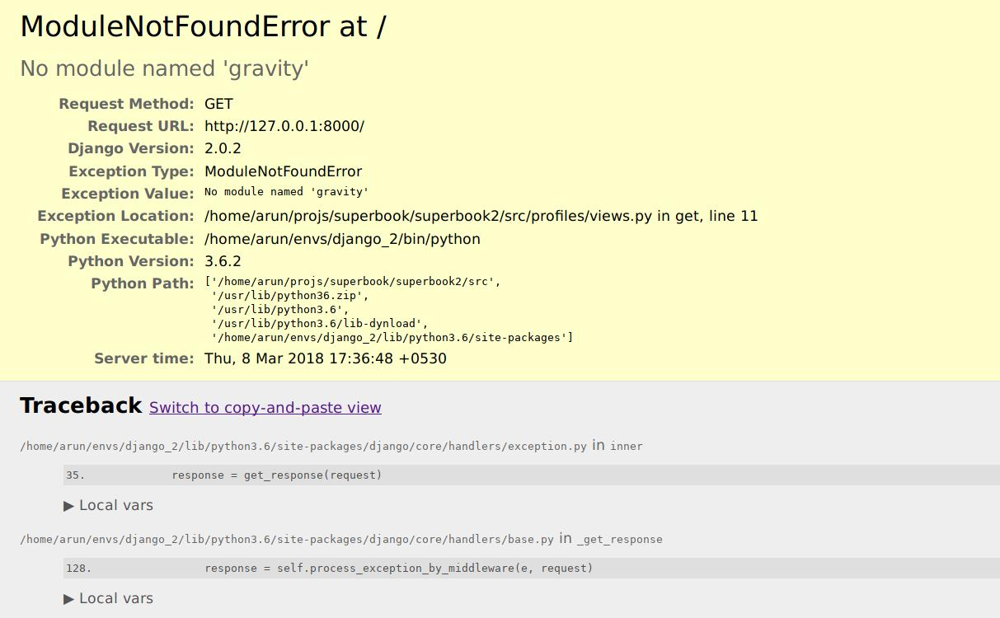
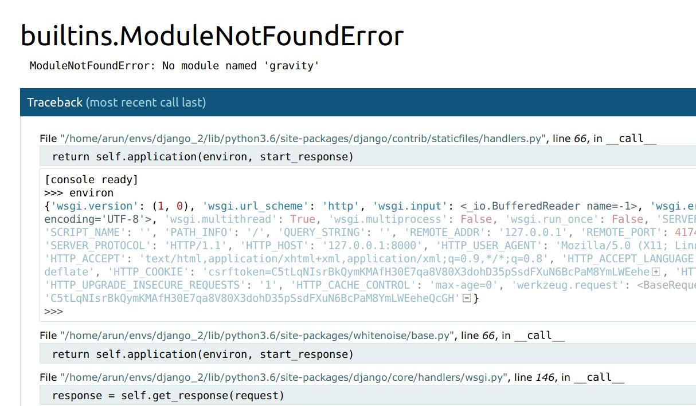
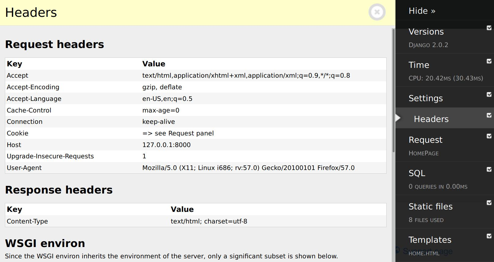
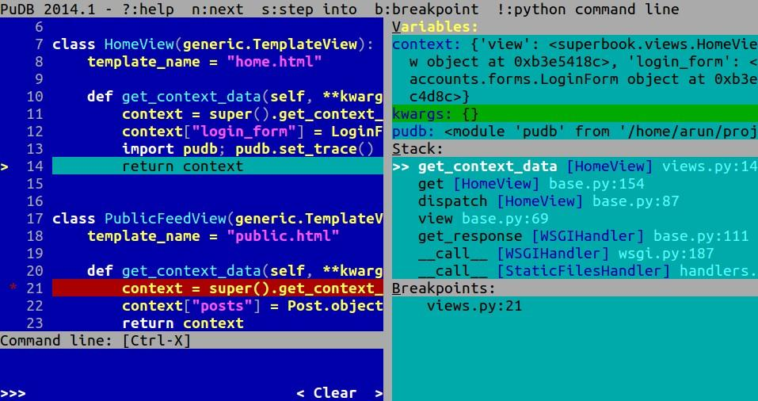

# تست کردن و رفع مشکل

در این بخش موضوعات زیر را بررسی خواهیم کرد:

توسعه تست محور TDD
- بایدها و نبایدها در نوشتن تست
- تقلید کردن Mocking
- عیب‌یابی Debugging 
- لاگ کردن Logging

هر برنامه‌نویسی حداقل یک‌بار به این فکر کرده است که نوشتن تست را انجام ندهد. در جنگو، ترکیب‌بندی پیش‌فرض اپ‌ها، دارای یک ماژول `tests.py`به همراه تعدادی محتوای جانگه‌دار (placeholder) است. این برای یادآوری آن است که تست‌ها ضروری هستند. با اینحال ما اغلب تمایل داریم که از نوشتن تست صرفنظر کنیم.

در جنگو، نوشتن تست تقریباً شبیه نوشتن کد است. درواقع عملاً کد است. بنابراین، فرآیند نوشتن تست ممکن است شبیه این به نظر بیاید که کدهای پروژه دوبرابر (یا بعضی وقت‌ها بیشتر) شود. بعضی مواقع، ما تحت چنان فشاری هستیم که ممکن است به نظر احمقانه بیاید که تست بنویسیم در حالی که فقط در تلاش هستیم که پروژه کار کند.

با اینحال در نهایت، اگر بخواهید کس دیگری از کد شما استفاده کند، ننوشتن تست بی‌معنی است. تصور کنید که یک تیغ ریش‌تراش برقی اختراح کرده‌اید و سعی می‌کنید آن را به دوست خود بفروشید و به او می‌گویید که تیغ به درستی کار می‌کند اما هنوز آن را به درستی تست نکرده‌اید. اگر دوست خوب شما باشند، ممکن است حرف شما را بپذیرند اما اگر این جمله را به غریبه‌ها بگویید، ترسناک خواهد بود.

## چرا تست بنویسیم؟

تست‌ها در یک برنامه، کنترل می‌کنند که آیا برنامه طبق انتظار کار می‌کند یا نه. شما ممکن است بگویید که برنامه شما کار می‌کند اما هیچ راهی برای اثبات آن ندارید.

علاوه بر این، بسیار مهم است که به یاد داشته باشید برعکس زبان‌هایی مانند هسکل که غلط‌های تایپی موقع کامپیال کنترل می‌شوند، حذف یونیت تست در پایتون به خاطر ماهیت duck-typing آن، بسیار خطرناک است (برای همین راهنمای تایپ می‌تواند کمک‌کننده باشد). یونیت تست‌ها در زمان اجرا (هرچند در یک اجرای متفاوت) در هنگام توسعه با پایتون بسیار مهم هستند.

نوشتن تست می‌تواند یک تجربه متواضع کننده باشد. تست‌ها می‌توانند ایرادات ما را نشان دهند و این امکان را به شما می‌دهند که زودتر از هر کس دیگری آن‌ها را شناسایی و رفع کنیم. در حقیقت، برخی توصیه می‌کنند که تست را قبل از نوشتن کد اصلی انجام دهید. 

## رویکرد TDD

رویکرد TDD یک روش توسعه نرم‌افزار است که در آن شما ابتدا تست را می‌نویسید، آن را اجرا می‌کنید (که ابتدا شکست می‌خورند) و سپس حداقل میزان کدی را می‌نویسید که باعث قبول شدن تست‌ها شود. ممکن است این روش متناقض به نظر برسد که چرا نیاز به تست‌هایی داریم وقتی که می‌دانیم هیچ کدی ننوشته‌ایم و تست‌ها به خاطر همین شکست خواهند خورد؟
 
با اینحال، دوباره نگاه کنید. ما در نهایت کدهایی را خواهیم نوشت که دقیقاً در این تست‌ها قبول خواهند شد. این به معنی آن است که این تست‌ها، تست‌‌های معمولی نیستند آن ها بیشتر شبیه به مشخصات کار هستند. این تست‌ها می‌گویند که چه چیزی انتظار داریم. این تست ها یا مشخصات، دقیقاً از سناریو کاربری مشتری شما، به دست آمده‌اند. شما به اندازه‌ای کد نوشته‌اید که درخواست مورد نظر انجام شود.

فرآیند TDD، مشابهت‌های زیادی به روش علمی دارد که پایه علوم مدرن است. در روش علمی، مهم است که ابتدا فرضیه را مشخص کنید، داده‌ها را جمع‌آوری کنید و سپس آزمایش‌هایی که قابل تکرار باشند انجام دهید تا فرضیه را اثبات یا رد کنند.

توصیه من این است که TDD را زمانی امتحان کنید که با تست نوشتن برای پروژه راحت هستید. تازه‌کارها ممکن است برای مشخص کردن موضوع تست که قرار است عملکرد پروژه را بررسی کند راحت نباشند. به همین دلیل من TDD را برای برنامه‌نویسی اکتشافی هم، توصیه نمی‌کنم.

## نوشتن یک تست موضوعی

انواع مختلفی از تست وجود دارد. با اینحال به عنوان یک حداقل، یک برنامه‌نویس نیاز دارد که برای نوشتن تست‌های واحد، آن‌ها را بشناسد. تست واحد، کوچکترین بخش قابل آزمودن یک اپلیکیشن را تست می‌کند. تست‌های یکپارچگی، کنترل می‌کنند که آیا این بخش‌های کوچک در کنار یکدیگر درست عمل می‌کنند یا نه.

کلمه واحد در اینجا یک کلمه کلیدی است. فقط یک واحد را در هر مرحله تست کنید. بیایید نگاهی به یک مثال ساده از یک تست موضوعی داشته باشیم:

```python
# tests.py
from django.test import TestCase
from django.core.urlresolvers import resolve
from .views import HomeView
class HomePageOpenTestCase(TestCase):
    def test_home_page_resolves(self):
        view = resolve('/')
        self.assertEqual(view.func.__name__,
            HomeView.as_view().__name__)
```

این یک تست ساده است که چک می‌کند که آیا کاربر هنگامی که به آدرس ریشه‌ای سایت ما مراجعه می‌کند به درستی به صفحه خانه منتقل شده است یا نه. شبیه به اکثر تست‌های خوب، این تست یک نام بلند و توصیفی دارد. این تست به سادگی از فانکشن `resolve()` جنگو استفاده می‌کند تا آدرسی را که به کمک / به موقعیت ریشه سایت نسبت داده شده با نام فانکشن مورد نظر ما مقایسه کند.

بسیار مهم است که بدانیم چه موضوعی در این تست بررسی نمی‌شود. ما سعی نکرده‌ایم که محتوای HTML این صفحه یا کد وضعیت آن را دریافت کنیم. ما خود را محدود کرده‌ایم که فقط یک موضوع را بررسی کنیم که فانکشن `resolve()` است. یعنی آدرس مورد نظر به کدام فانکشن ویو منتقل می‌شود.

بافرض اینکه این تست در اپ `app1` پروژه شما قرار دارد، این تست می‌تواند با دستور زیر اجرا شود:

```python
$ ./manage.py test app1
Creating test database for alias 'default'...
.
-----------------------------------------------------------------
Ran 1 test in 0.088s
OK
Destroying test database for alias 'default'...
```

این دستور تمام تست‌های موجود در اپ یا پکیج `app1` را اجرا می‌کند. اجراکننده پیش‌فرض تست، تمام ماژول‌های این اپ را که با الگوی `test*.py` مطابقت داشته باشد جستجو می‌کند.

جنگو در حال حاضر از ماژول استاندارد `unittest` که توسط پایتون ارائه می‌شود استفاده می‌کند. شما می‌توانید یک کلاس `testcase` را با زیرکلاس درست کردن از `django.test.TestCase`، بسازید.

این کلاس معمولاً متدهایی با نام‌گذاری زیر دارد:

- متد `test*`: هر متدی که نام آن با `test`شروع شود، به عنوان یک متد تست اجرا خواهد شد. تست‌ها به ترتیب حروف الفبایی نام‌هایشان اجرا خواهند شد.
- متد `setUp` (اختیاری): این متد قبل از هر متد تست، اجرا خواهد شد. این متد می‌تواند برای ساخت آبژکت‌های مشترک یا آماده کردن سایر کارهای اولیه تست، استفاده شود. 
- متد `tearDown`( اختیاری): این متد بعد از انجام یک تست، اجرا خواهد شد، فارغ از اینکه تست موفق بوده یا نه. فعالیت‌های پاک‌سازی معمولاً‌  در اینجا تعریف می‌شوند.

یک واحد تست، یک راه منطقی برای گروه‌بندی متدهای تستی است که همگی یک سناریو دارند. وقتی که تمام تست‌ها قبول شوند (به این معنی، که هیچ استثنایی را مطرح نکرده باشید)، واحد تست به عنوان قبول شده، در نظر گرفته می‌شود. اگر فقط یکی از متدها قبول نشود، کل واحد تست شکست خورده در نظر گرفته می‌شود.

## متد assert

هر متد تست، معمولاً یک متد `assert*()` را فراخوانی می‌کند تا برخی نتایج مورد انتظار را بررسی کند. ما از متد `assertEqual()` استفاده کردیم تا بررسی کنیم که نام تابع با نام مورد انتظار ما یکسان هست یا نه.

کتابخانه `unittest` پایتون ۳ همانند متد `assertEqual()`، بیش از ۳۲ متد assert ارائه می‌کند. جنگو بر این اساس، ۱۹ متد اختصاصی برای فریمورک خودش را نیز توسعه داده است. شما باید بهترین متد را متناسب با نتیجه‌ای که انتظار دارید انتخاب کنید در نتیجه بهترین نوع خطا، در صورت بروز مشکل، به شما نشان داده خواهد شد.

بیایید برای بررسی چرایی این موضوع، به یک `testcase` که دارای متد `setUp()` است نگاهی بیندازیم:

```python
def setUp(self):
    self.l1 = [1, 2]
    self.l2 = [1, 0]
```

تست ما بررسی می‌کند که آیا `l1` و `l2` برابر هستند (که با توجه به مقادیر آن‌ها باید این ادعا شکست بخورد). بیایید به چندین راه مختلف که این موضوع را بررسی می‌کنند نگاهی بیندازیم:

بیانیه ادعای آزمون | خروجی‌های تست(خط‌های غیر مهم حذف شده) |
| :---: | :---: |
```assert self.l1 == self.l2``` |  ```assert self.l1 == self.l2 AssertionError```
```self.assertEqual(self.l1, self.l2)``` | ```AssertionError: Lists differ: [1, 2] != [1, 0] First differing element 1: 2, 0```
```self.assertListEqual(self.l1,self.l2)``` | ```AssertionError: Lists differ: [1, 2] != [1, 0] First differing element 1: 2, 0```
```self.assertListEqual(self.l1, None)``` | ```AssertionError: Second sequence is not a list: None```

اولین عبارت، از عبارت پیش‌فرض `assert` در پایتون استفاده می‌کند. توجه کنید که کمترین میزان توضیحات در گزارش خطا وجود دارد. شما نمی‌توانید تشخیص دهید که چه مقدار یا نوعی از متغیر در `self.l1` و `self.l2` تعریف شده است. این اولین دلیلی است که باعث می‌شود ما از متدهای `assert*()` استفاده کنیم.

در عبارت بعدی، گزارش خطایی که توسط `assertEqual()` ارائه شده، به شما نشان می‌دهد که شما دو لیست مختلف را با یکدیگر مقایسه می‌کنید و حتی به شما می‌گوید که در کدام محل از لیست، تغییرات شروع شده است. این دقیقاً همان گزارشی است که اگر از متد `assertListEqual()` استفاده کنید، دریافت خواهید کرد. به این دلیل که بر اساس مستندات، اگر دو لیست را برای مقایسه به متد `assertEqual()` ارجاع دهید، این متد آن را به متد `assertListEqual()` ارسال خواهد کرد.

با وجود این، همانطور که آخرین مثال نشان می‌دهد همیشه بهتر است که از دقیق‌ترین متد `assert*`، برای تست‌های خود استفاده کنید. در مثال قبل، وقتی دومین آرگومان، از نوع لیست نیست، گزارش خطا به شما نشان می‌دهد که انتظار دریافت یک لیست را داشته است.

`از اختصاصی‌ترین متد assert* در تست‌های خود استفاده کنید.`

بنابراین، لازم است که با تمام متدهای `assert` آشنا باشید و مناسب‌ترین را برای بررسی نتایج مورد انتطار از تست خود انتخاب کنید. این اتفاق در مواقعی که شما انتظار دارید که برنامه شما کار خاصی را انجام ندهد، نیز معتبر است. به این موارد واحد تست منفی گفته می‌شود. شما همچنین می‌توانید برای بررسی اخطارها یا استثناها از متدهای `assertWarns`و `assertRaises` استفاده کنید.

## نوشتن واحد تست بهتر

ما قبلاً دیدیم که بهترین واحدهای تست، هر بار یک تکه کوچک کد را آزمایش می‌کنند. علاوه بر این لازم است که تست‌ها سریع نیز باشند. یک برنامه‌نویس احتیاج دارد که تست‌ها را حداقل یک‌بار قبل از هر کامیت به مخزن کنترل نسخه، اجرا کند. حتی یک تأخیر چند ثانیه‌ای ممکن است برنامه‌نویس را از اجرای تست، منصرف کند (که چیز خوبی نیست).

اینجا چند کیفیت از یک واحد تست خوب (که البته یک عبارت ساختگی است) و به صورتی که در ذهن بماند، آمده است؛ **fast, independent, repeatable, small,
transparent (FIRST)**، واحد تست فرست کلاس:

- **سریع Fast**: تست‌های سریع‌تر، بیشتر اجرا می‌شوند. به صورت ایده‌آل تست‌های شما باید در چند ثانیه اجرا شوند.
- **مستقل Independent**: هر واحد تست باید از دیگری مستقل باشد و بتواند به هر ترتیبی اجرا شود. 
- **تکرارپذیر Repeatable**: نتیجه باید هر بار که تست اجرا می‌شود، یکی باشد. به صورت ایده‌آل هر فاکتور متغیر یا شانسی، باید قبل از اجرای تست کنترل شود. 
- **کوچک Small**: واحد تست باید تا حد ممکن کوتاه باشد تا با سرعت بیشتر اجرا شود و قابل فهم‌تر باشد.
- **شفاف Transparent**: از پیاده‌سازی واحدهای تست پیچیده یا مبهم اجتناب کنید.

علاوه بر این، مطمئن شوید که تست شما خودکار است. هر مرحله غیر خودکار را حذف کنید، هرچقدر که کم یا کوچک باشد. فرآیند تست اتوماتیک، مانند یک جریان کار در تیم شما و ابزاری برای استفاده هدفمند است.

شاید مهم‌تر از این، نبایدهایی است که موقع نوشتن واحد تست، باید در نظر گرفته شوند:

- **فریمورک را تست نکنید**: جنگو به خوبی تست شده است. جستجوی URL، رندر شدن تمپلیت و یا هر عملکرد دیگر مرتبط با فریمورک را تست نکنید.
- **جزییات پیاده‌سازی را تست نکنید**: رابط (interface) را تست کنید و جزییات کوچک پیاده‌سازی را رها کنید. این کار باعث خواهد شد که در آینده بدون شکست خوردن آزمون‌ها بتوانید کد را بازنگری کنید.
- **بیشتر مدل‌ها، کمتر تمپلیت‌ها**: بیشتر از همه مدل‌ها را تست کنید و کمتر از همه تمپلیت‌ها را. تمپلیت‌ها باید کمترین میزان منطق کسب و کار را داشته باشند و بیشتر از بخش‌های دیگر، تغییر خواهند کرد.
- **اجتناب از آزمودن خروجی HTML**: خروجی متغیرهای ویو را تست کنید، به جای آن که خروجی رندر شده HTML را بررسی کنید.
- **اجتناب از آزمودن کلاینت وب در واحدهای تست**: کلاینت‌های وب، کامپوننت‌‌های مختلفی را فراخوانی می‌کنند بنابراین بهتر است در تست‌های یکپارچه‌سازی (integrating tests) استفاده شوند.
- **پرهیز از تعامل با سیستم‌های بیرونی**: تا حد امکان آن‌ها را کنار بگذارید. دیتابیس یک استثنا است چرا که دیتابیس تست، درون حافظه و بسیار سریع است.

البته که شما می‌توانید (و شاید بهتر است که)، هر جا که دلیل خوبی دارید (مانند کاری که در مثال اول انجام دادیم)، قوانین را زیر پا بگذارید. درنهایت هر چه در نوشتن تست خلاق‌تر باشید، زودتر می‌توانید خطاها را پیدا کنید و اپلیکیشن بهتری خواهید داشت. 

## تقلید کردن

پروژه‌های واقعی، وابستگی‌های زیادی بین بخش‌های مختلف دارند. وقتی که یک بخش تست می‌شود ممکن است نتیجه تست، از رفتار بقیه بخش‌های وابسته تأثیری نگیرد. برای مثال ممکن است برنامه شما یک وب سرویس بیرونی را فراخوانی کند که قابل اعتماد نیست یا سرعت پاسخ‌دهی مناسبی ندارد.

آبژکت‌های مقلد، چنین وابستگی‌هایی را با همان رابط کاربری اما به کمک پاسخ‌های بسته‌بندی شده و سریع، تقلید می‌کنند. پس از استفاده از یک آبژکت مقلد، می‌توانید ارزیابی کنید که آیا یک متد مشخص فراخوانی شد و آیا تعامل مورد نظر انجام شد یا نه.

مثال تست «واجد شرایط بودن پروفایل ابرقهرمان» را در *الگو: اشیاء سرویس* (مراجعه کنید به `بخش ۳`، *مدل‌ها*)، در نظر بگیرید. ما فراخوانی متد اشیاء سرویس را در یک تست، از کتابخانه `unittest.mock` پایتون ۳، تقلید کردیم:

```python
# profiles/tests.py
from django.test import TestCase
from unittest.mock import patch
from django.contrib.auth.models import User
class TestSuperHeroCheck(TestCase):
    def test_checks_superhero_service_obj(self):
        with patch("profiles.models.SuperHeroWebAPI") as ws:
            ws.is_hero.return_value = True
            u = User.objects.create_user(username="t")
            r = u.profile.is_superhero()
        ws.is_hero.assert_called_with('t')
        self.assertTrue(r)
```

در اینجا ما از `patch()` که یک مدیریت‌کننده زمینه است در قالب یک عبارت with استفاده کرده‌ایم. در حالی‌که متد `is_superhero()` در مدل پروفایل، متدکلاس `SuperHeroWebAPI.is_hero()` (که کوئری به یک سرویس بیرونی می‌فرستد) را فراخوانی می‌کند، ما نیاز داریم که مدل‌های `ماژول` را در همین‌جا شبیه‌سازی کنیم. همچنین ما مقدار بازگشتی را به صورت هاردکد معادل `True` قرارداده‌ایم.

دو ارزیابی آخر به ترتیب بررسی می‌کنند که متد با آرگومان‌های درست فراخوانی شده و نیز متد `is_hero()` مقدار `True` را برگردانده یا نه. با توجه به اینکه تمام متدهای کلاس `SuperHeroWebAPI` شبیه‌سازی شده‌اند، هر دو ارزیابی، تأیید خواهند شد.

اشیا مقلد از خانوده‌ای به نام **test doubles** هستند که شامل stubها و fake ها و مانند آن است. مانند بدلکاران در فیلم‌های سینمایی که به جای شخصیت اصلی بازی می‌کنند، این بدل‌های تست، به جای آبژکت‌های اصلی در تست‌ها استفاده می‌شوند. هر چند که خط مشخصی بین آن‌ها وجود ندارد، اشیاء مقلد اشیایی هستند که رفتارها را تست می‌کنند و stubها، جانگهدار(placeholder) پیاده‌سازی‌ها هستند.

## الگو – تست کردن با تجهیزات (fixture) و کارخانه‌ها (factory)

**مشکل**: تست کردن یک بخش، نیازمند ساخت آبژکت‌های پیش‌نیاز زیادی است. ساخت آن‌ها در هر تست، کاری تکراری است.

** راه حل**: از کارخانه‌ها و تجهیزات برای ساخت اشیاء مورد نیاز یک تست استفاده کنید.

### جزییات مشکل

قبل از اجرا هر تست، جنگو، دیتابیس تست را به مقدارهای اولیه بازمی‌گرداند، دقیقاً در وضعیتی که بعد از اجرای مهاجرت (migration) باید باشد. اکثر تست‌ها برای تنظیم وضعیت، نیاز به ساخت آبژکت‌هایی دارند. به جای ساخت آبژکت‌های اولیه مختلف برای هر سناریو، معمولاً یک گروه مشترک از آبژکت‌های اولیه ساخته می‌شود. 

در یک پروژه بزرگ، این کار می‌تواند به سادگی از کنترل خارج شود. تنوع زیاد این اشیاء اولیه به سختی می‌تواند خوانده شود و قابل فهم باشد. این موضوع باعث ایجاد مشکلات در داده‌های خود آزمایش می‌شود.

از آنجایی که این مشکل بسیار رایج است، راه‌های زیادی برای کاهش شلوغی و نوشتن واحد تست واضح‌تر، وجود دارد.

### جزییات راه حل

اولین راه‌حلی که به آن نگاه خواهیم کرد، روشی است که در مستندات خود جنگو آمده است؛ تجهیزات تست (test fixtures). تجهیزات تست در اینجا یک فایل شامل مقادیری داده است که می‌تواند به دیتابیس وارد شده و دیتابیس شما را به وضعیت مطلوب برساند. به طور معمول این داده‌ها در فرمت YAML یا JSON هستند که قبلاً از همین دیتابیس استخراج شده‌اند.

برای مثال، واحد تست زیر را در نظر بگیرید که از یک ابزار تست استفاده می‌کند:

```python
from django.test import TestCase
class PostTestCase(TestCase):
    fixtures = ['posts']
    def setUp(self):
        # Create additional common objects
        pass
    def test_some_post_functionality(self):
        # By now fixtures and setUp() objects are loaded
        pass
```
قبل از آن‌که `setUp()` در هر واحد تست فراخوانی شود، فیکسچر مشخص شده `'posts'`، فراخوانی می‌شود. به طور کلی، فیکسچرها در پوشه‌های مشخص شده با پسوندهای شناخته شده جستجو خواهند شد مثلاً `app/fixtures/posts.json`. 

با‌این‌حال، فیکسچرها مشکلاتی دارند. فیکسچرها، یک اسنپ‌شات غیر پویا از دیتابیس هستند. آن‌ها به طرح‌واره دیتابیس وابسته هستند و هربار که مدل‌های شما تغییر می‌کند باید به‌روزرسانی شوند. همچنین ممکن است هربار که ارزیابی شما در واحد تست تغییر کند، نیازمند به‌روزرسانی باشند. به‌روزرسانی یک فایل فیکسچر به صورت غیراتوماتیک با آبژکت‌ها و روابط زیاد، اصلاً شوخی نیست.

به خاطر تمام این دلایل، بسیاری استفاده از فیکچرها را یک ضدالگو می‌دانند. توصیه می‌شود که به جای آن از کارخانه‌ها استفاده کنید. یک کلاس کارخانه، آبژکت‌هایی از یک کلاس مشخص را می‌سازد که می‌توانند در یک تست استفاده شوند. این روش یک روش DRY برای ساخت آبژکت‌های اولیه مورد نیاز تست‌ها، است. 

بیایید یک متد ساخت آبژکت در یک کلاس کارخانه ساده درست کنیم:

```python
from django.test import TestCase
from .models import Post
class PostFactory:
    def make_post(self):
        return Post.objects.create(message="")
class PostTestCase(TestCase):

    def setUp(self):
        self.blank_message = PostFactory().makePost()

    def test_some_post_functionality(self):
        pass
```

درمقایسه با فیکسچرها، ساخت آبژکت اولیه و واحد تست، هر دو یک‌جا هستند. فیکسچر دیتای استاتیک را به همان شکلی که در دیتابیس هست و بدون صدازدن متدهای `save()` مخصوص به مدل، لود می‌کند. درحالیکه آبژکت‌های کارخانه‌ای به صورت دینامیک ساخته می‌شوند و از طریق ولیدیتورهای ساخته شده در مدل شما، اجرا می‌شوند.

با اینحال نوشتن چنین کلاس‌های کارخانه‌ای گرفتاری‌های زیادی دارد. پکیج `factory_boy` که بر اساس تفکر پکیج `factory_girl` ساخته شده، یک دستور نوشتن واضح برای ساخت آبژکت کارخانه‌ای دارد. 

وقتی شما کد قبلی را بازنویسی می‌کنید تا از `factory_boy` استفاده کنید، نتیجه زیر به دست می‌آید:

```python
import factory
from django.test import TestCase
from .models import Post
    class PostFactory(factory.Factory):
        class Meta:
            model = Post
        message = ""

    class PostTestCase(TestCase):

        def setUp(self):
            self.blank_message = PostFactory.create()
            self.silly_message = PostFactory.create(message="silly")

        def test_post_title_was_set(self):
            self.assertEqual(self.blank_message.message, "")
            self.assertEqual(self.silly_message.message, "silly")
```

توجه کنید که با این روش نوشتن توصیفی، کلاس `factory`  چقدر واضح‌تر شده است. لزومی ندارد که مقادیر هر صفت کلاس، به صورت استاتیک تعیین شوند. شما می‌توانید از مقادیر ترتیبی، تصادفی و یا محاسبه‌شده استفاده کنید. اگر می‌خواهید جانگه‌دارهای واقعی‌تری مانند فرمت آدرس‌های ایالات متحده داشته باشید، می‌توانید از پکیج `django-faker` استفاده کنید. 

در پایان، من توصیه می‌کنم که از آبژکت‌های کارخانه‌ای مخصوصاً از `factory_boy`برای پروژه‌هایی که نیاز به ساخت آبژکت‌های اولیه دارند استفاده کنید. اما همچنان ممکن است بخواهید از فیکسچرها برای داده‌های استاتیک مانند لیست کشورها یا سایزهای تیشرت‌ها استفاده کنید چرا که این داده‌ها معمولاً به ندرت تغییر می‌کنند. 

## پیش‌بینی‌های وحشتناک

پس از اعلام ضرب الاجل غیرممکن، انگار که همه تیم به طور ناگهانی دچار کمبود وقت شدند. آن‌ها از اسپرینت ۴ هفته‌ای اسکرام به اسپرینت ۱ هفته‌ای، رفتند. استیو تمام ملاقات‌های آن‌ها را به غیر از «ملاقات ۳۰ دقیقه‌ای امروز با استیو»، لغو کرد. او ترجیح می‌داد که اگر لازم بود با کسی صحبت کند، یک ملاقات یک به یک با هر نفر داشته باشد.

به اصرار خانم O ، جلسات ۳۰ دقیقه‌ای در یک سالن عایق صدا، ۲۰ طبقه پایین‌تر از دفتر مرکزی SHIM، برگزار شد. روز دوشنبه، همه تیم دور یک میز بزرگ دایره‌ای با روکش فلزی خاکستری، مانند بقیه اتاق،  ایستاده بودند. استیو به طرز ناخوشایندی، جلوی میز ایستاده بود و با کف دست، حرکتی موجی را نشان می‌داد.

اگرچه قبلاً همه واقعی شدن هولوگرام‌ها را دیده بودند، باز هم هر بار، تیم را شگفت‌زده می‌کرد. این دیسک تقریباً خود را به صدها مربع فلزی کوچک تقسیم کرده بود و مانند آسمانخراش‌‌های مینیاتوری در یک شهر آینده‌نگر، در حال رشد بود. چند ثانیه برای آن‌ها طول کشید تا تشخیص دهند که به یک نمودار میله‌ای سه بعدی نگاه می‌کنند.

«به نظر می‌رسد نمودار burn-down ما (نموداری که کارهای باقی‌مانده را نسبت به زمان نشان می‌دهد) نشانه‌هایی از کند شدن نشان می‌دهد. من فکر می‌کنم که این از نتایج تست‌های کاربری اخیر باشد. اما ...» در چهره‌ی استیو نشانه‌هایی از یک عطسه که جلوی آن گرفته شده، ظاهر شد. او مشتاقانه انگشت سبابه خود را در هوا به سمت بالا تکان داد و نمودار به آرامی به سمت راست گسترش پیدا کرد.

«با این نسبت، پیش‌بینی‌ها نشان می‌دهد که ما زمان انتشار به صورت زنده را در بهترین حالت، احتمالاً با چند روز تاخیر از دست خواهیم داد. من مقداری آنالیز انجام دادم و باگ‌های مهم زیادی را در آخرین نسخه توسعه، پیدا کردم. اگر بتوانیم به موقع آن‌ها را پیدا کنیم، زمان و انرژی زیادی را صرفه‌جویی خواهیم کرد. من می‌خواهم که عقل‌ها را روی هم بگذارید و چند ... ».

استیو دهانش را بست و یک عطسه بلند کرد. هولوگراف این حرکت را نشانه‌ای برای زوم کردن روی یک بخش غیر جذاب از نمودار، تفسیر کرد. استیو زیرلب فحش داد و آن را خاموش کرد. دستمالی گرفت و با یک قلم معمولی شروع کرد به یادداشت برداشتن از پیشنهادها.

یکی از پیشنهادهایی که استیو بیش از بقیه دوست داشت یک چک لیست کدنویسی بود که تمام باگ‌های رایج را مانند فراموش کردن مهاجرت دیتابیس، فهرست کند. او همچنین این ایده را هم دوست داشت که کاربران را برای دریافت بازخورد، زودتر وارد فرآیند توسعه کرد. همچنین برخی ایده‌های غیر معمول را نیز مانند یک ابزار مدیریتی توییتر، که وضعیت سرور یک‌پارچه‌سازی را توییت کند.

در پایان جلسه، استیو متوجه شد که اوان نیست. پرسید «اوان کجاست؟». برد که گیج شده بود گفت «ایده‌ای ندارم». چند دقیقه پیش اینجا بود.

اجرا کننده پیش‌فرض‌ تست‌ها در جنگو، در طی سال‌ها توسعه بسیار زیادی پیدا کرده است. با اینحال، اجرا کننده‌های تست مانند `py.test`و `nose` از نظر عملکرد برتر هستند. آن‌ها تست شما را در نوشتن و اجرا، ساده‌تر می‌کنند. حتی از این هم بهتر، با تست‌های موجود شما هم سازگار هستند.

ممکن است علاقمند باشید بدانید که چند درصد از کد شما توسط تست‌ها پوشش داده شده است. به این کار **پوشش کد** یا **code coverage** گفته می‌شود و `coverage.py` یک ابزار بسیار شناحته شده برای بررسی آن است. 

این روزها پروژه‌های بیشتری تمایل پیدا کرده‌اند که از کدهای جاوااسکریپت استفاده کنند. تست نوشتن برای آن‌ها معمولاً نیازمند یک محیط اجرایی مانند مرورگر است. سلنیوم (Selenium) یک ابزار اتوماسیون مروگر، برای انجام چنین تست‌هایی است.

در حالیکه بررسی جزییات تست‌ها در جنگو از محدوده تمرکز این کتاب خارج است، من قویاً توصیه می‌کنم که در مورد تست کردن بیشتر یاد بگیرید.

اگر بخواهیم بقیه مسایل را کنار بگذاریم، دو نکته بسیار مهم در این بخش منتقل شد؛ یک اینکه تست بنویسید و دیگری اینکه اگر در نوشتن تست قوی شده‌اید کدنویسی به صورت TDD را تمرین کنید.

## رفع اشکال

با وجود سخت‌ترین آزمون‌ها، حقیقت ناراحت‌کننده این است که ما هنوز هم باید با باگ‌ها سر و کله بزنیم. جنگو حداکثر تلاشش را می‌کند که در زمان گزارش خطا تا حد ممکن کمک‌کننده باشد. با اینحال، مهارت زیادی لازم است که علت ریشه‌ای مشکلات شناسایی شود. 

با تشکر از ترکیب مناسب ابزارها و تکنیک‌ها، نه تنها می‌توانیم مشکلات را شناسایی کنیم، بلکه می‌توانیم شناخت خوبی از رفتار کد در هنگام اجرا به دست آوریم. بیایید نگاهی به برخی از این ابزارها بیندازیم.

## صفحه حل مشکل جنگو

اگر در هنگام توسعه، یعنی در زمانی که `DEBUG=True` است، به هر نوعی از استثنا برخورد کنید، احتمالاً صفحه خطایی مانند این خواهید دید:



صفحه معمول خطاها در جنگو وقتی که تنظیمات رفع مشکل روشن باشد

از آنجایی که این صفحه زیاد دیده می‌شود، بسیاری از توسعه‌دهندگان به اندازه کافی به اطلاعات بسیار ارزشمند این صفحه اهمیت نمی‌دهند. بخش‌هایی از این صفحه که ارزش نگاه کردن دارد:

- **جزییات استثناء Exception details**: واضح است که شما باید به دقت بخوانید که این استثناء چه چیزی به شما می‌گوید.
- **محل استثناء Exception location**: این محل جایی است که پایتون گمان می‌کند مشکل در آن‌جا اتفاق افتاده. در جنگو ممکن است مشکل در همین موقعیت باشد یا ریشه مشکل در جای دیگر باشد
- **ردپا یا Traceback**: اینجا یک دسته‌‌ای از مشکلات را داریم که موقع پیش‌آمد خطا، ایجاد شده‌اند. خطی که باعث ایجاد خطا شده است آخرین خط است و خطاهای تودرتو که موجب بروز این مشکل شده‌اند در خط‌های بالاتر قرار دارند. فراموش نکنید که روی فلش‌های متغیرهای محلی (Local vars) کلیک کنید تا مقدار متغیرها را در زمان وقوع استثناء، ببینید.
- **اطلاعات درخواست Request information**: این جدولی است که متغیرهای زمینه، اطلاعات اضافه و تنظیمات پروژه را در خود دارد. ورودی‌های ناقص در ریکوئست را در اینجا کنترل کنید.

## یک صفحه عیب‌یاب بهتر

اغلب ممکن است آرزو کرده باشید که تعامل بیشتری در صفحه پیش‌فرض خطا در جنگو وجود می‌داشت. پکیج `django-extensions` به همراه عیب‌یاب فوق‌العاده Werkzeug ارائه می‌شود که دقیقاً همین ویژگی را دارد. در تصویر بعد همان استثناء قبلی دیده می‌شود، به مفسر تعاملی پایتون در هر مرحله از دسته‌ی خطاها، توجه کنید:



برای فعال کردن این عیب‌یاب، `django_extensions` را به بخش `INSTALLED_APPS` اضافه کنید. لازم است که سرور تست خود را مانند زیر اجرا کنید:

```python
$ python manage.py runserver_plus
```

علیرغم کاهش داده‌های عیب‌یابی، به نظر من عیب‌یاب Werkzeug، بسیار مفیدتر از صفحه گزارش خطا پیش‌فرض است.

## فانکشن پرینت

پاشیدن تابع `print()` در سراسر کد و برای عیب‌یابی ممکن است ابتدایی به نظر برسد، ولی تکنیک منتخب بسیاری از برنامه‌نویسان است.

معمولاً تابع `print()` قبل از خطی که استثاء به جود آمده اضافه می‌شود. این تابع برای نشان دادن مقدار متغیرها در خطوط منتهی به استثناء استفاده کرد. می‌توانید با چاپ کردن داده‌ها مسیر اجرا را تا رسیدن به یک خط مشخص، دنبال کنید.

در فرآیند توسعه، خروجی چاپ شده معمولاً در پنچره کنسولی که سرور توسعه در آن در حال اجرا است،‌دیده می‌شود در حالیکه در تولید نهایی، احتمالاً در فایل لاگ سرور شما ذخیره خواهد شد که البته سرباری هم برای سرور ایجاد خواهد کرد. 

در هر حال این روش خوبی برای استفاده در هنگام تولید نهایی نیست. حتی اگر از آن استفاده می‌کنید باید قبل از کامیت کد به مخزن کنترل نسخه‌ها، آن‌ها را از داخل کد حذف کنید.

## لاگ کردن

دلیل در نظر گرفتن بخش قبل آن بود که بگوییم شما باید توابع `print()` را با صدا زدن تابع لاگ کردن در ماژول `logging` پایتون، جابجا کنید. لاگ کردن مزیت‌های زیادی به نسبت پرینت دارد: یک برچسب زمان دارد، سطح فوریت در آن مشخص شده (برای مثال INFO و DEBUG) و در ضمن لازم نیست آن‌ها را بعداً از درون کد حذف کنید.

لاگ کردن برای توسعه حرفه‌ای، بسیاری حیاتی است. اپلیکیشن‌های زیادی در بخش تولید، مانند دیتابیس‌ها و وب سرورها، از لاگ کردن استفاده می‌کنند. فرآیند عیب‌یابی ممکن است شما را به سراغ همه این لاگ‌ها بفرستد تا بتوانید رد پای مشکل را پیدا کنید. بهتر است که برنامه شما بهترین روش را استفاده کند و لاگ کردن را برای خطاها (errors)، هشدارها (warnings) و پیغام‌های اطلاع‌رسانی (informational messages) استفاده کند.

برخلاف تصور رایج، استفاده از لاگر نیازمند کار زیادی نیست. البته احتیاج به تنظیم اولیه دارد اما برای کل پروژه فقط یک‌بار انجام می‌شود. اضافه براین بسیاری از تمپلیت‌ها (برای مثال تمپلیت `edge`) این کار را برای شما انجام داده‌اند.

هنگامی که متفیر `LOGGING` را در فایل `settings.py`، تنظیم کردید، همانطور که در اینجا نشان داده شده، اضافه کردن یک لاگر به کد بسیار ساده است:

```python
# views.py
import logging
logger = logging.getLogger(__name__)
def complicated_view():
    logger.debug("Entered the complicated_view()!")
```

ماژول `logging` مراحل مختلفی از پیغام‌های لاگ را ارائه می‌کند در نتیجه شما می‌توانید به سادگی پیام‌های کم اهمیت را فیلتر کنید. خروجی نیز می‌تواند در شکل‌های مختلفی قالب‌بندی شود یا به جاهای مختلفی مانند خروجی استاندارد یا فایل‌ها، فرستاده شود. برای آشنایی بیشتر، مستندات ماژول `logging` پایتون را بخوانید.

## پکیج Django Debug Toolbar

پکیج Django Debug Toolbar یک ابزار ضروری نه تنها برای عیب‌یابی، بلکه برای ردگیری اطلاعات جزیی درباره هر درخواست و پاسخ است. به جای آنکه فقط در هنگام خطا دیده شود، نوار ابزار آن همیشه در صفحه رندر شده شما حضور دارد. 

در ابتدا مانند یک کلید گرافیکی در سمت راست صفحه مرورگر دیده می‌شود. بعد از آنکه آن را کلیک کنید یک نوار ابزار نیمه شفاف با بخش‌های زیادی ظاهر می‌شود:



نوار ابزار بازشده Django Debug Toolbar

هر بخش با اطلاعات جزیی درباره صفحه، مانند تعداد SQLهای اجرا شده یا تمپلیتی که برای رندر صفحه استفاده شده، پر شده است. از آنجایی که وقتی مقدار متغیر `DEBUG` در تنظیمات False باشد این پنجره دیده نخواهد شد، Django Debug Toolbar یک ابزار اختصاصی برای مرحله توسعه است.

## عیب‌یاب پایتونی pdb

در هنگام عیب‌یابی، ممکن است نیاز داشته باشید که یک اپلیکیشن جنگو در میانه اجرا متوقف کنید تا وضعیت آن را بررسی کنید. یک راه حل ساده آن است که یک استثنا با مقدار `assert False` در محل مورد نظر اضافه کنید. 

حالا اگر بخواهید اجرای برنامه را مرحله به مرحله از همان خط ادامه دهید، چه باید کرد؟ این کار با استفاده از عیب‌یاب‌های تعاملی مانند عیب‌یاب `pdb` پایتون امکان‌پذیر است. به سادگی با اضافه کردن این خط در هرجایی که می‌خواهید برنامه متوقف شود و به `pdb` منتقل شود، انجام پذیر است:

```python
import pdb; pdb.set_trace()
```

هنگامی که `pdb` را وارد می‌کنید، یک خط فرمان با نشانه (`Pdb`) در کنسول شما ظاهر می‌شود. در همان زمان مرورگر شما چیزی را نشان نخواهد داد،‌ برای آنکه ریکوئست هنوز به طور کامل پردازش نشده است.

خط فرمان `pdb` بسیار قدرتمند است. این خط فرمان به شما اجازه می‌دهد که در میان کد، خط به خط جلو بروید و متغیرها را چاپ کنید یا آن‌ها را تغییر دهید و در نتیجه وضعیت اجرا را تحت تأثیر قرار دهید. این صفحه تعاملی بسیار شبیه به عیب‌یاب GNU، یعنی GDB است. 

## سایر عیب‌یاب‌ها

عیب‌یاب‌های بسیار دیگری نیز می‌توانند جایگزین `pdb` شوند. معمولاً این عیب‌یاب‌ها صفحه ارتباطی بهتری دارند. موارد زیر، تعدادی از عیب‌یاب‌های مبتنی بر کنسول هستند:

- پکیج `ipdb`: شبیه به IPython دارای تکمیل خودکار، رنگ‌بندی تکه‌های کد و مانند آن است.
- پکیج `pudb`: شبیه به IDEهای قدیمی توربو C، کدها و مقادیر را در کنار هم نشان می‌دهد.
- پکیج `IPython`: این پکیج، یک عیب‌یاب نیست. شما می‌توانید یک شل `IPython` کامل را در هرجای کد به کمک اضافه کردن `from IPythonimport embed; embed()`، اجرا کنید.

پکیج منتخب من برای جایگزینی با `pdb`، پکیج `pudb` است. چنان ساده است که حتی مبتدی‌ها هم به سادگی می‌توانند با آن کار کنند. فقط کافی است شبیه به `pdb`، دستور زیر را اضافه کنید تا اجرا متوقف شود:

```python
import pudb; pudb.set_trace()
```

وقتی که این خط اجرا می‌شود یک عیب‌یاب تمام صفحه مانند زیر، ظاهر می‌شود:



کلید ? را فشار دهید تا راهنمای کاملی در مورد همه کلیدها و دستورات ببینید.

علاوه براین، عیب‌یاب‌های گرافیکی بسیار زیاد و مستقلی هم وجود دارند مانند `winpdb`، که درون IDE هایی مانند PyCharm، PyDev و Komodo، جایگذاری شده‌اند. پیشنهاد می‌کنم چندتایی از آن‌ها را امتحان کنید تا نمونه‌ای را که بیش از همه با فرآيند کار شما هماهنگ است، پیدا کنید. 

## عیب‌یابی در تمپلیت‌های جنگو

پروژه‌ها ممکن است منطق بسیار پیچیده‌ای در تمپلیت‌های خود داشته باشند. اشتباهات ظریف در هنگام ساخت یک تمپلیت، ممکن است به باگ‌هایی منجر شود که پیداکردنشان ساده نیست. ما باید `TEMPLATE_DEBUG` را (علاوه بر `DEBUG`)‌ در فایل `settings.py`، مساوی مقدار `True` قرار دهیم تا چنانچه خطایی در تمپلیت وجود داشت، جنگو گزارش خطای بهتری را نشان دهد.

چندین روش خام برای عیب‌یابی تمپلیت‌ها وجود دارد مانند اضافه کردن متغیرها مانند {{ `variable` }}، اما اگر می‌خواهید همه متغیرها را نشان دهید از تگ پیش‌ساخته `debug` (درون یک محیط نوشتاری قابل کلیک)، به صورت زیر استفاده کنید:

```HTML
<textarea onclick="this.focus();this.select()" style="width: 100%;">
    
        
    
</textarea>
```

یک گزینه بهتر استفاده از  Django Debug Toolbar است که قبل‌تر به آن اشاره شد. نه تنها متغیرهای زمینه را نشان می‌دهد بلکه درخت وراثت تمپلیت‌های شما را هم نشان می‌دهد. 

با اینحال، ممکن است بخواهید در میانه تمپلیت (مثلاً درون یک حلقه) توقفی ایجاد کنید و وضعیت تمپلیت را بررسی کنید. یک عیب‌یاب می‌تواند در این موقعیت، کمک خوبی باشد. در حقیقت، می‌توانید با استفاده از تگ‌های اختصاصی تمپلیت، از هرکدام از عیب‌یاب‌های معرفی شده پایتونی، در تمپلیت خود استفاده کنید.

مثال زیر، یک پیاده‌سازی ساده از چنین تگ‌های تمپلیت اختصاصی است. فایل زیر را در دایرکتوری `templatetag`، درون یک پکیج بسازید:

```python
# templatetags/debug.py
import pudb as dbg
# Change to any *db
from django.template import Library, Node
register = Library()

class PdbNode(Node):
    
    def render(self, context):
        dbg.set_trace()
        return ''
        # Debugger will stop here

    @register.tag
    def pdb(parser, token):
        return PdbNode()
```

در تمپلیت خود، کتابخانه تگ‌های تمپلیت را فراخوانی کنید و تگ `pdb` را هر جا که لازم است اجرای برنامه متوقف شود، بگذارید و وارد عیب‌یاب شوید:

```jinja


    {# Some place you want to break #}
    

```

درون عیب‌یاب، شما می‌توانید همه چیز را کنترل کنید. مثلاً برای دیدن متغیرهای زمینه از دیکشنری `context` مانند زیر، استفاده کنید:

```python
>>> print(context["item"])
Item0
```

اگر به تگ‌های تمپلیت‌ بیشتری برای عیب‌یابی و بررسی کد، احتیاج داشتید پیشنهاد می‌کنم پیکج `django-template-debug` را بررسی کنید.

## خلاصه

در این بخش، به انگیزه‌ها و کانسپت‌‌های درون تست‌نویسی در جنگو نگاه کردیم. همچنین بهترین روش‌ها برای نوشتن یک واحد تست را پیدا کردیم. در بخش عیب‌یابی، با ابزارها و روش‌های عیب‌یابی مختلف برای پیدا کردن باگ‌ها در کدهای جنگو و تمپلیت‌ها آشنا شدیم.

در بخش بعد، یک قدم به فرآیند تولید نهایی کد و فهم مشکلات امنیتی و کاهش خطرات و تهدیدها بر اثر حمله‌های مختلف، آشنا خواهیم شد.
