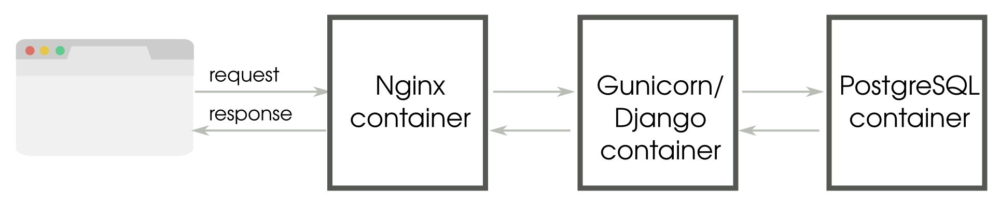

# Production-Ready

In this chapter, we will discuss the following topics:
- Picking a web stack
- Hosting approaches
- Deployment tools
- Monitoring
- Performance tips

So, you have developed and tested a fully functional web application in Django. Deploying
this application can involve a diverse set of activities from choosing your hosting provider
to performing installations. Even more challenging could be the tasks of maintaining a
production site so it works without interruption and handling unexpected bursts in traffic.

The discipline of system administration is vast. Hence, this chapter will cover a lot of
ground. However, given the limited space, we will attempt to familiarize you with the
various aspects of building a production environment.

### The production environment

Although most of us intuitively understand what a production environment is, it is
worthwhile clarifying what it really means. A production environment is simply one where
end users use your application. It should be available, resilient, secure, responsive, and
must have abundant capacity for current (and future) needs.

Unlike a development environment, the chance of real business damage due to any issues
in a production environment is high. Hence, before moving to production, the code is
moved to various testing and acceptance environments in order to get rid of as many bugs
as possible. For easy traceability, every change made to the production environment must
be tracked, documented, and made accessible to everyone in the team.

As an upshot, there must be no development performed directly on the production
environment. In fact, there is no need to install development tools, such as a compiler or
debugger, in production. The presence of any unneeded software increases the attack
surface of your site and could pose a security risk.

Most web applications are deployed on sites with extremely low downtime, for example,
large data centers are at five nines, that is, 99.999 percent, uptime. By designing for failure,
even if an internal component fails, there is enough redundancy to prevent the entire
system crashing. This concept of avoiding a **single point of failure (SPOF)** can be applied
at every level, hardware or software.

Hence, it is a crucial collection of software you choose to run in your production
environment.

### Choosing a web stack

So far, we have not discussed the stack on which your application will be running. Even
though we are talking about it at the very end of this book, it is best not to postpone such
decisions to the later stages of the application lifecycle. Ideally, your development
environment must be as close as possible to the production environment to avoid the but it
works on my machine situation.

By a web stack, we refer to the set of technologies that are used to build a web application.
It is usually depicted as a series of components, such as OS, database, and web server, all
piled on top of one another. Hence, it is referred to as a stack.

We will mainly focus on open source solutions here because they are widely used.
However, various commercial applications can also be used if they are more suited to your
needs.

### Components of a stack

A production Django web stack is built using several kinds of application (or layers,
depending on your terminology). While constructing your web stack, some of the choices
you might need to make are as follows:
- Which OS and distribution? For example, Debian, Red Hat, or OpenBSD
- Which WSGI server? For example, Gunicorn or uWSGI.
- Which web server? For example, Apache or Nginx.
- Which database? For example, PostgreSQL, MySQL, or Redis.
- Which caching system? For example, Memcached or Redis.
- Which process control and monitoring system? For example, Upstart, Systemd, or Supervisord.
- How to store static media? For example, Amazon S3 or CloudFront

There could be several more, and these choices are not mutually exclusive either. Some use
several of these applications in tandem. For example, username availability might be
looked up on Redis, while the primary database might be PostgreSQL.

There is no one size fits all answer when it comes to selecting your stack. Different
components have different strengths and weaknesses. Choose them only after careful
consideration and testing. For instance, you might have heard that Nginx is a popular
choice for a web server, but you might actually need Apache's rich ecosystem of modules or
options.

Sometimes, the selection of the stack is based on various non-technical reasons. Your
organization might have standardized on a particular operating system, say, Debian for all
its servers, or your cloud hosting provider might support only a limited set of stacks.

Hence, how you choose to host your Django application is one of the key factors in
determining your production setup.

### Virtual machines or Docker

Most of us are familiar with using virtual machines either in development or in production.
They isolate your application (guest machine) from the underlying infrastructure (host
machine). Container technologies such as Docker are increasingly being used for cloud
deployments, either complementing, or replacing virtual machines.

Containers are a means to create multiple user-space instances over the same kernel. Unlike
virtual machines, containers avoid the need to start, and run separate guest operating
systems. Typically, each container packages an application and its dependencies in a userspace instance separate from other containers. 
Unlike virtual machines, they do not have a separate instance of the operating system, making them lighter, and faster to start or stop.

Docker has become the containerization technology of choice with a large ecosystem and
wide support among cloud vendors. Docker images are created from a binary image called
base image or automatically built from a script called a Dockerfile. This helps you recreate
the same environment in production for development or testing purposes, thus ending the
infamous excuse but it worked in my machine.

### Microservices

The most common design pattern using Docker is breaking down applications and services
into microservices. The advantage is that individual microservices can be developed and
deployed independently while being more elastic and resilient in demanding situations.
Hence, containerization technologies such as Docker is a natural fit due to its minimal
overhead and application-level isolation.

The following is a simplistic example of a Django web application implemented as
microservice using containers:

This single microservice is composed of three containers with separate logical components:
**Nginx container** (web server), **Gunicorn/Django container** (web application), and
**PostgreSQL container** (database). Each container is instantiated from a Docker image,
which may be built using a Dockerfile.

Docker containers have an ephemeral file system, so persistent data is managed by
explicitly creating a volume. Volumes can be used to share data between containers. In this
case, the static files of the Django project can be shared to the Nginx container to serve them
directly.

As you can imagine, most real-world applications will be composed of multiple
Microservices and each of them would require multiple containers. If you run them on
multiple servers, how would you deploy these containers across them? How can you scale
individual microservices up or down? Kubernetes is the most widely recommended
solution for managing such container clusters.

Although we have covered containers in this section at a very high level, there are many
implementation details, such as deployment patterns, which could not be covered here, as
they can be a book by itself. Containers and orchestration tools have become an important
part of modern web application development by making radically easier-to-manage
application environments.

### Hosting

When it comes to hosting, you will need to be sure whether to go for a hosting platform
such as Heroku or not. If you do not know much about managing a server or do not have
anyone with that knowledge in your team, then a hosting platform is a convenient option.

### Platform as a service

A **Platform as a Service (PaaS)** is defined as a cloud service where the solution stack is
already provided and managed for you. Popular platforms for Django hosting include
Heroku, PythonAnywhere, and Google App Engine.

In most cases, deploying a Django application should be as simple as selecting the services
or components of your stack and pushing out your source code. You do not have to
perform any system administration or setup yourself. The platform is entirely managed.

Like most cloud services, the infrastructure can also scale on demand. If you need an
additional database server or more RAM on a server, it can be easily provisioned from a
web interface or the command line. The pricing is primarily based on your usage.

The bottom line with such hosting platforms is that they are very easy to set up and ideal
for smaller projects. They tend to be more expensive as your user base grows.

Another downside is that your application might get tied to a platform or become difficult
to port. For instance, Google App Engine is used to support only a non-relational database,
which means you need to use **django-nonrel**, a fork of Django. This limitation is now
somewhat mitigated with Google Cloud SQL.

### Virtual private servers

A **virtual private server (VPS)** is a virtual machine hosted in a shared environment. From
the developer's perspective, it would seem like a dedicated machine (hence, the word
private) preloaded with an operating system. You will need to install and set up the entire
stack yourself, though many VPS providers such as WebFaction and DigitalOcean offer
easier Django setups.

If you are a beginner and can spare some time, I highly recommend this approach. You will
be given root access, and you can build the entire stack yourself. You will not only
understand how various pieces of the stack come together but also have full control in finetuning each individual component.

Compared to a PaaS, a VPS might work out to be more value for money, especially for
high-traffic sites. You might be able to run several sites from the same server as well.

### Serverless

Imagine that you need to host an infrequently used service, but paying for a dedicated
server that is always up and running is proving to be costly or inefficient to maintain.
Serverless architectures might be what you are looking for. The name serverless is a
misnomer since all client requests are indeed handled by servers, which are dynamically
provisioned for the lifetime of the request.

A more appropriate term would be **Function as a Service (FaaS)**, as these platforms
support execution of an application logic like a small Python function but does not store
any state. Building an application composed of such functions would be quite similar to the
microservices architecture discussed earlier.

Typically, you only pay for the milliseconds of server time that a serverless application
uses, which makes it much cheaper than dedicated servers. Scaling is automatically
handled, so there is no additional effort needed to handle massive spikes in traffic. Last but
not the least, there is no headache of having to set up and maintain server infrastructure.

Django might not sound like it would work in such an environment, but **Zappa** makes it
easy to deploy Django applications (in fact, any WSGI compatible application) on a
serverless platform such as AWS Lambda with minimal changes. This opens up the
possibility of enjoying all the advantages of serverless while using Django.

### Other hosting approaches

Even though hosting on a platform or VPS are by far the two most popular hosting options,
there are plenty of other options. If you are interested in maximizing performance, you can
opt for a bare metal server with collocation from providers, such as **Rackspace**.

On the lighter end of the hosting spectrum, you can save the cost by hosting multiple
applications within Docker containers. Docker is a tool to package your application and
dependencies in a virtual container. Compared to traditional virtual machines, a Docker
container starts up faster and has minimal overheads (since there is no bundled operating
system or hypervisor).

Docker is ideal for hosting micro services-based applications. It is becoming as ubiquitous
as virtualization with almost every PaaS and VPS provider supporting them.

It is also a great development platform since Docker containers encapsulate the entire
application state and can be directly deployed to production.

### Deployment tools

Once you have zeroed in on your hosting solution, there could be several steps in your
deployment process, from running regression tests to spawning background services.

The key to a successful deployment process is automation. Since deploying applications
involves a series of well-defined steps, it can be rightly approached as a programming
problem. Once you have an automated deployment in place, you do not have to worry
about deployments for fear of missing a step.

In fact, deployments should be painless and as frequent as required. For example, the
Facebook team can release code to production several times in a day. Considering
Facebook's enormous user base and code base, this is an impressive feat, yet, it becomes
necessary as emergency bug fixes and patches need to be deployed as soon as possible.

A good deployment process is also idempotent. In other words, even if you accidentally
run the deployment tool twice, the actions should not be executed twice (or rather it should
leave it in the same state).

Let's take a look at some of the popular tools for deploying Django applications.

### Fabric

Fabric is favored among Python web developers for its simplicity and ease of use. It expects
a file named `fabfile.py` that defines all the actions (for deployment or otherwise) in your
project. Each of these actions can be a local or remote shell command. The remote host is
connected via SSH.

The key strength of Fabric is its ability to run commands on a set of remote hosts. For
instance, you can define a **web** group that contains the hostnames of all web servers in
production.

**TIP:** You can run a Fabric action only against these web servers by specifying
the web group name on the command line.

To illustrate the tasks involved in deploying a site using Fabric, let's take a look at a typical
deployment scenario.

### Typical deployment steps

Imagine that you have a medium-sized web application deployed on a single web server.
Git has been chosen as the version control and collaboration tool. A central repository that
is shared with all users has been created in the form of a bare Git tree.

Let's assume that your production server has been fully set up. When you run your Fabric
deployment command, say, **fab deploy**, the following scripted sequence of actions take
place:
1. Runs all tests locally
2. Commits all local changes to Git
3. Pushes to a remote central Git repository
4. Resolves merge conflicts, if any
5. Collects the static files (CSS, images)
6. Copies the static files to the static file server
7. At the remote host, pulls changes from a central Git repository
8. At the remote host, runs (database) migrations
9. At the remote host, touches `app.wsgi` to restart WSGI server

The entire process is automatic and should be completed in a few seconds. By default, if
any step fails, then the deployment gets aborted. Though not explicitly mentioned, there
would be checks to ensure that the process is idempotent.

Fabric is not yet compatible with Python 3, though the developers are in
the process of porting it. In the meantime, you can run Fabric in a Python
2.x virtual environment or check out similar tools, such as PyInvoke.

### Configuration management

Managing multiple servers in different states can be hard with Fabric. Configuration
management tools such as Chef, Puppet, or Ansible try to bring a server to a certain desired
state.

Unlike Fabric, which requires the deployment process to be specified in an imperative
manner, these configuration-management tools are declarative. You just need to define the
final state you want the server to be in, and it will figure out how to get there.

For example, if you want to ensure that the Nginx service is running at startup on all your
web servers, then you will need to define a server state having the Nginx service both
running and starting on boot. On the other hand, with Fabric, you will need to specify the
exact steps to install and configure Nginx to reach such a state.

One of the most important advantages of configuration-management tools is that they are
idempotent by default. Your servers can go from an unknown state to a known state,
resulting in an easier server configuration management and reliable deployment.

Among configuration-management tools, Chef, and Puppet enjoy wide popularity since
they were one of the earliest tools in this category. However, their roots in Ruby can make
them look a bit unfamiliar to the Python programmer. For such folks, we have Salt and
Ansible as excellent alternatives.

Configuration-management tools have a considerable learning curve compared to simpler
tools, such as Fabric. However, they are essential tools for creating reliable production
environments and are certainly worth learning.

### Monitoring

Even a medium-sized website can be extremely complex. Django might be one of the
hundreds of applications and services running and interacting with each other. In the same
way that the heartbeat and other vital signs can be constantly monitored to assess the
health of the human body, so are various metrics collected, analyzed, and presented in
most production systems.

While logging keeps track of various events, such as the arrival of a web request or an
exception, monitoring usually refers to collecting key information periodically, such as
memory utilization, or network latency. However, differences get blurred at the application
level, for example, while monitoring database query performance, which might very well
be collected from logs.

Monitoring also helps with the early detection of problems. Unusual patterns, such as
spikes or a gradually increasing load, can be signs of bigger underlying problems, such as
memory leak. A good monitoring system can alert site owners of problems before they
happen.

Monitoring tools usually need a backend service (sometimes called agents) to collect the
statistics and frontend service to display dashboards or generate reports. Popular data
collection backends include StatsD and Monit. This data can be passed to frontend tools,
such as **Graphite**.

There are several hosted monitoring tools, such as New Relic and Status.io, which are easier
to set up and use.

Measuring performance is another important role of monitoring. As we will soon see in a
later section, any proposed optimization must be carefully measured and monitored before
getting implemented.

### Improving Performance

Performance is a feature. Studies show how slow sites have an adverse effect on users, and
therefore revenue. For instance, tests at Amazon in 2007 revealed that for every 100 ms
increase in load time of [amazon.com](https://www.amazon.com/), the sales decreased by 1 percent.

Reassuringly, several high-performance web applications such as Disqus and Instagram
have been built on Django. At Disqus, in 2013, they could handle 1.5 million concurrently
connected users, 45,000 new connections per second, 165,000 messages per second, with
less than 0.2 seconds latency end-to-end.

The key to improving performance is finding where the bottlenecks are. Rather than relying
on guesswork, it is always recommended that you measure and profile your application to
identify these performance bottlenecks. As Lord Kelvin would say:
- "If you can't measure it, you can't improve it."

In most web applications, the bottlenecks are likely to be at the browser or the database end
rather than within Django. However, to the user, the entire application needs to be
responsive.

Let's take a look at some of the ways to improve the performance of a Django application.
Due to widely differing techniques, the tips are split into two parts: frontend and backend.

### Frontend performance

Django programmers might quickly overlook frontend performance because it deals with
understanding how the client side, usually a browser, works. However, let's quote Steve
Souders' study of Alexa-ranked top 10 websites:
- "80-90% of the end-user response time is spent on the frontend. Start there."

A good starting point for frontend optimization would be to check your site with Google
page speed or Yahoo! YSlow (commonly used as browser plugins). These tools will rate
your site and recommend various best practices, such as minimizing the number of HTTP
requests or gzipping the content.

As a best practice, your static assets, such as images, stylesheets, and JavaScript files, must
not be served through Django. Rather a static file server, cloud storages such as Amazon S3,
or a **content delivery network (CDN)** should serve them for better performance.

Even then, Django can help you improve frontend performance in a number of ways:
- **Cache infinitely with** `CachedStaticFilesStorage`: The fastest way to load static assets is to leverage the browser cache. By setting a long caching time, you
can avoid re-downloading the same asset again and again. However, the challenge is to know when not to use the cache when the content changes. 
    - `CachedStaticFilesStorage` class solves this elegantly by appending the asset's MD5 hash to its filename. This way, you can
      extend the TTL of the cache for these files infinitely.
    - To use this, set the `CACHES` setting named `staticfiles` to `CachedStaticFilesStorage`
      or, if you have a custom storage, inherit from `CachedFilesMixin`.
      Also, it is best to configure your caches to use the local memory
      cache backend to perform the static filename to its hashed name
      lookup.
- **Use a static asset manager**: An asset manager can pre-process your static assets
  to minify, compress, or concatenate them, thereby reducing their size and
  minimizing requests. It can also preprocess them, enabling you to write them in
  other languages, such as CoffeeScript and **Syntactically awesome stylesheets
  (Sass)**. There are several Django packages that offer static asset management
  such as `django-pipeline` or `webassets`.

### Backend performance
The scope of backend performance improvements covers your entire server-side web stack,
including database queries, template rendering, caching, and background jobs. You will
want to extract the highest performance from them since it is entirely within your control.

For quick and easy profiling needs, `django-debug-toolbar` is quite handy. We can also
use Python profiling tools, such as the `hotshot` module for detailed analysis. In Django,
you can use one of the several profiling middleware snippets to display the output of
hotshot in the browser.

A recent live-profiling solution is `django-silk`. It stores all the requests and responses in
the configured database, allowing aggregated analysis over an entire user session, say, to
find the worst-performing views. It can also profile any piece of Python code by adding a
decorator.

As before, we will take a look at some of the ways to improve backend performance.
However, considering that they are vast topics in themselves, they have been grouped into
sections. Many of these have already been covered in the previous chapters but have been
summarized here for easy reference.

### Templates

As the documentation suggests, you should enable the cached template loader in
production. This avoids the overhead of reparsing and recompiling the templates each time
it needs to be rendered. The cached template is compiled the first time it is needed and then
stored in memory. Subsequent requests for the same template are served from memory.

If you find that another templating language such as Jinja2 renders your page significantly
faster, then it is quite easy to replace the built-in Django template language.

### Database 

Sometimes, the Django ORM can generate inefficient SQL code. There are several
optimization patterns to improve this, as follows:
- **Reduce database hits with** `select_related`: If you are using a
  `OneToOneField` or a Foreign key relationship, in forwarding direction, for a
  large number of objects, then `select_related()` can perform a SQL join and
  reduce the number of database hits.
- **Reduce database hits with** `prefetch_related`: For accessing a
  `ManyToManyField` method or, a Foreign key relation, in reverse direction, or a
  Foreign key relation in a large number of objects, consider
  using `prefetch_related` to reduce the number of database hits.
- **Fetch only needed fields with values or** `values_list`: You can save time and
  memory usage by limiting queries to return only the needed fields and skipping
  model instantiation using `values()` or `values_list()`.  
- **Denormalize models**: Selective denormalization improves performance by
  reducing joins at the cost of data consistency. It can also be used for
  precomputing values, such as the sum of fields or the active status report into an
  extra column. Compared to using annotated values in queries, denormalized
  fields are often simpler and faster.
- **Add an index**: If a non-primary key gets searched a lot in your queries, consider
  setting that field's `db_index` to `True` in your model definition.
- **Create, update, and delete multiple rows at once**: Multiple objects can be
  operated upon in a single database query with the `bulk_create()`, `update()`,
  and `delete()` methods. However, they come with several important caveats
  such as skipping the `save()` method on that model. So, read the documentation
  carefully before using them.

As a last resort, you can always fine-tune the raw SQL statements using proven database
performance expertise. However, maintaining the SQL code can be painful over time.

### Caching

Any computation that takes the time can take advantage of caching and return
precomputed results faster. However, the problem is stale data or, often, quoted as one of
the hardest things in computer science, cache invalidation. This is commonly spotted when,
despite refreshing the page, a YouTube video's view count doesn't change.

Django has a flexible cache system that allows you to cache anything from a template
fragment to an entire site. It allows a variety of pluggable backends such as file-based or
data-based backed storage.

Most production systems use a memory-based caching system, such as Redis or
Memcached. This is purely because volatile memory is many orders of magnitude faster
than disk-based storage.

Such cache stores are ideal for storing frequently used but ephemeral data, such as user
sessions.

### Cached session backend

By default, Django stores its user session in the database. This usually gets retrieved for
every request. To improve performance, the session data can be stored in memory by
changing the `SESSION_ENGINE` setting. For instance, add the following in `settings.py` to
store the session data in your cache:
- SESSION_ENGINE = "django.contrib.sessions.backends.cache"

Since some cache storage can evict stale data leading to the loss of session data, it is
preferable to use Redis or Memcached as the session store, with memory limits high
enough to support the maximum number of active user sessions.

### Caching frameworks

For basic caching strategies, it might be easier to use a caching framework. Among the
popular ones are `django-cache-machine` and `django-cachalot`. They can handle
common scenarios, such as automatically caching results of queries to avoid database hits
every time you perform a read.

The simplest of these is Django-cachalot, a successor of Johnny Cache. It requires very little
configuration. It is ideal for sites that have multiple reads and infrequent writes (that is, the
vast majority of applications), it caches all Django ORM-read queries in a consistent
manner.

### Caching patterns

Once your site starts getting heavy traffic, you will need to start exploring several caching
strategies throughout your stack. Using Varnish, a caching server that sits between your
users and Django, many of your requests might not even hit the Django server.

Varnish can make pages load extremely fast (sometimes, hundreds of times faster than
normal). However, if used improperly, it might serve static pages to your users. Varnish
can be easily configured to recognize dynamic pages or dynamic parts of a page such as a
shopping cart.

**Russian doll caching**, popular in the rails community, is an interesting template cacheinvalidation pattern. 
Imagine a user's timeline page with a series of posts, each containing a
nested list of comments. In fact, the entire page can be considered as several nested lists of
content. At each level, the rendered template fragment gets cached.

So, if a new comment gets added to a post, only the associated post and timeline caches get
invalidated.

We first invalidate the cache content directly outside the changed content
and move progressively until we reach the outermost content. The
dependencies between models need to be tracked for this pattern to work.

Another common caching pattern is to cache forever. Even after the content changes, the
user might get served stale data from the cache. However, an asynchronous job, such as a
Celery job, also gets triggered to update the cache. You can also periodically warm the
cache at a certain interval to refresh the content.

Essentially, a successful caching strategy identifies the static and dynamic parts of a site.
For many sites, the dynamic parts are the user-specific data when you are logged in. If this
is separated from the generally available public content, then implementing caching
becomes easier.

Don't treat caching as integral to the working of your site. The site must fall back to a
slower but working state even if the caching system breaks down.

**Cranos**:
<pre>
    It was six in the morning and the SHIM building was surrounded by a
    grey fog. Somewhere inside, a small conference room had been designated
    the war room. For the last three hours, the SuperBook team had been
    holed up here diligently executing their pre-go-live plan.

    More than 30 users had logged on the IRC chatroom #superbookgolive
    from various parts of the world. The chat log was projected on a giant
    whiteboard. When the last item was struck off, Evan glanced at Steve.
    Then, he pressed a key triggering the deployment process.
    
    The room fell silent as the script output kept scrolling off the wall. One
    error, Steve thought, just one error can potentially set them back by hours.
    Several seconds later, the command prompt reappeared. It was live! The
    team erupted in joy. Leaping from their chairs they gave high-fives to
    each other. Some were crying tears of happiness. After weeks of
    uncertainty and hard work, it all seemed surreal.

    However, the celebrations were short-lived. A loud explosion from above
    shook the entire building. Steve knew the second breach had begun. He
    shouted to Evan, "don't turn on the beacon until you get my message",
    and sprinted out of the room.
    
    As Steve hurried up the stairway to the rooftop, he heard the sound of
    footsteps above him. It was Madam O. She opened the door and flung
    herself in. He could hear her screaming "no!" and a deafening blast shortly
    after that.
    
    By the time he reached the rooftop, he saw Madam O sitting with her back
    against the wall. She was clutching her left arm and wincing in pain. Steve
    slowly peered around the wall. At a distance, a tall bald man seemed to be
    working on something with the help of two robots.
    
    "He looks like...." Steve broke off, unsure of himself.
    
    "Yes, it is Hart. Rather I should say he is Cranos now."
    
    "What?"
    
    "Yes, a split personality. A monster that laid hidden in Hart's mind for
    years. I tried to help him control it. Many years back, I thought I had
    stopped it from ever coming back. However, all this stress took a toll on
    him. Poor thing, if only I could get near him."
    
    Poor thing indeed, he nearly tried to kill her. Steve took out his mobile
    and sent out a message to turn on the beacon. He had to improvise.
    
    With his hands high in the air and fingers crossed, he stepped out. The
    two robots immediately aimed directly at him. Cranos motioned them to
    stop.

    "Well, who do we have here? Mr. SuperBook himself. Did I crash into
    your launch party, Steve?"
    
    "It was our launch, Hart."
    
    "Don't call me that", growled Cranos. "That guy was a fool. He wrote the
    Sentinel code but he never understood its potential. I mean, just look at
    what Sentinels can do, unravel every cryptographic algorithm known to
    man. What happens when it enters an intergalactic network?"
    
    The hint was not lost on Steve. "SuperBook?" he asked slowly.
    
    Cranos let out a malicious grin. Behind him, the robots were busy wiring
    into SHIM's core network. "While your SuperBook users will be busy
    playing SuperVille, the tentacles of Sentinel will spread into new
    unsuspecting worlds. Critical systems of every intelligent species will be
    sabotaged. The Supers will have to bow to a new intergalactic supervillain
    Cranos."
    
    As Cranos was delivering this extended monologue, Steve noticed a
    movement of the corner of his eye. It was Acorn, the super-intelligent
    squirrel, scurrying along the right edge of the rooftop. He also spotted
    Hexa hovering strategically on the other side. He nodded at them.
    
    Hexa levitated a garbage bin and flung it towards the robots. Acorn
    distracted them with high-pitched whistles. "Kill them all!" Cranos said
    irritably. As he turned to watch his intruders, Steve fished out his phone,
    dialed into FaceTime and held it towards Cranos.
    
    "Say hello to your old friend, Cranos," said Steve.
    
    Cranos turned to face the phone and the screen revealed Madam O's face.
    With a smile, she muttered under her breath, "Taradiddle Bumfuzzle!"
    
    The expression on Cranos's face changed instantly. The seething anger
    disappeared. He now looked like a man they had once known.
    
    "What happened?" asked Hart confused.
    
    "We thought we had lost you," said Madam O over the phone. "I had to
    use hypnotic trigger words to bring you back."
    
    Hart took a moment to survey the scene around him. Then, he slowly
    smiled and nodded at her.
    
    ----------------------------------------------------
    
    One Year Later
    
    Who would have guessed Acorn would turn into an intergalactic singing
    sensation in less than a year? His latest album Acorn Unplugged debuted
    at the top of Billboard's Top 20 chart. He threw a grand party in his new
    white mansion overlooking a lake.
    
    The guest list included superheroes, pop stars, actors, and celebrities of all
    sorts.
    
    "So, there was a singer in you after all," said Captain Obvious holding a
    martini.
    
    "I guess there was," replied Acorn. He looked dazzling in a golden tuxedo
    with all sorts of bling-bling.
    
    Steve appeared with Hexa in tow, who looked ravishing in a flowing
    silver gown.
    
    "Hey Steve, Hexa. It has been a while. Is SuperBook still keeping you late
    at work, Steve?"
    
    "Not so much these days. Knock on wood," replied Hexa with a smile.
    
    "Ah, you guys did a fantastic job. I owe a lot to SuperBook. My first single,
    'Warning: Contains Nuts', was a huge hit in the Tucana galaxy. They
    watched the video on SuperBook more than a billion times!"
    
    "I am sure every other superhero has a good thing to say about SuperBook
    too. Take Blitz. His AskMeAnything interview won back the hearts of his
    fans. They were thinking that he was on experimental drugs all this time.
    It was only when he revealed that his father was Hurricane that his
    powers made sense."
    
    "By the way, how is Hart doing these days?"
    
    "Much better," said Steve. "He got professional help. The sentinels were
    handed back to S.H.I.M. They are developing a new quantum
    cryptographic algorithm that will be much more secure."
    
    "So, I guess we are safe until the next supervillain shows up," said Captain
    Obvious hesitantly.
    
    "Hey, at least the beacon works," said Steve, and the crowd burst into
    laughter.
</pre>

### Summary

In this final chapter, we looked at various approaches to make your Django application
stable, reliable, and fast. In other words, to make it production-ready. Although system
administration might be an entire discipline in itself, a fair knowledge of the web stack is
essential. We explored several hosting options, including PaaS, VPS, and Serverless.

We also looked at several automated deployment tools and a typical deployment scenario.
Finally, we covered several techniques to improve frontend and backend performance.

The most important milestone of a website is finishing and taking it to production.
However, it is by no means the end of your development journey. There will be new
features, alterations, and rewrites.

Every time you revisit the code, use the opportunity to take a step back and find a cleaner
design, identify a hidden pattern, or think of a better implementation. Other developers,
and perhaps your future self, will thank you for it.

