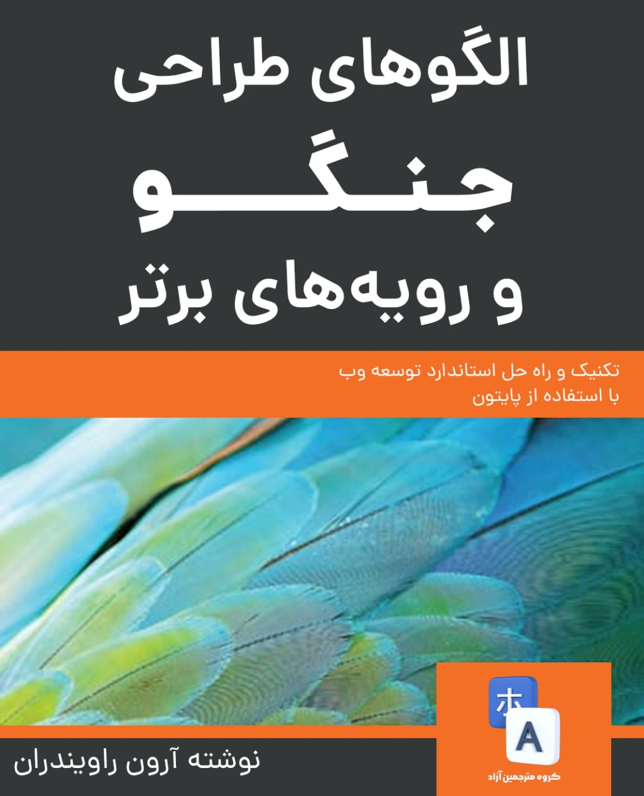

 # ترجمه آزاد کتاب  Django Design Patterns and Best Practices

قبل از شروع فهرست کتاب، اگر مایل به مشارکت هستید، [نحوه مشارکت](https://github.com/ftg-iran/ddpabp-persian/blob/main/CONTRIBUTING.md) را حتما مطالعه کنید.

شما می توانید برای کمک کردن و خشنود کردن و انگیزه دادن به تیم ما، اهدای مالی به خیریه‌ی محک داشته باشید.
لینک درگاه خیریه محک در سمت راست صفحه درج شده است. لازم به ذکر است که اگر مبلغی را اهدا کرده اید چون ما بی خبر از آن کار هستیم، یک رسید از آن داخل [گروه تلگرامی ما](https://t.me/dfp_farsi) آپلود کنید.

### فهرست مطالب

  
<a href="https://github.com/AmirAref/ddpabp-persian/tree/main/01-%20Django%20and%20Patterns#%D8%AC%D9%86%DA%AF%D9%88-%D8%A7%D9%84%DA%AF%D9%88%D9%87%D8%A7">جنگو و الگوها</a>

   

  - [چرا جنگو؟](/01-%20Django%20and%20Patterns/README.md#%DA%86%D8%B1%D8%A7-%D8%AC%D9%86%DA%AF%D9%88)
  - [داستان جنگو ](/01-%20Django%20and%20Patterns/README.md#%D8%AF%D8%A7%D8%B3%D8%AA%D8%A7%D9%86-%D8%AC%D9%86%DA%AF%D9%88)
  - [جنگو چگونه کار می‌کند؟ ](/01-%20Django%20and%20Patterns/README.md#%D8%AC%D9%86%DA%AF%D9%88-%DA%86%DA%AF%D9%88%D9%86%D9%87-%DA%A9%D8%A7%D8%B1-%D9%85%DB%8C-%DA%A9%D9%86%D8%AF)
  - [الگو چیست؟ ](/01-%20Django%20and%20Patterns/README.md#%D8%A7%D9%84%DA%AF%D9%88-%DA%86%DB%8C%D8%B3%D8%AA)
  - [الگوها در این کتاب ](/01-%20Django%20and%20Patterns/README.md#%D8%A7%D9%84%DA%AF%D9%88%D9%87%D8%A7-%D8%AF%D8%B1-%D8%A7%DB%8C%D9%86-%DA%A9%D8%AA%D8%A7%D8%A8)
  - [نتیجه‌گیری](/01-%20Django%20and%20Patterns/README.md#%D8%AE%D9%84%D8%A7%D8%B5%D9%87)

  
<a href="/02-%20Application%20Design/README.md#%D8%B7%D8%B1%D8%A7%D8%AD%DB%8C-%D8%A8%D8%B1%D9%86%D8%A7%D9%85%D9%87">طراحی برنامه</a>

   

  - [چگونه نیازها را جمع‌آوری کنیم؟](/02-%20Application%20Design/README.md#%DA%86%DA%AF%D9%88%D9%86%D9%87-%D9%86%DB%8C%D8%A7%D8%B2%D9%85%D9%86%D8%AF%DB%8C%D9%87%D8%A7-%D8%B1%D8%A7-%D8%AC%D9%85%D8%B9%D8%A2%D9%88%D8%B1%DB%8C-%DA%A9%D9%86%DB%8C%D9%85)
  - [آیا شما یک داستان‌گو هستید؟ ](/02-%20Application%20Design/README.md#%D8%A2%DB%8C%D8%A7-%D8%B4%D9%85%D8%A7-%DB%8C%DA%A9-%D9%82%D8%B5%D9%87%DA%AF%D9%88-%D9%87%D8%B3%D8%AA%DB%8C%D8%AF)
  - [HTML mockups ](/02-%20Application%20Design/README.md#%D9%85%D8%A7%DA%A9%D8%AA%D9%87%D8%A7%DB%8C-html)
  - [طراحی برنامه ](/02-%20Application%20Design/README.md#%D8%B7%D8%B1%D8%A7%D8%AD%DB%8C-%D8%A7%D9%BE%D9%84%DB%8C%DA%A9%DB%8C%D8%B4%D9%86)
  - [Best Practice ها قبل از شروع یک پروژه ](/02-%20Application%20Design/README.md#%D8%A8%D9%87%DB%8C%D9%86%D9%87%D8%AA%D8%B1%DB%8C%D9%86-%D8%B1%D9%88%D8%B4%D9%87%D8%A7-%D9%82%D8%A8%D9%84-%D8%A7%D8%B2-%D8%B4%D8%B1%D9%88%D8%B9-%D9%BE%D8%B1%D9%88%DA%98%D9%87)
  - [SuperBook - ماموریت شما، اگر بخواهید آن را بپذیرید](/02-%20Application%20Design/README.md#%D8%B3%D9%88%D9%BE%D8%B1%D8%A8%D9%88%DA%A9-%D9%85%D8%A3%D9%85%D9%88%D8%B1%DB%8C%D8%AA%DB%8C-%DA%A9%D9%87-%D8%A8%D8%A7%DB%8C%D8%AF-%D8%A8%D9%BE%D8%B0%DB%8C%D8%B1%DB%8C%D8%AF)
  - [نتیجه‌گیری](/02-%20Application%20Design/README.md#%D8%AE%D9%84%D8%A7%D8%B5%D9%87)

  
<a href="/03-%20Models/README.md#%D9%85%D8%AF%D9%84%D9%87%D8%A7">مدل‌ها</a>

   

  - [M بزرگ‌تر از V و C است](/03-%20Models/README.md#%D8%A7%D9%85-%D8%A8%D8%B2%D8%B1%DA%AF-%D8%AA%D8%B1-%D8%A7%D8%B2-%D9%88%DB%8C-%D9%88-%D8%B3%DB%8C-%D8%A8%D8%B2%D8%B1%DA%AF-%D8%AA%D8%B1-%D8%A7%D8%B2-%D9%88%DB%8C-%D8%A7%D8%B3%D8%AA)
  - [شکار مدل ](/03-%20Models/README.md#%D8%B4%DA%A9%D8%A7%D8%B1-%D9%85%D8%AF%D9%84%D9%87%D8%A7)
  - [الگوهای ساختاری ](/03-%20Models/README.md#%D8%A7%D9%84%DA%AF%D9%88%D9%87%D8%A7%DB%8C-%D8%B3%D8%A7%D8%AE%D8%AA%D8%A7%D8%B1%DB%8C)
  - [الگوهای بازیابی ](/03-%20Models/README.md#%D8%A7%D9%84%DA%AF%D9%88%D9%87%D8%A7%DB%8C-%D8%A8%D8%A7%D8%B2%DB%8C%D8%A7%D8%A8%DB%8C)
  - [Migrations](/03-%20Models/README.md#%D9%85%D9%87%D8%A7%D8%AC%D8%B1%D8%AA%D9%87%D8%A7-migrations)
  - [نتیجه‌گیری](/03-%20Models/README.md#%D8%AE%D9%84%D8%A7%D8%B5%D9%87)

  
<a href="/04-%20Views%20and%20URLs/README.md#%D9%88%DB%8C%D9%88%D9%87%D8%A7-%D9%88-url%D9%87%D8%A7">Views and URLs</a>

   

  - [یک ویو از بالا](/04-%20Views%20and%20URLs/README.md#%D9%86%DA%AF%D8%A7%D9%87%DB%8C-%D8%A8%D9%87-%D9%88%DB%8C%D9%88-%D8%A7%D8%B2-%D8%A8%D8%A7%D9%84%D8%A7)
  - [ویوهای عمومی مبتنی بر کلاس ](/04-%20Views%20and%20URLs/README.md#%D9%88%DB%8C%D9%88%D9%87%D8%A7%DB%8C-%D8%B9%D9%85%D9%88%D9%85%DB%8C-%D9%85%D8%A8%D8%AA%D9%86%DB%8C-%D8%A8%D8%B1-%DA%A9%D9%84%D8%A7%D8%B3)
  - [View mixin ها](/04-%20Views%20and%20URLs/README.md#%D9%85%DB%8C%DA%A9%D8%B3%DB%8C%D9%86%D9%87%D8%A7%DB%8C-%D9%88%DB%8C%D9%88)
  - [Decorator ها ](/04-%20Views%20and%20URLs/README.md#%D8%AF%DA%A9%D9%88%D8%B1%D8%A7%D8%AA%D9%88%D8%B1%D9%87%D8%A7)
  - [الگوهای ویو ](/04-%20Views%20and%20URLs/README.md#%D8%A7%D9%84%DA%AF%D9%88%D9%87%D8%A7%DB%8C-%D9%88%DB%8C%D9%88)
  - [طراحی URLها](/04-%20Views%20and%20URLs/README.md#%D8%B7%D8%B1%D8%A7%D8%AD%DB%8C-%DA%A9%D8%B1%D8%AF%D9%86-url%D9%87%D8%A7)
  - [React.js, Vue.js, و دیگر جایگزین‌های ویو](/04-%20Views%20and%20URLs/README.md#reactjs-vuejs-%D9%88-%D8%AF%DB%8C%DA%AF%D8%B1-%D9%88%DB%8C%D9%88%D9%87%D8%A7%DB%8C-%D8%AC%D8%A7%DB%8C%DA%AF%D8%B2%DB%8C%D9%86)
  - [نتیجه‌گیری](/04-%20Views%20and%20URLs/README.md#%D8%AE%D9%84%D8%A7%D8%B5%D9%87)

  
<a href="/05-%20Templates/README.md#%DB%B5-%D8%AA%D9%85%D9%BE%D9%84%DB%8C%D8%AA%D9%87%D8%A7">قالب‌ها</a>

   

  - [فهمیدن ویژگی‌های زبان قالب جنگو](/05-%20Templates/README.md#%D8%AF%D8%B1%DA%A9-%D9%88%DB%8C%DA%98%DA%AF%DB%8C%D9%87%D8%A7%DB%8C-%D8%B2%D8%A8%D8%A7%D9%86-%D8%AA%D9%85%D9%BE%D9%84%DB%8C%D8%AA-%D8%AC%D9%86%DA%AF%D9%88)
  - [Jinja2](/05-%20Templates/README.md#%D8%AC%DB%8C%D9%86%D8%AC%D8%A7-%DB%B2)
  - [سازمان‌ دادن قالب‌ها](/05-%20Templates/README.md#%D8%B3%D8%A7%D8%B2%D9%85%D8%A7%D9%86%D8%AF%D9%87%DB%8C-%D8%AA%D9%85%D9%BE%D9%84%DB%8C%D8%AA%D9%87%D8%A7)
  - [قالب‌ها چگونه کار می‌کنند؟ ](/05-%20Templates/README.md#%D8%AA%D9%85%D9%BE%D9%84%DB%8C%D8%AA%D9%87%D8%A7-%DA%86%DA%AF%D9%88%D9%86%D9%87-%DA%A9%D8%A7%D8%B1-%D9%85%DB%8C%DA%A9%D9%86%D9%86%D8%AF)
  - [استفاده از Bootstrap](/05-%20Templates/README.md#%D8%A7%D8%B3%D8%AA%D9%81%D8%A7%D8%AF%D9%87-%D8%A7%D8%B2-%D8%A8%D9%88%D8%AA%D8%B3%D8%AA%D8%B1%D9%BE)
  - [الگوهای قالب](/05-%20Templates/README.md#%D8%A7%D9%84%DA%AF%D9%88%D9%87%D8%A7%DB%8C-%D8%AA%D9%85%D9%BE%D9%84%DB%8C%D8%AA)
  - [نتیجه‌گیری](/05-%20Templates/README.md#%D8%AE%D9%84%D8%A7%D8%B5%D9%87)

  
<a href="/06-%20Admin%20Interface/README.md#%D9%81%D8%B5%D9%84-%DB%B6---%D8%B1%D8%A7%D8%A8%D8%B7-%DA%A9%D8%A7%D8%B1%D8%A8%D8%B1%DB%8C-%D8%A7%D8%AF%D9%85%DB%8C%D9%86">رابط ادمین</a>

   

  - [استفاده از رابط ادمین](/06-%20Admin%20Interface/README.md#%D8%A7%D8%B3%D8%AA%D9%81%D8%A7%D8%AF%D9%87-%D8%A7%D8%B2-%D8%B1%D8%A7%D8%A8%D8%B7-%DA%A9%D8%A7%D8%B1%D8%A8%D8%B1%DB%8C-%D8%A7%D8%AF%D9%85%DB%8C%D9%86)
  - [گسترش دادن مدلها برای ادمین](/06-%20Admin%20Interface/README.md#%D8%A8%D9%87%DB%8C%D9%86%D9%87-%D8%B3%D8%A7%D8%B2%DB%8C-%D9%85%D8%AF%D9%84-%D9%87%D8%A7-%D8%A8%D8%B1%D8%A7%DB%8C-%D8%A8%D8%AE%D8%B4-%D8%A7%D8%AF%D9%85%DB%8C%D9%86)
  - [سفارشی‌سازی‌های رابط ادمین](/06-%20Admin%20Interface/README.md#%D8%B3%D9%81%D8%A7%D8%B1%D8%B4%DB%8C-%D8%B3%D8%A7%D8%B2%DB%8C-%D8%B1%D8%A7%D8%A8%D8%B7-%D9%85%D8%AF%DB%8C%D8%B1%DB%8C%D8%AA)
  - [محافظت از ادمین](/06-%20Admin%20Interface/README.md#%D8%AD%D9%81%D8%A7%D8%B8%D8%AA-%D8%A7%D8%B2-%D8%A7%D8%AF%D9%85%DB%8C%D9%86)
  - [نتیجه‌گیری](/06-%20Admin%20Interface/README.md#%D8%AE%D9%84%D8%A7%D8%B5%D9%87)

  
<a href="/07-%20Forms/README.md#%D9%81%D8%B1%D9%85-%D9%87%D8%A7-">فرم‌ها</a>

   

  - [فرم‌ها چگونه کار می‌کنند؟](/07-%20Forms/README.md#%D9%81%D8%B1%D9%85-%D9%87%D8%A7-%DA%86%DA%AF%D9%88%D9%86%D9%87-%DA%A9%D8%A7%D8%B1-%D9%85%DB%8C-%DA%A9%D9%86%D9%86%D8%AF)
  - [نمایش فرم‌ها](/07-%20Forms/README.md#%D9%86%D9%85%D8%A7%DB%8C%D8%B4-%D9%81%D8%B1%D9%85-%D9%87%D8%A7-)
  - [درک‌ کردن CSRF](/07-%20Forms/README.md#%D8%A2%D8%B4%D9%86%D8%A7%DB%8C%DB%8C-%D8%A8%D8%A7-csrf)
  - [پردازش فرم با ویوهای مبتنی بر کلاس](/07-%20Forms/README.md#%D9%BE%D8%B1%D8%AF%D8%A7%D8%B2%D8%B4-%D9%81%D8%B1%D9%85-%D9%87%D8%A7-%D8%A8%D8%A7-class-based-view--cbv-)
  - [الگوهای فرم](/07-%20Forms/README.md#%D8%A7%D9%84%DA%AF%D9%88%D9%87%D8%A7%DB%8C-%D9%81%D8%B1%D9%85--)
  - [نتیجه‌گیری](/07-%20Forms/README.md#%D8%AE%D9%84%D8%A7%D8%B5%D9%87)

  
<a href="/08-%20Working%20Asynchronously/README.md#%D9%81%D8%B5%D9%84-8-%DA%A9%D8%A7%D8%B1%DA%A9%D8%B1%D8%AF%D9%86-%D8%A8%D9%87-%D8%B5%D9%88%D8%B1%D8%AA-%D9%86%D8%A7%D9%87%D9%85%D8%B2%D9%85%D8%A7%D9%86">کار کردن به صورت ناهمزمان</a>

   

  - [چرا ناهمزمانی؟](/08-%20Working%20Asynchronously/README.md#%DA%86%D8%B1%D8%A7-%D9%86%D8%A7%D9%87%D9%85%D8%B2%D9%85%D8%A7%D9%86%DB%8C)
  - [الگوهای ناهمزمانی](/08-%20Working%20Asynchronously/README.md#%D9%BE%D8%AA%D8%B1%D9%86-%D9%87%D8%A7-%D9%88-%D8%A7%D9%84%DA%AF%D9%88%D9%87%D8%A7%DB%8C-%D9%86%D8%A7%D9%87%D9%85%D8%B2%D9%85%D8%A7%D9%86%DB%8Casynchronous-patterns)
  - [راه‌حل‌های ناهمزمانی برای جنگو](/08-%20Working%20Asynchronously/README.md#%D8%B1%D8%A7%D9%87-%D8%AD%D9%84-%D9%87%D8%A7%DB%8C-%D9%86%D8%A7%D9%87%D9%85%D8%B2%D9%85%D8%A7%D9%86%DB%8C-%D8%AF%D8%B1-%D8%AC%D9%86%DA%AF%D9%88)
  - [نتیجه‌گیری](/08-%20Working%20Asynchronously/README.md#%D8%AE%D9%84%D8%A7%D8%B5%D9%87)

  
<a href="/09-%20Creating%20APIs/README.md#%D8%A7%DB%8C%D8%AC%D8%A7%D8%AF-api%D9%87%D8%A7">ایجاد APIها</a>

   

  - [RESTful API](/09-%20Creating%20APIs/README.md#restful-api)
  - [Django Rest Framework](/09-%20Creating%20APIs/README.md#%D9%81%D8%B1%DB%8C%D9%85%D9%88%D8%B1%DA%A9-%D8%B1%D8%B3%D8%AA-%D8%AC%D9%86%DA%AF%D9%88)
  - [الگوهای API](/09-%20Creating%20APIs/README.md#%D8%A7%D9%84%DA%AF%D9%88%D9%87%D8%A7%DB%8C-api)
  - [نتیجه‌گیری](/09-%20Creating%20APIs/README.md#%D8%AE%D9%84%D8%A7%D8%B5%D9%87)

  
<a href="/10-%20Dealing%20with%20Legacy%20Code/README.md#%D8%B3%D8%B1%D9%88-%DA%A9%D8%A7%D8%B1-%D8%AF%D8%A7%D8%B4%D8%AA%D9%86-%D8%A8%D8%A7-%DA%A9%D8%AF-%D9%85%D9%88%D8%B1%D8%AB%DB%8C">سر و کار داشتن با کد میراثی</a>

   

  - [پیدا کردن ورژن جنگو](/10-%20Dealing%20with%20Legacy%20Code/README.md#%DB%8C%D8%A7%D9%81%D8%AA%D9%86-%D9%86%D8%B3%D8%AE%D9%87-%D8%AC%D9%86%DA%AF%D9%88)
  - [فایل‌ها کجا هستند؟ این PHP نیست](/10-%20Dealing%20with%20Legacy%20Code/README.md#%D9%81%D8%A7%DB%8C%D9%84-%D9%87%D8%A7-%DA%A9%D8%AC%D8%A7-%D9%87%D8%B3%D8%AA%D9%86%D8%AF-%D8%A7%DB%8C%D9%86-php-%D9%86%DB%8C%D8%B3%D8%AA)
  - [شروع با urls.py](/10-%20Dealing%20with%20Legacy%20Code/README.md#%D8%B4%D8%B1%D9%88%D8%B9-%D8%A8%D8%A7-urlspy)
  - [پرش در اطراف کد](/10-%20Dealing%20with%20Legacy%20Code/README.md#%D9%BE%D8%B1%D8%B4-%D8%AF%D8%B1-%D8%A7%D8%B7%D8%B1%D8%A7%D9%81-%DA%A9%D8%AF)
  - [درک کردن پایه‌ی کد](/10-%20Dealing%20with%20Legacy%20Code/README.md#%D8%AF%D8%B1%DA%A9-%DA%A9%D8%B1%D8%AF%D9%86-%D9%BE%D8%A7%DB%8C%D9%87%DB%8C-%DA%A9%D8%AF)
  - [تغییرات افزایشی یا نوشتن مجدد به صورت کامل؟](/10-%20Dealing%20with%20Legacy%20Code/README.md#%D8%AA%D8%BA%DB%8C%DB%8C%D8%B1%D8%A7%D8%AA-%D8%A7%D9%81%D8%B2%D8%A7%DB%8C%D8%B4%DB%8C-%DB%8C%D8%A7-%D9%86%D9%88%D8%B4%D8%AA%D9%86-%D9%85%D8%AC%D8%AF%D8%AF-%D8%A8%D9%87-%D8%B5%D9%88%D8%B1%D8%AA-%DA%A9%D8%A7%D9%85%D9%84)
  - [تست نوشتن قبل از ایجاد هرگونه تغییر](/10-%20Dealing%20with%20Legacy%20Code/README.md#%D8%AA%D8%B3%D8%AA-%D9%86%D9%88%D8%B4%D8%AA%D9%86-%D9%82%D8%A8%D9%84-%D8%A7%D8%B2-%D8%A7%DB%8C%D8%AC%D8%A7%D8%AF-%D9%87%D8%B1%DA%AF%D9%88%D9%86%D9%87-%D8%AA%D8%BA%DB%8C%DB%8C%D8%B1)
  - [یکپارچگی دیتابیس میراثی](/10-%20Dealing%20with%20Legacy%20Code/README.md#%DB%8C%DA%A9%D9%BE%D8%A7%D8%B1%DA%86%DA%AF%DB%8C-%D8%AF%DB%8C%D8%AA%D8%A7%D8%A8%DB%8C%D8%B3-%D9%85%DB%8C%D8%B1%D8%A7%D8%AB%DB%8C)
  - [تصحیح آینده](/10-%20Dealing%20with%20Legacy%20Code/README.md#%D8%A2%DB%8C%D9%86%D8%AF%D9%87-%D9%86%DA%AF%D8%B1%DB%8C3--future-proof)
  - [نتیجه‌گیری](/10-%20Dealing%20with%20Legacy%20Code/README.md#%D8%AE%D9%84%D8%A7%D8%B5%D9%87)

  
<a href="/11-%20Testing%20and%20Debugging/README.md#%D8%AA%D8%B3%D8%AA-%DA%A9%D8%B1%D8%AF%D9%86-%D9%88-%D8%B1%D9%81%D8%B9-%D9%85%D8%B4%DA%A9%D9%84">تست کردن و دیباگ کردن</a>

   

  - [چرا تست بنویسیم؟](/11-%20Testing%20and%20Debugging/README.md#%DA%86%D8%B1%D8%A7-%D8%AA%D8%B3%D8%AA-%D8%A8%D9%86%D9%88%DB%8C%D8%B3%DB%8C%D9%85)
  - [TDD](/11-%20Testing%20and%20Debugging/README.md#%D8%B1%D9%88%DB%8C%DA%A9%D8%B1%D8%AF-tdd)
  - [یک نمونه تست نوشتن](/11-%20Testing%20and%20Debugging/README.md#%D9%86%D9%88%D8%B4%D8%AA%D9%86-%DB%8C%DA%A9-%D8%AA%D8%B3%D8%AA-%D9%85%D9%88%D8%B6%D9%88%D8%B9%DB%8C)
  - [Mocking](/11-%20Testing%20and%20Debugging/README.md#%D8%AA%D9%82%D9%84%DB%8C%D8%AF-%DA%A9%D8%B1%D8%AF%D9%86)
  - [Pattern - Test fixtures and factories](/11-%20Testing%20and%20Debugging/README.md#%D8%A7%D9%84%DA%AF%D9%88--%D8%AA%D8%B3%D8%AA-%DA%A9%D8%B1%D8%AF%D9%86-%D8%A8%D8%A7-%D8%AA%D8%AC%D9%87%DB%8C%D8%B2%D8%A7%D8%AA-fixture-%D9%88-%DA%A9%D8%A7%D8%B1%D8%AE%D8%A7%D9%86%D9%87%D9%87%D8%A7-factory)
  - [آموختن بیشتر درباره‌ی تست کردن](/11-%20Testing%20and%20Debugging/README.md#%D9%BE%DB%8C%D8%B4%D8%A8%DB%8C%D9%86%DB%8C%D9%87%D8%A7%DB%8C-%D9%88%D8%AD%D8%B4%D8%AA%D9%86%D8%A7%DA%A9)
  - [دیباگ کردن](/11-%20Testing%20and%20Debugging/README.md#%D8%B1%D9%81%D8%B9-%D8%A7%D8%B4%DA%A9%D8%A7%D9%84)
  - [تابع پرینت](/11-%20Testing%20and%20Debugging/README.md#%D9%81%D8%A7%D9%86%DA%A9%D8%B4%D9%86-%D9%BE%D8%B1%DB%8C%D9%86%D8%AA)
  - [Logging](/11-%20Testing%20and%20Debugging/README.md#%D9%84%D8%A7%DA%AF-%DA%A9%D8%B1%D8%AF%D9%86)
  - [نوار ابزار دیباگ جنگو](/11-%20Testing%20and%20Debugging/README.md#%D9%BE%DA%A9%DB%8C%D8%AC-django-debug-toolbar)
  - [The Python debugger pdb ](/11-%20Testing%20and%20Debugging/README.md#%D8%B9%DB%8C%D8%A8%DB%8C%D8%A7%D8%A8-%D9%BE%D8%A7%DB%8C%D8%AA%D9%88%D9%86%DB%8C-pdb)
  - [بقیه‌ی دیباگرها](/11-%20Testing%20and%20Debugging/README.md#%D8%B3%D8%A7%DB%8C%D8%B1-%D8%B9%DB%8C%D8%A8%DB%8C%D8%A7%D8%A8%D9%87%D8%A7)
  - [دیباگ کردن قالب‌های جنگو](/11-%20Testing%20and%20Debugging/README.md#%D8%B9%DB%8C%D8%A8%DB%8C%D8%A7%D8%A8%DB%8C-%D8%AF%D8%B1-%D8%AA%D9%85%D9%BE%D9%84%DB%8C%D8%AA%D9%87%D8%A7%DB%8C-%D8%AC%D9%86%DA%AF%D9%88)
  - [نتیجه‌گیری](/11-%20Testing%20and%20Debugging/README.md#%D8%AE%D9%84%D8%A7%D8%B5%D9%87)

  
<a href="/12-%20Security/README.md#%D8%A7%D9%85%D9%86%DB%8C%D8%AA">امنیت</a>

   

  - [Cross-site scripting](/12-%20Security/README.md#cross-site-scripting)
  - [Cross-site request forgery](/12-%20Security/README.md#%D8%AC%D8%B9%D9%84-%D9%87%D8%A7%DB%8C-%D8%AF%D8%B1%D8%AE%D9%88%D8%A7%D8%B3%D8%AA-%D8%A8%DB%8C%D9%86-%D8%B3%D8%A7%DB%8C%D8%AA%DB%8Ccross-site-request-forgery)
  - [SQL injection](/12-%20Security/README.md#%D8%AA%D8%B2%D8%B1%DB%8C%D9%82-sql-sql-injection)
  - [Clickjacking](/12-%20Security/README.md#%D8%AF%D8%B2%D8%AF%DB%8C-%DA%A9%D9%84%DB%8C%DA%A9-clickjacking)
  - [Shell injection](/12-%20Security/README.md#%D8%AA%D8%B2%D8%B1%DB%8C%D9%82-%D8%AF%D8%B3%D8%AA%D9%88%D8%B1%D8%A7%D8%AA-%D8%B3%DB%8C%D8%B3%D8%AA%D9%85-%D8%B9%D8%A7%D9%85%D9%84-shell-injection)
  - [یک چک‌لیست دم‌دستی امنیت](/12-%20Security/README.md#%DB%8C%DA%A9-%DA%86%DA%A9-%D9%84%DB%8C%D8%B3%D8%AA-%D8%A7%D9%85%D9%86%DB%8C%D8%AA%DB%8C-%D9%85%D9%81%DB%8C%D8%AF)
  - [نتیجه‌گیری](/12-%20Security/README.md#%D8%AE%D9%84%D8%A7%D8%B5%D9%87)

  
<a href="/13-%20Production-Ready/README.md#%D8%A2%D9%85%D8%A7%D8%AF%D9%87-%D8%A8%D8%B1%D8%A7%DB%8C-%D8%AA%D9%88%D9%84%DB%8C%D8%AF">آمادگی برای محیط پروداکشن</a>

   

  - [محیط پروداکشن](/13-%20Production-Ready/README.md#%D9%85%D8%AD%DB%8C%D8%B7-%D8%AA%D9%88%D9%84%DB%8C%D8%AF-%D9%88-%D9%BE%D8%B1%D9%88%D8%AF%D8%A7%DA%A9%D8%B4%D9%86)
  - [ماشین‌های مجازی یا داکر](/13-%20Production-Ready/README.md#%D9%85%D8%A7%D8%B4%DB%8C%D9%86%D9%87%D8%A7%DB%8C-%D9%85%D8%AC%D8%A7%D8%B2%DB%8C-%DB%8C%D8%A7-%D8%AF%D8%A7%DA%A9%D8%B1)
  - [میزبانی](/13-%20Production-Ready/README.md#%D9%85%DB%8C%D8%B2%D8%A8%D8%A7%D9%86%DB%8C-%D9%88-%D9%87%D8%A7%D8%B3%D8%AA%DB%8C%D9%86%DA%AF)
  - [ابزارهای استقرار](/13-%20Production-Ready/README.md#%D8%A7%D8%A8%D8%B2%D8%A7%D8%B1%D9%87%D8%A7%DB%8C-%D8%A7%D8%B3%D8%AA%D9%82%D8%B1%D8%A7%D8%B1-%D8%B3%D8%A7%D8%B2%DB%8C-%D9%88-%D8%AF%DB%8C%D9%BE%D9%84%D9%88%DB%8C)
  - [نظارت](/13-%20Production-Ready/README.md#%D9%85%D8%A7%D9%86%DB%8C%D8%AA%D9%88%D8%B1%DB%8C%D9%86%DA%AF)
  - [افزایش کارایی](/13-%20Production-Ready/README.md#%D8%A8%D9%87%D8%A8%D9%88%D8%AF-%DA%A9%D8%A7%D8%B1%D8%A7%DB%8C%DB%8C)
  - [نتیجه‌گیری](/13-%20Production-Ready/README.md#%D8%AE%D9%84%D8%A7%D8%B5%D9%87)

  
<a href="/Appendix%20A%20%20Python%202%20Versus%20Python%203/README.md#%D9%BE%D8%A7%DB%8C%D8%AA%D9%88%D9%86-2-%D8%AF%D8%B1-%D9%85%D9%82%D8%A7%D8%A8%D9%84-%D9%BE%D8%A7%DB%8C%D8%AA%D9%88%D9%86-3">ضمیمه‌ی A: پایتون ۲ در برابر پایتون ۳</a>

   

  - [پایتون ۳](/Appendix%20A%20%20Python%202%20Versus%20Python%203/README.md#%D9%BE%D8%A7%DB%8C%D8%AA%D9%88%D9%86-3)
  - [اطلاعات بیشتر](/Appendix%20A%20%20Python%202%20Versus%20Python%203/README.md#%D8%A7%D8%B7%D9%84%D8%A7%D8%B9%D8%A7%D8%AA-%D8%A8%DB%8C%D8%B4%D8%AA%D8%B1)

| تاریخ اتمام ترجمه |       مترجم      |                    فصل             |
|:-----------------:|:----------------:|:----------------------------------:|
|        اتمام           |  محمدامیر لطفی پور       |01- Django and Patterns             |
|         اتمام     |  Rahimz       |02- Application Design              |
|           اتمام         |  Rahimz       |03- Models                          |
|         اتمام          |  Hamed Daneshvar       |04- Views and URLs                  |
|            اتمام       |  Rahimz        |05- Templates                       |
|            اتمام     |  sajjad ebrahimi moghaddam        |06- Admin Interface                 |
|             اتمام      |  amirajoodani        |07- Forms                           |
|            اتمام        |  Khalil Farashiani       |08- Working Asynchronously          |
|          اتمام         |  Hamed Daneshvar       |09- Creating APIs                   |
|              اتمام     |  Fereydoon jafari babookani       |10- Dealing with Legacy Code        |
|            اتمام       |  Rahimz       |11- Testing and Debugging           |
|            اتمام       |  Mohammad Amin Orojloo       |12- Security                        |
|         اتمام       |  mokarramis        |13- Production-Ready                |
|              اتمام     |  Hamed Alizade       |Appendix A: Python 2 Versus Python 3|

## ممنون از افرادی که در ترجمه این کتاب مشارکت داشتند :heart:

